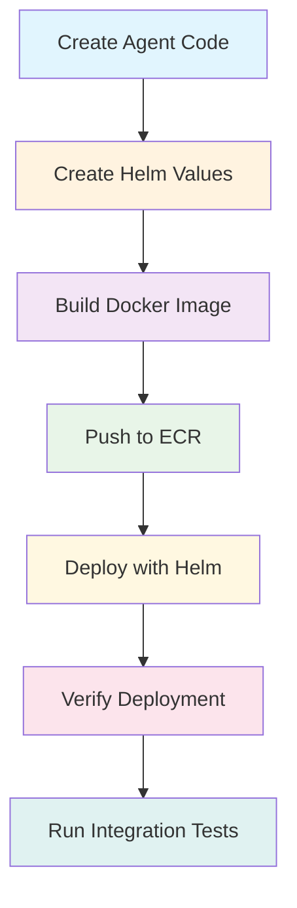
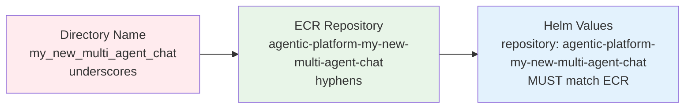
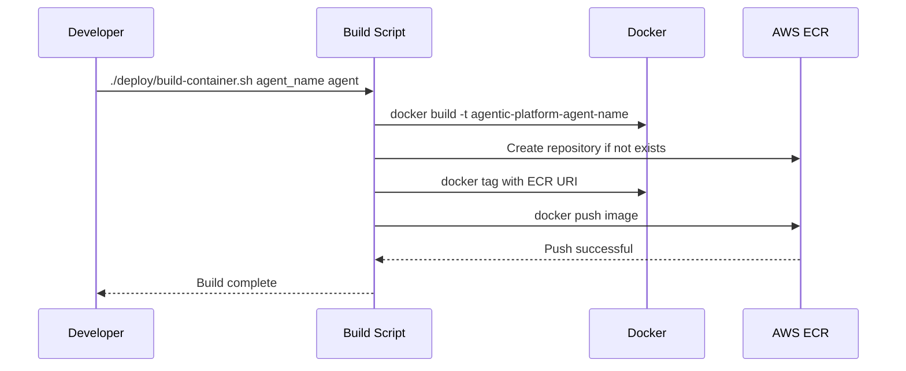
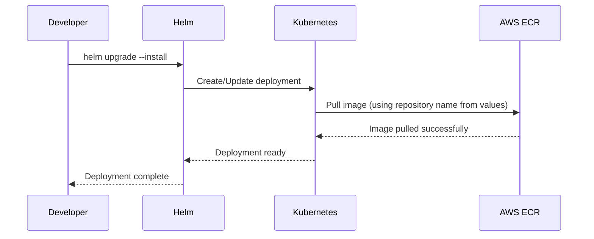
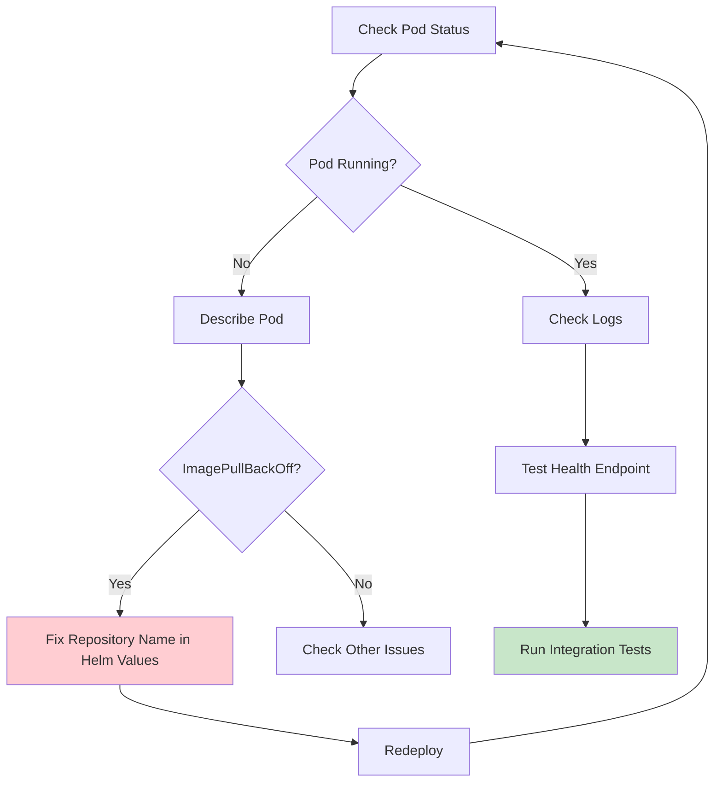
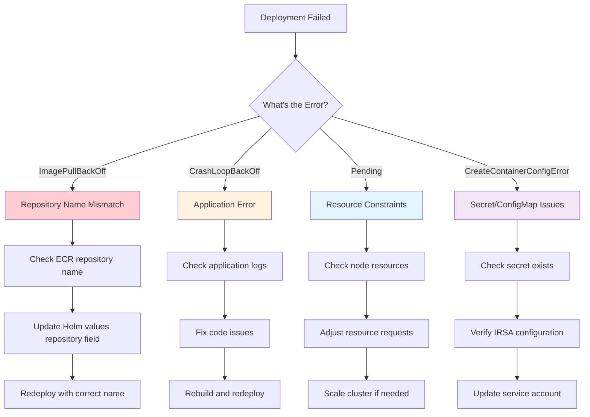
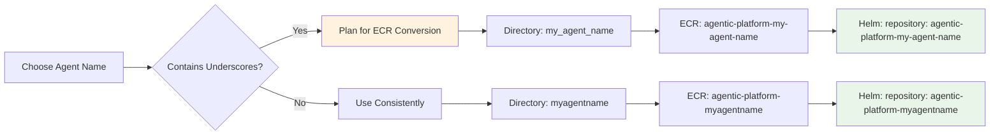

# How to Create a New Agent on the Agentic Platform

This comprehensive guide walks you through creating a new agent on the Agentic Platform, from initial setup to deployment on EKS. We'll use the `my_new_multi_agent_chat` agent as a complete example.

## Table of Contents

1. [Platform Overview](#platform-overview)
2. [Agent Architecture](#agent-architecture)
3. [Step-by-Step Agent Creation](#step-by-step-agent-creation)
4. [Deployment Process](#deployment-process)
5. [Testing and Validation](#testing-and-validation)
6. [Best Practices](#best-practices)
7. [Troubleshooting](#troubleshooting)

## Platform Overview

The Agentic Platform is a comprehensive framework for building, deploying, and managing AI agents at scale. It provides:

- **Standardized Architecture**: Consistent patterns across all agents
- **FastAPI Integration**: RESTful APIs with authentication
- **Streaming Support**: Real-time responses via Server-Sent Events
- **EKS Deployment**: Kubernetes-native scaling and management
- **Authentication**: AWS Cognito M2M token-based security
- **Monitoring**: Health checks, logging, and observability

### Core Components

```
Agentic Platform
├── Core Framework (src/agentic_platform/core/)
│   ├── API Models - Request/Response structures
│   ├── Memory Models - Message and content types
│   ├── Streaming Models - Real-time event types
│   └── LLM Gateway Client - LiteLLM proxy integration
├── Agent Implementations (src/agentic_platform/agent/)
│   ├── agentic_chat/ - Basic chat agent
│   ├── agentic_rag/ - RAG-enabled agent
│   ├── langgraph_chat/ - LangGraph-based agent
│   └── my_new_multi_agent_chat/ - Multi-agent system
├── Deployment Infrastructure
│   ├── Kubernetes Helm Charts
│   ├── Docker Configurations
│   └── AWS EKS Integration
└── Testing Framework
    ├── Integration Tests
    ├── Local Testing
    └── Authentication Testing
```

## Agent Architecture

Every agent follows a standardized architecture pattern:

### 1. FastAPI Server Layer
- **Entry Point**: `server.py` - FastAPI application
- **Endpoints**: `/health`, `/invoke`, `/invocations`, `/stream`
- **Middleware**: CORS, authentication, logging
- **Path Prefix**: Unique path for ingress routing

### 2. Controller Layer
- **Request Handling**: Parse and validate incoming requests
- **Response Formatting**: Convert agent responses to platform format
- **Error Management**: Standardized error handling and HTTP status codes

### 3. Agent Implementation Layer
- **Core Logic**: Agent-specific implementation (Strands, LangGraph, etc.)
- **Tool Integration**: Custom tools and external integrations
- **Streaming Support**: Async generators for real-time responses

### 4. Supporting Components
- **System Prompts**: Agent behavior definitions
- **Streaming Converters**: Framework-to-platform event conversion
- **Custom Tools**: Agent-specific functionality

## Step-by-Step Agent Creation

### Step 1: Create Directory Structure

```bash
mkdir -p src/agentic_platform/agent/your_agent_name/{agent,controller,prompt,streaming,tool}
```

**Example Structure:**
```
src/agentic_platform/agent/my_new_multi_agent_chat/
├── server.py
├── Dockerfile
├── requirements.txt
├── README.md
├── agent/
│   └── multi_agent_chat_agent.py
├── controller/
│   └── multi_agent_chat_controller.py
├── prompt/
│   └── multi_agent_chat_prompt.py
├── streaming/
│   └── strands_converter.py
└── tool/
    └── collaboration_tool.py
```

### Step 2: Implement FastAPI Server

Create `server.py` with standardized endpoints:

```python
from fastapi import FastAPI, HTTPException, Depends
from fastapi.middleware.cors import CORSMiddleware
from fastapi.responses import StreamingResponse
import logging

from agentic_platform.core.models.api_models import AgenticRequest, AgenticResponse
from agentic_platform.core.auth.cognito_auth import get_current_user
from .controller.your_controller import YourController

# Configure logging
logging.basicConfig(level=logging.INFO)
logger = logging.getLogger(__name__)

app = FastAPI(title="Your Agent Name", version="1.0.0")

# CORS middleware
app.add_middleware(
    CORSMiddleware,
    allow_origins=["*"],
    allow_credentials=True,
    allow_methods=["*"],
    allow_headers=["*"],
)

controller = YourController()

@app.get("/health")
async def health():
    """Health check endpoint - no authentication required."""
    return {"status": "healthy", "agent": "your_agent_name"}

@app.post("/invoke", response_model=AgenticResponse)
async def invoke(
    request: AgenticRequest,
    current_user: dict = Depends(get_current_user)
):
    """Synchronous chat endpoint - authentication required."""
    try:
        response = controller.invoke(request)
        return response
    except Exception as e:
        logger.error(f"Error in invoke: {e}")
        raise HTTPException(status_code=500, detail=str(e))

@app.post("/invocations")
async def invocations(
    request: AgenticRequest,
    current_user: dict = Depends(get_current_user)
):
    """Batch processing endpoint - authentication required."""
    return await invoke(request, current_user)

@app.post("/stream")
async def stream(
    request: AgenticRequest,
    current_user: dict = Depends(get_current_user)
):
    """Streaming chat endpoint - authentication required."""
    try:
        return StreamingResponse(
            controller.create_stream(request),
            media_type="text/plain"
        )
    except Exception as e:
        logger.error(f"Error in stream: {e}")
        raise HTTPException(status_code=500, detail=str(e))
```

### Step 3: Implement Controller

Create `controller/your_controller.py`:

```python
import logging
from typing import AsyncGenerator

from agentic_platform.core.models.api_models import AgenticRequest, AgenticResponse
from agentic_platform.core.models.streaming_models import StreamEvent
from ..agent.your_agent import YourAgent

logger = logging.getLogger(__name__)

class YourController:
    """Controller for handling requests to your agent."""

    def __init__(self):
        self.agent = YourAgent()

    def invoke(self, request: AgenticRequest) -> AgenticResponse:
        """Handle synchronous invoke requests."""
        try:
            return self.agent.invoke(request)
        except Exception as e:
            logger.error(f"Error in controller invoke: {e}")
            raise

    async def create_stream(self, request: AgenticRequest) -> AsyncGenerator[str, None]:
        """Handle streaming requests."""
        try:
            async for event in self.agent.invoke_stream(request):
                yield f"data: {event.model_dump_json()}\n\n"
        except Exception as e:
            logger.error(f"Error in controller stream: {e}")
            # Yield error event
            from agentic_platform.core.models.streaming_models import ErrorEvent
            error_event = ErrorEvent(
                session_id=request.session_id or "default",
                error=str(e)
            )
            yield f"data: {error_event.model_dump_json()}\n\n"
```

### Step 4: Implement Core Agent Logic

Create `agent/your_agent.py` - this varies by framework:

#### For Strands Framework:
```python
import logging
from typing import AsyncGenerator

from strands import Agent
from strands_tools import calculator
from strands.models.openai import OpenAIModel

from agentic_platform.core.models.api_models import AgenticRequest, AgenticResponse
from agentic_platform.core.models.memory_models import Message, TextContent
from agentic_platform.core.models.streaming_models import StreamEvent
from agentic_platform.core.client.llm_gateway.llm_gateway_client import LLMGatewayClient, LiteLLMClientInfo

logger = logging.getLogger(__name__)

class YourAgent:
    """Your agent implementation using Strands framework."""

    def __init__(self):
        # Get LiteLLM proxy configuration
        litellm_info: LiteLLMClientInfo = LLMGatewayClient.get_client_info()
        
        # Configure model
        self.model_config = {
            "model_id": "us.anthropic.claude-3-5-sonnet-20241022-v2:0",
            "client_args": {
                "api_key": litellm_info.api_key,
                "base_url": litellm_info.api_endpoint,
                "timeout": 30
            }
        }
        
        # Initialize agent
        self.agent = Agent(
            model=OpenAIModel(**self.model_config),
            tools=[calculator],  # Add your tools
            system_prompt="Your system prompt here"
        )

    def invoke(self, request: AgenticRequest) -> AgenticResponse:
        """Handle synchronous requests."""
        text_content = request.message.get_text_content()
        if text_content is None:
            raise ValueError("No text content found in request message")
        
        result = self.agent(text_content.text)
        
        response_message = Message(
            role="assistant",
            content=[TextContent(text=str(result))]
        )
        
        return AgenticResponse(
            message=response_message,
            session_id=request.session_id or "default",
            metadata={"agent_type": "your_agent_type"}
        )

    async def invoke_stream(self, request: AgenticRequest) -> AsyncGenerator[StreamEvent, None]:
        """Handle streaming requests."""
        # Implementation depends on your streaming converter
        pass
```

### Step 5: Create System Prompts

Create `prompt/your_prompt.py`:

```python
"""System prompts for your agent."""

YOUR_SYSTEM_PROMPT = """You are a helpful AI assistant specialized in [your domain].

Your capabilities include:
1. [Capability 1]
2. [Capability 2]
3. [Capability 3]

Guidelines:
- Be helpful and accurate
- Provide clear explanations
- Use tools when appropriate
- Maintain conversation context

Always strive to provide the most helpful response possible."""
```

### Step 6: Implement Streaming Converter (if needed)

Create `streaming/strands_converter.py` for Strands agents:

```python
"""Streaming converter for Strands events to platform StreamEvents."""

import logging
from typing import List, Any

from agentic_platform.core.models.streaming_models import (
    StreamEvent, ContentBlockStartEvent, ContentBlockDeltaEvent, 
    ContentBlockEndEvent, MessageStartEvent, MessageEndEvent
)

logger = logging.getLogger(__name__)

class StrandsStreamingConverter:
    """Converts Strands streaming events to platform StreamEvent types."""

    def __init__(self, session_id: str):
        self.session_id = session_id
        self.message_started = False

    def convert_chunks_to_events(self, chunk: Any) -> List[StreamEvent]:
        """Convert a Strands chunk to platform StreamEvents."""
        events = []
        
        # Start message if not started
        if not self.message_started:
            events.append(MessageStartEvent(session_id=self.session_id))
            events.append(ContentBlockStartEvent(session_id=self.session_id))
            self.message_started = True
        
        # Handle different chunk types
        if hasattr(chunk, 'content') and chunk.content:
            events.append(ContentBlockDeltaEvent(
                session_id=self.session_id,
                delta=chunk.content
            ))
        
        return events
```

### Step 7: Create Custom Tools (if needed)

Create `tool/your_tool.py`:

```python
"""Custom tools for your agent."""

from strands import tool

@tool
def your_custom_tool(parameter: str) -> str:
    """
    Description of what your tool does.
    
    Args:
        parameter: Description of the parameter
        
    Returns:
        Description of the return value
    """
    # Your tool implementation
    result = f"Processed: {parameter}"
    return result
```

### Step 8: Create Docker Configuration

Create `Dockerfile`:

```dockerfile
# Stage 1: Builder stage with dependencies
FROM ghcr.io/astral-sh/uv:python3.12-bookworm-slim AS builder

# Create a non-root user and group
RUN groupadd appgroup && useradd -g appgroup appuser

# Configure UV for container environment
ENV UV_SYSTEM_PYTHON=1 UV_COMPILE_BYTECODE=1

# Set working directory
WORKDIR /app

# Copy requirements
COPY src/agentic_platform/agent/your_agent_name/requirements.txt .

RUN uv pip install -r requirements.txt

# Stage 2: Server stage
FROM builder AS server

# Set working directory
WORKDIR /app

# Copy source code
COPY --chown=appuser:appgroup src/agentic_platform/core/ agentic_platform/core/
COPY --chown=appuser:appgroup src/agentic_platform/tool/ agentic_platform/tool/
COPY --chown=appuser:appgroup src/agentic_platform/agent/your_agent_name/ agentic_platform/agent/your_agent_name/

# Set PYTHONPATH
ENV PYTHONPATH=/app:$PYTHONPATH

# Expose port
EXPOSE 8080

# Switch to non-root user
USER appuser

# Run server
CMD ["uvicorn", "agentic_platform.agent.your_agent_name.server:app", "--host", "0.0.0.0", "--port", "8080"]
```

### Step 9: Create Requirements File

Create `requirements.txt`:

```txt
fastapi==0.115.12
uvicorn==0.34.0
boto3==1.37.27
pyjwt==2.10.1
cryptography==44.0.2
requests
litellm>=1.66.2
pydantic>=2.10.6
# Add framework-specific dependencies
strands-agents[litellm,openai]>=0.1.6  # For Strands
strands-agents-tools>=0.1.9             # For Strands
# OR
# langgraph>=0.2.0                      # For LangGraph
# langchain>=0.3.0                      # For LangGraph
aws-opentelemetry-distro>=0.10.1
```

## Deployment Process

### Overview

The deployment process involves building a Docker image, pushing it to ECR, and deploying to EKS using Helm. **Critical**: Pay attention to naming conventions to avoid deployment failures.



### ⚠️ Critical Naming Convention Issue

**IMPORTANT**: There's a critical naming mismatch that will cause `ImagePullBackOff` errors if not handled correctly:



**The Issue:**
- Agent directory uses underscores: `my_new_multi_agent_chat`
- ECR repository gets created with hyphens: `agentic-platform-my-new-multi-agent-chat`
- Helm values MUST match ECR repository name exactly

### Step 1: Create Helm Values

Create `k8s/helm/values/applications/your-agent-name-values.yaml`:

```yaml
# Default values for your-agent-name
namespace: "default"
replicaCount: 1

image:
  # ⚠️ CRITICAL: Repository name MUST match ECR repository exactly
  # If your agent directory is "my_new_agent", ECR will be "agentic-platform-my-new-agent"
  # Use hyphens, NOT underscores here
  repository: "agentic-platform-your-agent-name"  # Use hyphens!
  tag: latest
  pullPolicy: Always

nameOverride: "your-agent-name"
fullnameOverride: "your-agent-name"

service:
  type: ClusterIP
  port: 80
  targetPort: 8080

env:
  - name: PYTHONPATH
    value: /app

# Resource allocation
resources:
  requests:
    cpu: 100m
    memory: 256Mi
  limits:
    memory: 512Mi

# Ingress configuration
ingress:
  enabled: true
  path: "/your-agent-path"

# Service account for permissions
serviceAccount:
  name: "your-agent-name-sa"
  create: true
  irsaConfigKey: "AGENT_ROLE_ARN"

# IRSA role configuration
irsaConfigKey: "AGENT_ROLE_ARN"

# Agent secret configuration
agentSecret:
  configKey: "AGENT_LITELLM_SECRET_ARN"

# Default values if keys aren't found in central config
configDefaults:
  LITELLM_API_ENDPOINT: "http://litellm.default.svc.cluster.local:80"
  RETRIEVAL_GATEWAY_ENDPOINT: "http://retrieval-gateway.default.svc.cluster.local:80/api/retrieval-gateway"
  MEMORY_GATEWAY_ENDPOINT: "http://memory-gateway.default.svc.cluster.local:80/api/memory-gateway"
```

### Step 2: Build and Push Container



#### Option A: Using Platform Scripts (Recommended)

```bash
# Build and push container
./deploy/build-container.sh your_agent_name agent

# This script will:
# 1. Build Docker image
# 2. Create ECR repository if needed
# 3. Tag and push to ECR
# 4. Output the final ECR URI
```

#### Option B: Manual Build Process

```bash
# 1. Build Docker image
docker build -t agentic-platform-your_agent_name \
  -f src/agentic_platform/agent/your_agent_name/Dockerfile .

# 2. Get ECR login
aws ecr get-login-password --region us-west-2 | \
  docker login --username AWS --password-stdin YOUR_ACCOUNT.dkr.ecr.us-west-2.amazonaws.com

# 3. Create ECR repository (if it doesn't exist)
aws ecr create-repository --repository-name agentic-platform-your-agent-name --region us-west-2

# 4. Tag for ECR (note: hyphens in repository name!)
docker tag agentic-platform-your_agent_name:latest \
  YOUR_ACCOUNT.dkr.ecr.us-west-2.amazonaws.com/agentic-platform-your-agent-name:latest

# 5. Push to ECR
docker push YOUR_ACCOUNT.dkr.ecr.us-west-2.amazonaws.com/agentic-platform-your-agent-name:latest
```

### Step 3: Verify ECR Repository

**Before deploying**, verify the ECR repository name:

```bash
# List ECR repositories to confirm naming
aws ecr describe-repositories --region us-west-2 --query 'repositories[].repositoryName' | grep your-agent

# Expected output: "agentic-platform-your-agent-name" (with hyphens)
```

### Step 4: Deploy to EKS



#### Option A: Using Platform Script (Recommended)

```bash
# Deploy to EKS
./deploy/deploy-application.sh your-agent-name agent

# This will:
# 1. Use Helm to deploy with your values file
# 2. Create Kubernetes resources
# 3. Start pods with your container image
```

#### Option B: Manual Helm Deployment

```bash
# Deploy with Helm
helm upgrade --install your-agent-name ./k8s/helm/charts/agentic-service \
  -f k8s/helm/values/applications/your-agent-name-values.yaml \
  --namespace default

# Monitor deployment
kubectl get pods -l app=your-agent-name -w
```

### Step 5: Verify Deployment



#### Check Pod Status

```bash
# Check if pods are running
kubectl get pods -l app=your-agent-name

# Expected output:
# NAME                              READY   STATUS    RESTARTS   AGE
# your-agent-name-xxxxxxxxx-xxxxx   1/1     Running   0          2m
```

#### If ImagePullBackOff Error

```bash
# Describe pod to see error details
kubectl describe pod -l app=your-agent-name

# Look for error like:
# Failed to pull image "123456789.dkr.ecr.us-west-2.amazonaws.com/agentic-platform-your_agent_name:latest"
# ErrImagePull: repository does not exist or may require 'docker login'
```

**Fix**: Update Helm values file repository name to match ECR exactly:

```yaml
image:
  repository: "agentic-platform-your-agent-name"  # Use hyphens to match ECR!
```

Then redeploy:

```bash
./deploy/deploy-application.sh your-agent-name agent
```

#### Check Logs

```bash
# View application logs
kubectl logs -l app=your-agent-name --tail=50

# Expected healthy logs:
# INFO:     Started server process
# INFO:     Waiting for application startup.
# INFO:     Application startup complete.
# INFO:     Uvicorn running on http://0.0.0.0:8080
```

#### Test Health Endpoint

```bash
# Port forward to test locally
kubectl port-forward service/your-agent-name 8080:80 &

# Test health endpoint
curl http://localhost:8080/health

# Expected response:
# {"status":"healthy","agent":"your_agent_name"}
```

### Step 6: Deployment Troubleshooting Guide



#### Common Issues and Solutions

| Issue | Symptoms | Solution |
|-------|----------|----------|
| **Repository Name Mismatch** | `ImagePullBackOff`, `ErrImagePull` | Update Helm values `repository` field to match ECR name exactly |
| **Missing ECR Repository** | `repository does not exist` | Run build script or create ECR repository manually |
| **Authentication Issues** | `no basic auth credentials` | Check ECR login and AWS credentials |
| **Resource Limits** | `Pod pending`, `Insufficient memory` | Adjust resource requests/limits in Helm values |
| **Health Check Failures** | `Readiness probe failed` | Ensure `/health` endpoint responds quickly |
| **Secret Issues** | `CreateContainerConfigError` | Verify AWS Secrets Manager and IRSA configuration |

### Step 7: Naming Convention Best Practices

To avoid the underscore/hyphen issue:



**Recommended Naming Strategy:**

1. **Agent Directory**: Use underscores if needed for Python module naming
   - Example: `my_new_multi_agent_chat`

2. **ECR Repository**: Will automatically use hyphens (AWS ECR converts underscores)
   - Example: `agentic-platform-my-new-multi-agent-chat`

3. **Helm Values**: MUST match ECR repository exactly
   - Example: `repository: "agentic-platform-my-new-multi-agent-chat"`

4. **Kubernetes Resources**: Use hyphens consistently
   - Example: `my-new-multi-agent-chat`

### Step 8: Verification Checklist

Before considering deployment complete:

- [ ] Pod status is `Running` (1/1 Ready)
- [ ] Health endpoint returns 200 OK
- [ ] Application logs show successful startup
- [ ] Service is accessible via port-forward
- [ ] ECR repository name matches Helm values exactly
- [ ] No `ImagePullBackOff` or `CrashLoopBackOff` errors
- [ ] Resource usage is within expected limits
- [ ] Integration tests pass (next section)

## Testing and Validation

### Step 1: Create Integration Tests

Create `tests/integ/workflows/your_agent_name/`:

```bash
mkdir -p tests/integ/workflows/your_agent_name
```

### Step 2: Implement Test Runner

Create `tests/integ/workflows/your_agent_name/run_your_agent_eks_test_with_auth.py`:

```python
#!/usr/bin/env python3
"""EKS integration test runner for your agent with authentication."""

import asyncio
import json
import subprocess
import sys
import time
from typing import Optional

import boto3
import httpx
import requests

class EKSYourAgentTesterWithAuth:
    """EKS integration tester for your agent with authentication."""

    def __init__(self):
        self.test_results = []
        self.port_forward_process = None
        self.auth_token = None

    def get_m2m_token(self) -> Optional[str]:
        """Get M2M token from AWS Secrets Manager."""
        # Implementation similar to other agents
        pass

    def test_eks_cluster_connection(self) -> bool:
        """Test EKS cluster connectivity."""
        # Implementation similar to other agents
        pass

    def test_service_exists(self) -> bool:
        """Test that your service exists."""
        # Implementation similar to other agents
        pass

    def test_pods_running(self) -> bool:
        """Test that your pods are running."""
        # Implementation similar to other agents
        pass

    async def test_health_endpoint(self) -> bool:
        """Test health endpoint."""
        # Implementation similar to other agents
        pass

    async def test_invoke_endpoint_with_auth(self) -> bool:
        """Test invoke endpoint with authentication."""
        # Implementation similar to other agents
        pass

    async def test_streaming_endpoint_with_auth(self) -> bool:
        """Test streaming endpoint with authentication."""
        # Implementation similar to other agents
        pass

    async def run_all_tests(self) -> bool:
        """Run all EKS integration tests."""
        # Implementation similar to other agents
        pass

async def main():
    """Main test runner."""
    tester = EKSYourAgentTesterWithAuth()
    try:
        success = await tester.run_all_tests()
        sys.exit(0 if success else 1)
    except KeyboardInterrupt:
        print("\n🛑 Tests interrupted by user")
        sys.exit(1)

if __name__ == "__main__":
    asyncio.run(main())
```

### Step 3: Create Test Documentation

Create `tests/integ/workflows/your_agent_name/README.md` with comprehensive test documentation.

### Step 4: Run Tests

```bash
# Run integration tests
python tests/integ/workflows/your_agent_name/run_your_agent_eks_test_with_auth.py

# Expected output:
# 🚀 EKS Integration Tests for Your Agent (With Auth)
# ======================================================================
# ✅ PASS EKS Cluster Connection
# ✅ PASS Your Agent Service Exists
# ✅ PASS Your Agent Pods Running
# ✅ PASS Service Logs
# ✅ PASS Health Endpoint (No Auth)
# ✅ PASS Invoke Endpoint (With Auth)
# ✅ PASS Streaming Endpoint (With Auth)
# 
# Results: 7/7 tests passed
# 🎉 All EKS integration tests passed!
```

## Best Practices

### 1. Code Organization
- **Consistent Structure**: Follow the established directory pattern
- **Separation of Concerns**: Keep server, controller, agent, and tools separate
- **Reusable Components**: Leverage platform core utilities

### 2. Error Handling
- **Comprehensive Logging**: Use structured logging throughout
- **Graceful Degradation**: Handle failures without crashing
- **User-Friendly Errors**: Provide clear error messages

### 3. Performance
- **Resource Limits**: Set appropriate memory and CPU limits
- **Async Operations**: Use async/await for I/O operations
- **Connection Pooling**: Reuse HTTP connections where possible

### 4. Security
- **Authentication**: Always require auth for non-health endpoints
- **Input Validation**: Validate all incoming requests
- **Secrets Management**: Use AWS Secrets Manager for sensitive data

### 5. Testing
- **Comprehensive Coverage**: Test all endpoints and error conditions
- **Integration Tests**: Test actual deployed services
- **Authentication Testing**: Verify M2M token flows

### 6. Documentation
- **README Files**: Document each component thoroughly
- **API Documentation**: Use FastAPI's automatic OpenAPI generation
- **Deployment Guides**: Provide clear deployment instructions

## Troubleshooting

### Common Issues

#### 1. Import Errors
```
ModuleNotFoundError: No module named 'your_module'
```
**Solution**: Check PYTHONPATH and package structure

#### 2. Authentication Failures
```
401 Unauthorized
```
**Solution**: Verify M2M token configuration and AWS credentials

#### 3. Container Build Failures
```
ERROR: Could not find a version that satisfies the requirement
```
**Solution**: Check requirements.txt and Python version compatibility

#### 4. EKS Deployment Issues
```
ImagePullBackOff
```
**Solution**: Verify ECR repository and image tags

#### 5. Health Check Failures
```
Readiness probe failed
```
**Solution**: Ensure `/health` endpoint responds quickly

### Debug Commands

```bash
# Check pod status
kubectl get pods -l app=your-agent-name

# View pod logs
kubectl logs -l app=your-agent-name --tail=50

# Describe pod for events
kubectl describe pod POD_NAME

# Check service configuration
kubectl get service your-agent-name -o yaml

# Test health endpoint locally
curl http://localhost:8080/health

# Check ingress configuration
kubectl get ingress -o yaml | grep -A10 -B10 your-agent-path
```

### Performance Monitoring

```bash
# Check resource usage
kubectl top pods -l app=your-agent-name

# View metrics
kubectl get --raw /apis/metrics.k8s.io/v1beta1/pods | jq '.items[] | select(.metadata.labels.app=="your-agent-name")'

# Check horizontal pod autoscaler
kubectl get hpa your-agent-name
```

## Conclusion

Creating a new agent on the Agentic Platform involves:

1. **Following Established Patterns**: Use the standardized architecture
2. **Implementing Core Components**: Server, controller, agent, and supporting files
3. **Configuring Deployment**: Docker, Kubernetes, and Helm configurations
4. **Creating Comprehensive Tests**: Integration tests with authentication
5. **Documenting Everything**: READMEs, API docs, and deployment guides

The `my_new_multi_agent_chat` agent serves as a complete reference implementation demonstrating all these concepts in a production-ready multi-agent system.

For additional support, refer to existing agent implementations and the platform's core documentation.
