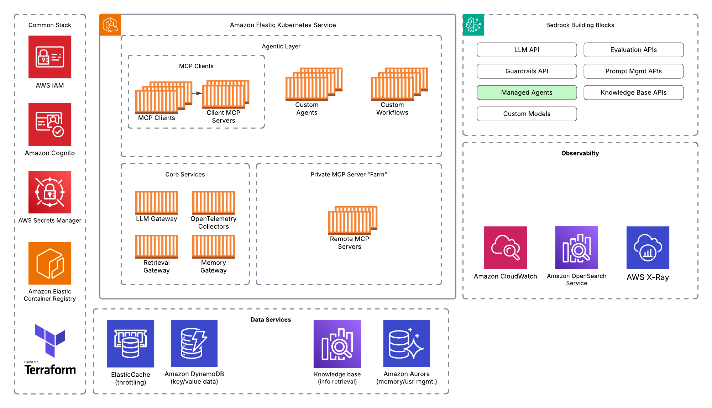
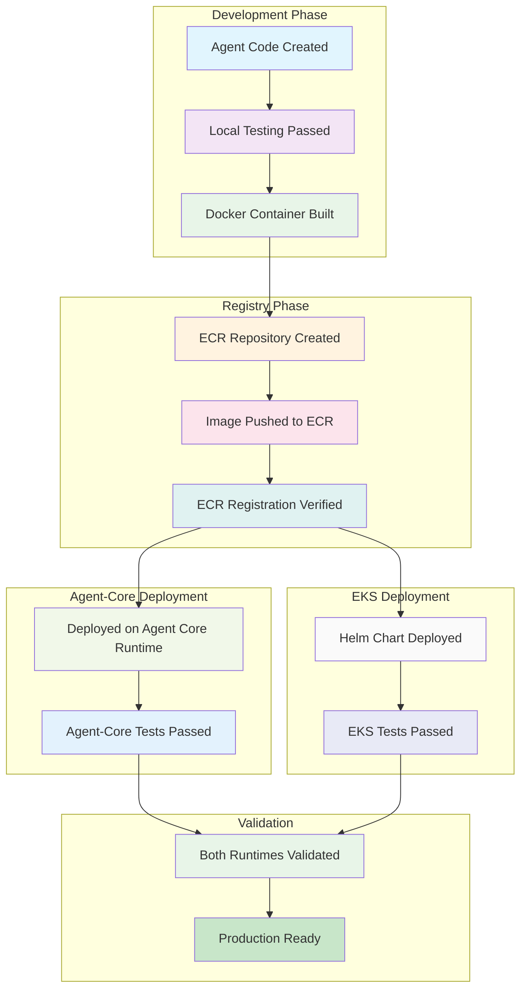

# New Agent Deployment Guide

This comprehensive guide walks you through building and deploying a new agent on the Agentic Platform, from initial development to production deployment on both Agent-Core and EKS runtimes.

## Overview


## Prerequisites

- AWS CLI configured with appropriate permissions
- Docker installed and running
- Terraform installed
- Python 3.11+ environment
- Access to the platform's AWS account and ECR registry

---

## Step 1: Create Agent Code Structure

Create your new agent in the platform's agent directory structure.

### 1.1 Create Agent Directory

```bash
mkdir -p src/agentic_platform/agent/my-new-agent
cd src/agentic_platform/agent/my-new-agent
```

### 1.2 Required Agent Structure

Your agent must follow this directory structure:

```
src/agentic_platform/agent/my-new-agent/
├── Dockerfile                    # Container definition
├── requirements.txt             # Python dependencies
├── server.py                   # FastAPI server entry point
├── agent/                      # Core agent logic
│   └── my_new_agent.py        # Main agent implementation
├── controller/                 # API controllers
│   └── my_new_agent_controller.py
├── prompt/                     # Agent prompts
│   └── system_prompt.py
└── streaming/                  # Streaming utilities (optional)
    └── streaming_utils.py
```

### 1.3 Create Core Files

Replicate source code pattern employed within `src/agentic_platform/agent/agentic_chat_enhanced`


## Step 2: Local Testing

Test your agent locally before containerization.

### 2.1 Set Up Local Environment

```bash
# Create virtual environment
python -m venv venv
source venv/bin/activate  # On Windows: venv\Scripts\activate

# Install dependencies
cd src/agentic_platform/agent/my-new-agent
pip install -r requirements.txt
```

### 2.2 Run Local Server

```bash
python server.py
```

The server will start on `http://localhost:8000`

### 2.3 Test API Endpoints

```bash
# Health check
curl http://localhost:8000/api/v1/health

# Chat endpoint
curl -X POST http://localhost:8000/api/v1/chat \
  -H "Content-Type: application/json" \
  -d '{"message": "Hello, agent!", "context": {}}'
```

### 2.4 Create Local Test Script

Create `tests/local-test/local-test-my-new-agent.py`:

replicate pattern followed for `tests/local-test/local-test-agentic-chat-enhanced.py`


Run the test:
```bash
python tests/local-test/local-test-my-new-agent.py
```

---

## Step 3: Build Docker Container and Register on Container Registry (ECR)

In this step , you will use terraform to  

Build docker container >> Regiter it on ECR >> unit test your deployed container

This container image will be shared across multiple runtimes - in our case between AgentCore and EKS as you will see below.


### 3.1 Build Container Locally

Create `agent_name.tfvars` by replicating pattern followed for 

'infrastructure/stacks/ecr-agent/agentic_chat_enhanced.tfvars'


```bash
# From project root, Terraform init

cd infrastructure/stacks/ecr-agent && terraform init

# Terraform plan
terraform plan -var-file="MY_AGENT_NAME.tfvars"

# Terraform apply

terraform apply -var-file="MY_AGENT_NAME.tfvars" -auto-approve

# save output values 

terraform output -json | jq -S '.' > outputs-ecr-agent-$(date +%Y%m%d-%H%M%S).json

```

See sample output:

`image_uri_latest = "123456789.dkr.ecr.us-east-1.amazonaws.com/agentic-platform-agentic_chat_enhanced:latest"
repository_name = "agentic-platform-agentic_chat_enhanced"
repository_url = "123456789.dkr.ecr.us-east-1.amazonaws.com/agentic-platform-agentic_chat_enhanced"
`

### 3.2 Test Container Locally

```bash
# Run container
docker run -p 8000:8000 "VALUE OF image_uri_latest"

# Test in another terminal
curl http://localhost:8000/api/v1/health
```
## Step 4: Verify ECR Registration

Confirm your container is properly registered in ECR.

### 4.1 List ECR Repositories

```bash
aws ecr describe-repositories --region us-east-1 --repository-names agentic-platform-my-new-agent
```

### 4.2 List Images in Repository

```bash
aws ecr list-images --region us-east-1 --repository-name agentic-platform-my-new-agent
```

### 4.3 Get Image Details

```bash
aws ecr describe-images --region us-east-1 --repository-name agentic-platform-my-new-agent --image-ids imageTag=latest
```

## Step 5: Deploy ECR Container to Agent-Core Runtime

Deploy your agent to the Agent-Core runtime environment.

### 5.1 Create Agent-Core Configuration

Create terraform stack variable similar to the example 'infrastructure/stacks/agentcore-runtime/agentic_chat_enhanced.tfvars'

- ENVIRONMENT: "local|test|prod"

The variables below are outputss from  excuting the 'infrastructure/stacks/platform-agentcore' stack

- LITELLM_API_ENDPOINT: see e.g "https://blah.cloudfront.net/frontend/api/litellm"  
- LITELLM_KEY: "sk-QVsMxxxxxxxxxxxxxx"

Outputs generated by 'infrastructure/stacks/ecr-agent/outputs.tf'

- image_uri_latest : The URI of the container image on ECR with latest tag  

### 5.2 Deploy to Agent-Core

```bash
cd infrastructure/stacks/agentcore-runtime

# Initialize Terraform
terraform init

# Plan deployment
terraform plan -var-file="my-new-agent.tfvars"

# Apply configuration
terraform apply -var-file="my-new-agent.tfvars"
```

### 5.3 Agent-Core Deployment Architecture

ToDo: Insert Image here

## Step 6: End-to-End Integration Testing on Agent-Core Runtime

Test your deployed agent on the Agent-Core runtime.

### 6.1 Get Agent-Core Endpoint

```bash
# Get the load balancer DNS name
terraform output -state=infrastructure/stacks/agentcore-runtime/terraform.tfstate alb_dns_name
```

### 6.2 Create Agent-Core Integration Test

see sample created for 'tests/integ/workflows/agentic_chat_enhanced/run_agentic_chat_enhanced_agentcore_test.py'

### 6.3 Run Agent-Core Integration Tests

```bash
python tests/integ/workflows/my_new_agent/run_my_new_agent_agentcore_test.py
```

## Step 7: Deploy Docker Container at ECR to Kubernetes (EKS) Runtime

Pre-Condition: ensure that all the platform components to support EKS deployment are present, for this follow either the 

a) Bootstrap via CodeBuild - details here 'bootstrap/README.md' OR 
b) Manual deployment - instructiosn here 'infrastructure/README.md'




_High Level Architecture - Agents on EKS Platform _

### 7.1 Create Helm Values Configuration

see sample created for 'k8s/helm/values/applications/agentic-chat-enhanced-values.yaml'

### 7.2 Deploy to EKS

```bash

# Deploy without building container
./deploy-application.sh <service-name>

```

### 7.3 Verify EKS Deployment

```bash

# Check service
kubectl get svc -n agents -l app=my-new-agent

# Check ingress
kubectl get ingress -n agents

# View logs
kubectl logs -n agents -l app=my-new-agent --tail=100
```

## Step 8: End-to-End Integration Testing on EKS Runtime

see sample end-to-end testing of agent on EKS w/ Auth

'tests/integ/workflows/agentic_chat_enhanced/run_agentic_chat_enhanced_eks_test_with_auth.py'


```bash
# Check pod status
cd tests/integ/workflows/agentic_chat_enhanced/

python run_agentic_chat_enhanced_eks_test_with_auth.py

```


## Step 9: Summary of Activities and Validation

Comprehensive summary of the deployment process and validation checklist.

### 9.1 Deployment Summary


### 9.2 Troubleshooting Common Issues

#### Build Issues
```bash
# Check Docker daemon
docker info

# Verify AWS credentials
aws sts get-caller-identity

# Check ECR permissions
aws ecr describe-repositories --region us-east-1
```

#### Deployment Issues
```bash
# EKS troubleshooting
kubectl describe pod -n agents -l app=my-new-agent
kubectl logs -n agents -l app=my-new-agent --previous
```

#### Network Issues
```bash
# Test connectivity
curl -v https://your-endpoint/api/v1/health

# Check security groups (Agent-Core)
aws ec2 describe-security-groups --group-ids sg-xxxxxxxxx

# Check ingress (EKS)
kubectl describe ingress -n agents my-new-agent
```

## Step 10: Conclusion

You have successfully deployed your new agent to both Agent Core and EKS runtimes using a single ECR repository. The single ECR repository strategy ensures consistency while providing the flexibility to leverage the unique benefits of each runtime platform.

