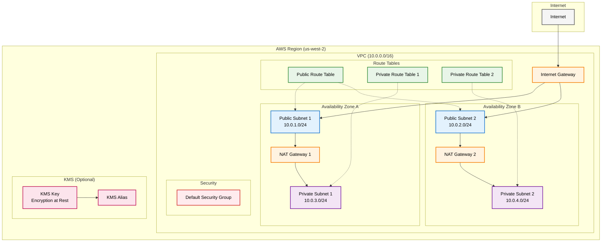
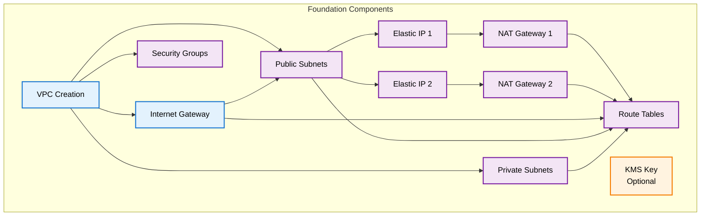
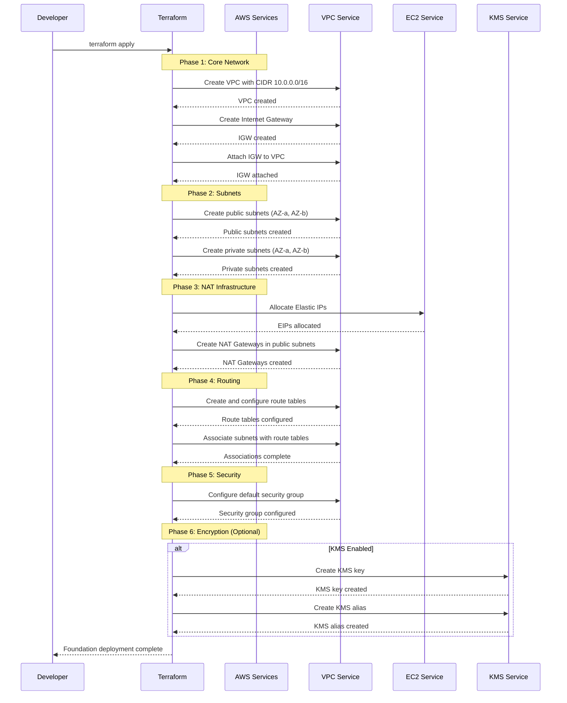
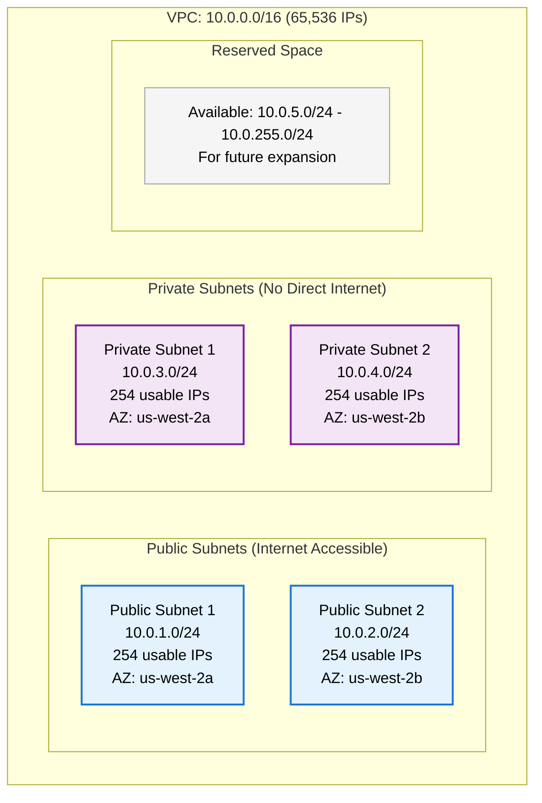
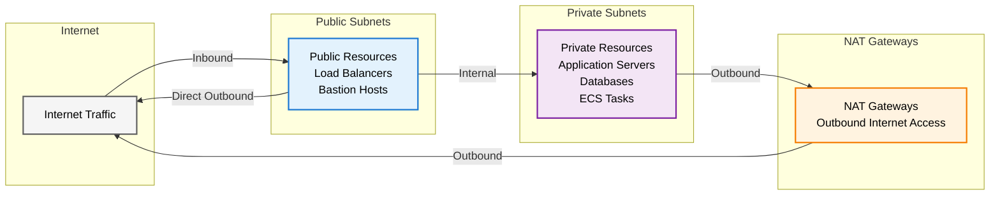
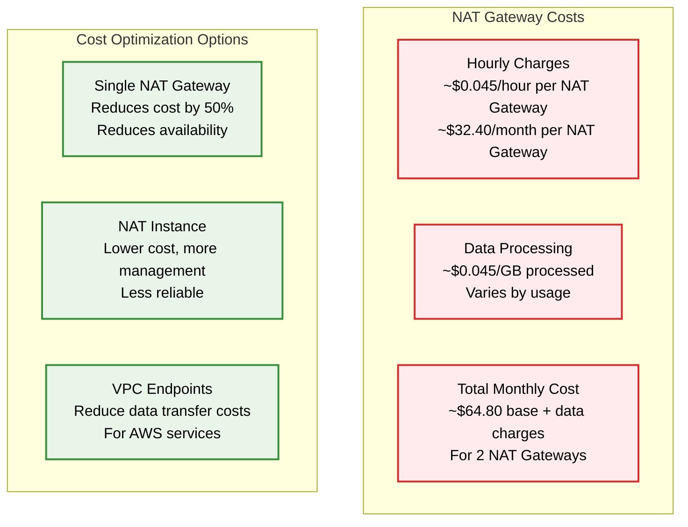

# Foundation Stack

> **📋 Prerequisites for Viewing Diagrams**
> 
> This README contains Mermaid diagrams for visualizing the architecture and workflows. To view these diagrams properly, please install a Mermaid plugin/extension for your editor or browser:
> 
> - **VS Code**: Install the "Markdown Preview Mermaid Support" extension
> - **GitHub**: Mermaid diagrams are natively supported in GitHub markdown
> - **Browser**: Use the "Mermaid Diagrams" browser extension or view on GitHub
> - **Alternative**: Copy the mermaid code to [mermaid.live](https://mermaid.live) for online rendering

This Terraform stack deploys the foundational infrastructure components required by all other stacks in the Agentic Platform. It provides the core networking and security infrastructure that serves as the foundation for the entire platform.

## Overview

The Foundation stack creates the essential AWS infrastructure components:

- **VPC (Virtual Private Cloud)**: Isolated network environment with public and private subnets
- **Internet Gateway**: Provides internet access to public subnets
- **NAT Gateways**: Enable outbound internet access for private subnets
- **Route Tables**: Control traffic routing within the VPC
- **Security Groups**: Network-level security controls
- **KMS Key**: Optional encryption key for data at rest (when enabled)

## Architecture Overview



## Component Dependencies



## Prerequisites

Before deploying the Foundation stack, ensure you have:

### 1. AWS Account Setup
- **AWS Account**: Active AWS account with appropriate permissions
- **AWS CLI**: Configured with credentials that have administrative permissions
- **AWS Region**: Choose your target region (default: us-west-2)

### 2. Required Tools
- **Terraform**: Version >= 1.0
- **Git**: For source code management

### 3. AWS Permissions
Your AWS credentials must have permissions for:
- VPC and subnet management
- Internet Gateway and NAT Gateway operations
- Route table and security group management
- Elastic IP allocation and management
- KMS key creation and management (if encryption is enabled)

### 4. Planning Considerations
- **Region Selection**: Choose a region with multiple availability zones
- **CIDR Planning**: Default VPC CIDR is 10.0.0.0/16 (can be customized)
- **Cost Considerations**: NAT Gateways incur hourly charges and data transfer costs
- **Encryption**: Decide whether to enable KMS encryption for downstream services

## Step-by-Step Deployment Guide

### Step 1: Navigate to Foundation Directory

```bash
cd infrastructure/stacks/foundation
```

### Step 2: Create Configuration File

Create a `terraform.tfvars` file with your desired configuration:

```bash
# Create configuration file
vim terraform.tfvars
```

**Example Configuration** (`terraform.tfvars`):
```hcl
########################################################
# Core Configuration
########################################################

aws_region   = "us-west-2"
environment  = "dev"
stack_name   = "agent-platform"

########################################################
# KMS Configuration (Optional)
########################################################

enable_kms_encryption = true
kms_deletion_window   = 7

# Optional: Specify KMS key administrators
# kms_key_administrators = [
#   "arn:aws:iam::123456789012:user/admin-user",
#   "arn:aws:iam::123456789012:role/admin-role"
# ]
```

**Configuration Options:**

The following variables can be configured in your `terraform.tfvars` file. Default values are defined in `variables.tf`:

| Variable | Description | Default (from variables.tf) | Required |
|----------|-------------|------------------------------|----------|
| `aws_region` | AWS region for deployment | `us-west-2` | No |
| `environment` | Environment name (dev, staging, prod) | `dev` | No |
| `stack_name` | Prefix for resource names | `agent-ptfm` | No |
| `enable_kms_encryption` | Enable KMS encryption | `false` | No |
| `kms_deletion_window` | KMS key deletion window (days) | `7` | No |
| `kms_key_administrators` | List of KMS key administrator ARNs | `[]` (empty list) | No |

**Note**: All variables have default values defined in `variables.tf`, so you only need to specify values in `terraform.tfvars` that differ from the defaults.

### Step 3: Initialize Terraform

```bash
terraform init
```

This will:
- Download required Terraform providers
- Initialize the backend
- Prepare the working directory

### Step 4: Plan the Deployment

```bash
terraform plan
```

Review the plan to ensure all resources will be created correctly. You should see:
- 1 VPC
- 4 subnets (2 public, 2 private)
- 1 Internet Gateway
- 2 NAT Gateways
- 2 Elastic IPs
- Route tables and associations
- Security groups
- KMS key and alias (if enabled)

### Step 5: Deploy the Foundation

```bash
terraform apply
```

**What happens during deployment:**

1. **VPC Creation**: A new VPC is created with the specified CIDR block
2. **Subnet Creation**: Public and private subnets are created in two availability zones
3. **Internet Gateway**: Attached to the VPC for public internet access
4. **Elastic IPs**: Allocated for NAT Gateways
5. **NAT Gateways**: Created in public subnets for private subnet internet access
6. **Route Tables**: Configured with appropriate routes for public and private traffic
7. **Security Groups**: Default security group is configured
8. **KMS Key**: Created with alias (if encryption is enabled)

### Step 6: Verify Deployment

```bash
# Check all outputs
terraform output

# Verify VPC creation
aws ec2 describe-vpcs --vpc-ids $(terraform output -raw vpc_id)

# Verify subnets
aws ec2 describe-subnets --subnet-ids $(terraform output -raw public_subnet_ids | tr -d '[]," ')

# Verify NAT Gateways
aws ec2 describe-nat-gateways --nat-gateway-ids $(terraform output -raw nat_gateway_1_id)

# If KMS is enabled, verify KMS key
aws kms describe-key --key-id $(terraform output -raw kms_key_id)
```

### Step 7: Document Outputs for Other Stacks

Save the foundation outputs for use in other stacks:

```bash
# Create a reference file for other stacks
cat > foundation-outputs.txt << EOF
VPC_ID=$(terraform output -raw vpc_id)
VPC_CIDR=$(terraform output -raw vpc_cidr_block)
PUBLIC_SUBNET_IDS=$(terraform output -raw public_subnet_ids)
PRIVATE_SUBNET_IDS=$(terraform output -raw private_subnet_ids)
KMS_KEY_ARN=$(terraform output -raw kms_key_arn)
KMS_KEY_ID=$(terraform output -raw kms_key_id)
EOF

echo "Foundation stack deployed successfully!"
echo "Save these outputs for use in other stacks:"
cat foundation-outputs.txt
```

## Deployment Sequence Diagram



## Network Architecture Details

### Subnet Design



### Traffic Flow Patterns



## Cost Considerations

### NAT Gateway Costs

NAT Gateways are the primary cost component of the foundation stack:



## Security Considerations

### Network Security

The foundation stack implements several security best practices:

1. **Network Isolation**: Private subnets have no direct internet access
2. **Controlled Egress**: All outbound traffic from private subnets goes through NAT Gateways
3. **Availability Zone Distribution**: Resources spread across multiple AZs for resilience
4. **Security Groups**: Default security group with minimal permissions

### KMS Encryption

When enabled, the KMS key provides:

- **Data at Rest Encryption**: For RDS, EBS, S3, and other services
- **Key Rotation**: Automatic annual key rotation
- **Access Control**: IAM-based key administration
- **Audit Trail**: CloudTrail logging of key usage

## Troubleshooting Common Issues

### 1. Insufficient Permissions

```bash
# Check your AWS credentials
aws sts get-caller-identity

# Verify permissions
aws iam simulate-principal-policy \
  --policy-source-arn $(aws sts get-caller-identity --query Arn --output text) \
  --action-names ec2:CreateVpc ec2:CreateSubnet ec2:CreateNatGateway \
  --resource-arns "*"
```

### 2. Region Availability Zone Issues

```bash
# Check available AZs in your region
aws ec2 describe-availability-zones --region us-west-2

# Verify NAT Gateway support
aws ec2 describe-availability-zones \
  --region us-west-2 \
  --query 'AvailabilityZones[?State==`available`]'
```

### 3. CIDR Block Conflicts

```bash
# Check existing VPCs in the region
aws ec2 describe-vpcs --query 'Vpcs[*].[VpcId,CidrBlock]' --output table

# Verify no CIDR overlap with existing VPCs
```

### 4. NAT Gateway Creation Failures

```bash
# Check Elastic IP limits
aws ec2 describe-account-attributes \
  --attribute-names vpc-max-elastic-ips

# Verify public subnet has internet gateway route
aws ec2 describe-route-tables \
  --filters "Name=association.subnet-id,Values=$(terraform output -raw public_subnet_1_id)"
```

## Updating the Foundation

To update the foundation stack:

```bash
# Update terraform.tfvars with new values
vim terraform.tfvars

# Plan the changes
terraform plan

# Apply the changes
terraform apply
```

**Warning**: Some changes may require resource replacement and could cause downtime for dependent services.

## Cleanup

To remove the foundation stack:

```bash
# Ensure no other stacks depend on this foundation
# Check for resources in the VPC
aws ec2 describe-instances --filters "Name=vpc-id,Values=$(terraform output -raw vpc_id)"

# Destroy the foundation (only if no dependencies exist)
terraform destroy
```

**Critical Warning**: Do not destroy the foundation stack if other stacks (platform-agentcore, agentcore-runtime) are still deployed, as they depend on these resources.

## Outputs Reference

The foundation stack provides the following outputs for use by other stacks:

### Networking Outputs
- `vpc_id`: VPC identifier
- `vpc_cidr_block`: VPC CIDR block
- `public_subnet_ids`: List of public subnet IDs
- `private_subnet_ids`: List of private subnet IDs
- `internet_gateway_id`: Internet Gateway ID
- `nat_gateway_1_id`, `nat_gateway_2_id`: NAT Gateway IDs
- `default_security_group_id`: Default security group ID

### KMS Outputs (if enabled)
- `kms_key_id`: KMS key ID
- `kms_key_arn`: KMS key ARN
- `kms_alias_name`: KMS alias name
- `kms_alias_arn`: KMS alias ARN

### Common Values
- `name_prefix`: Common naming prefix
- `common_tags`: Standard tags applied to all resources
- `aws_region`: Deployment region
- `environment`: Environment name

## Next Steps

After deploying the Foundation stack:

1. **Document Outputs**: Save the foundation outputs for use in other stacks
2. **Deploy Platform Stack**: Deploy either `platform-agentcore` (ECS-based) or `platform-eks` (EKS-based)
3. **Set Up Monitoring**: Configure CloudWatch for VPC Flow Logs and NAT Gateway monitoring
4. **Cost Monitoring**: Set up billing alerts for NAT Gateway usage
5. **Security Review**: Review security groups and NACLs as needed

## Related Documentation

- [Platform AgentCore Stack](../platform-agentcore/README.md)
- [AgentCore Runtime Stack](../agentcore-runtime/README-v2.md)
- [AWS VPC Documentation](https://docs.aws.amazon.com/vpc/)
- [AWS NAT Gateway Documentation](https://docs.aws.amazon.com/vpc/latest/userguide/vpc-nat-gateway.html)
