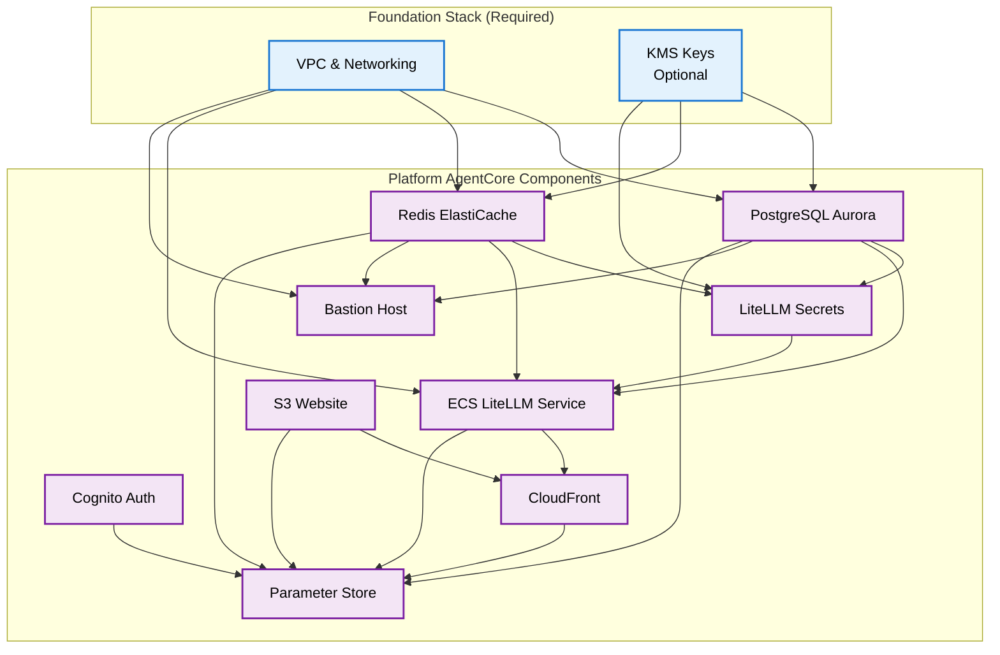

# Platform AgentCore Stack

> **📋 Prerequisites for Viewing Diagrams**
> 
> This README contains Mermaid diagrams for visualizing the architecture and workflows. To view these diagrams properly, please install a Mermaid plugin/extension for your editor or browser:
> 
> - **VS Code**: Install the "Markdown Preview Mermaid Support" extension
> - **GitHub**: Mermaid diagrams are natively supported in GitHub markdown
> - **Browser**: Use the "Mermaid Diagrams" browser extension or view on GitHub
> - **Alternative**: Copy the mermaid code to [mermaid.live](https://mermaid.live) for online rendering

This Terraform stack deploys a "lite" version of the agentic platform using ECS instead of EKS. It provides a complete platform infrastructure for running AI agents with LiteLLM as the model proxy service.

## Overview

The Platform AgentCore stack creates a containerized platform that includes:

- **ECS Cluster**: Fargate-based container orchestration for LiteLLM
- **LiteLLM Service**: AI model proxy for accessing multiple LLM providers
- **PostgreSQL Aurora**: Database for application data and LiteLLM configuration
- **Redis ElastiCache**: Caching layer for improved performance
- **Cognito Authentication**: User authentication and authorization
- **CloudFront + S3**: Static website hosting for frontend applications
- **Bastion Host**: Secure access to VPC resources
- **Parameter Store**: Centralized configuration management

## Prerequisites

Before deploying the Platform AgentCore stack, ensure you have:

### 1. Foundation Infrastructure
- **Foundation Stack**: Must be deployed first (`infrastructure/stacks/foundation/`)
- **VPC and Networking**: VPC, subnets, and security groups from foundation
- **KMS Keys**: Optional encryption keys from foundation stack

### 2. Required Tools
- **Terraform**: Version >= 1.0
- **AWS CLI**: Configured with appropriate permissions
- **Docker**: For local testing (optional)

### 3. AWS Permissions
Your AWS credentials must have permissions for:
- ECS cluster and service management
- ECR repository operations (if using custom images)
- RDS Aurora cluster management
- ElastiCache cluster management
- Cognito user pool operations
- S3 bucket and CloudFront distribution management
- IAM role and policy management
- Secrets Manager operations
- Parameter Store operations

### 4. Foundation Stack Outputs
You'll need the following outputs from your foundation stack:
- VPC ID and CIDR block
- Private and public subnet IDs
- KMS key ARN and ID (if encryption is enabled)

## Architecture Overview


## Component Dependencies



## Step-by-Step Deployment Guide

### Step 1: Verify Foundation Stack

Ensure your foundation stack is deployed and gather required outputs:

```bash
# Navigate to foundation stack
cd infrastructure/stacks/foundation

# Get foundation outputs
terraform output vpc_id
terraform output vpc_cidr_block
terraform output private_subnet_ids
terraform output public_subnet_ids

# If KMS is enabled
terraform output kms_key_arn
terraform output kms_key_id
```

### Step 2: Navigate to Platform AgentCore Directory

```bash
cd infrastructure/stacks/platform-agentcore
```

### Step 3: Create Configuration File

Copy and customize the configuration file:

```bash
# Copy the example configuration
cp terraform.tfvars.example terraform.tfvars

# Edit the configuration
vim terraform.tfvars
```

**Example Configuration** (`terraform.tfvars`):
```hcl
########################################################
# Core Configuration
########################################################

aws_region   = "us-west-2"
environment  = "dev"
name_prefix  = "agentcore-"

########################################################
# Networking Configuration (from foundation stack)
########################################################

vpc_id         = "vpc-0123456789abcdef0"
vpc_cidr_block = "10.0.0.0/16"

private_subnet_ids = [
  "subnet-0123456789abcdef0",
  "subnet-0123456789abcdef1"
]

public_subnet_ids = [
  "subnet-0123456789abcdef2",
  "subnet-0123456789abcdef3"
]

########################################################
# KMS Configuration (optional)
########################################################

enable_kms_encryption = false
kms_key_arn = "arn:aws:kms:us-west-2:123456789012:key/12345678-1234-1234-1234-123456789012"
kms_key_id  = "12345678-1234-1234-1234-123456789012"

########################################################
# PostgreSQL Configuration
########################################################

postgres_instance_count       = 1
postgres_instance_class      = "db.serverless"
postgres_deletion_protection = false
postgres_iam_username        = "postgres_iam_user"

########################################################
# Redis Configuration
########################################################

redis_node_type                 = "cache.t3.micro"
redis_engine_version           = "7.0"
redis_num_cache_clusters       = 2  # Minimum 2 required for automatic failover
redis_maintenance_window       = "sun:05:00-sun:06:00"
redis_snapshot_window          = "03:00-04:00"
redis_snapshot_retention_limit = 1

########################################################
# ECS LiteLLM Configuration
########################################################

litellm_cpu                  = 1024  # 1 vCPU
litellm_memory              = 2048   # 2 GB
litellm_desired_count       = 1
litellm_enable_auto_scaling = true
litellm_min_capacity        = 1
litellm_max_capacity        = 3

########################################################
# S3 Configuration
########################################################

s3_force_destroy = true  # Set to false for production
```

### Step 4: Initialize Terraform

```bash
terraform init
```

### Step 5: Plan the Deployment

```bash
terraform plan
```

Review the plan to ensure all resources will be created correctly.

### Step 6: Deploy the Platform

```bash
terraform apply
```

**What happens during deployment:**

1. **PostgreSQL Aurora Cluster** is created with security groups
2. **Redis ElastiCache** cluster is provisioned
3. **Cognito User Pool** and clients are configured
4. **LiteLLM Secrets** are created in Secrets Manager
5. **ECS Cluster** is created with Fargate capacity
6. **ECS Service** deploys LiteLLM containers
7. **Application Load Balancer** is configured for LiteLLM
8. **Bastion Host** is launched for VPC access
9. **S3 Bucket** is created for static website hosting
10. **CloudFront Distribution** is configured
11. **Parameter Store** configuration is populated

### Step 7: Verify Deployment

```bash
# Check all outputs
terraform output

# Verify ECS service is running
aws ecs describe-services \
  --cluster $(terraform output -raw ecs_cluster_name) \
  --services $(terraform output -raw litellm_service_name)

# Test LiteLLM endpoint
curl -I $(terraform output -raw litellm_load_balancer_url)/health

# Check CloudFront distribution
aws cloudfront get-distribution \
  --id $(terraform output -raw cloudfront_distribution_id)
```

### Step 8: Configure LiteLLM API Keys

After deployment, you need to configure LiteLLM with your AI provider API keys:

```bash
# Get the LiteLLM secret name
SECRET_NAME=$(terraform output -raw litellm_secret_name)

# Update the secret with your API keys
aws secretsmanager update-secret \
  --secret-id $SECRET_NAME \
  --secret-string '{
    "OPENAI_API_KEY": "your-openai-api-key",
    "ANTHROPIC_API_KEY": "your-anthropic-api-key",
    "LITELLM_MASTER_KEY": "your-master-key-for-litellm"
  }'

# Restart ECS service to pick up new secrets
aws ecs update-service \
  --cluster $(terraform output -raw ecs_cluster_name) \
  --service $(terraform output -raw litellm_service_name) \
  --force-new-deployment
```

### Step 9: Test the Platform

```bash
# Get platform endpoints
LITELLM_URL=$(terraform output -raw litellm_load_balancer_url)
WEBSITE_URL=$(terraform output -raw spa_website_url)

# Test LiteLLM health
curl $LITELLM_URL/health

# Test LiteLLM models endpoint
curl -H "Authorization: Bearer your-master-key" \
  $LITELLM_URL/v1/models

echo "Platform deployed successfully!"
echo "LiteLLM URL: $LITELLM_URL"
echo "Website URL: $WEBSITE_URL"
```

## Deployment Sequence Diagram


## Platform Configuration Management

The platform uses AWS Parameter Store to centralize configuration:


## Accessing Platform Resources

### Via Bastion Host

```bash
# Get bastion instance ID
BASTION_ID=$(terraform output -raw bastion_instance_id)

# Connect to bastion
aws ssm start-session --target $BASTION_ID

# From bastion, access PostgreSQL
psql -h $(terraform output -raw postgres_cluster_endpoint) -U postgres_iam_user -d postgres

# From bastion, access Redis
redis-cli -h $(terraform output -raw redis_primary_endpoint)
```

### Via Parameter Store

```bash
# Get complete platform configuration
aws ssm get-parameter \
  --name $(terraform output -raw parameter_store_name) \
  --with-decryption \
  --query 'Parameter.Value' \
  --output text | jq .
```

## Monitoring and Troubleshooting

### Common Deployment Issues

#### 1. Redis ElastiCache Configuration Error

**Error Message:**
```
Error: "num_cache_clusters": must be at least 2 if automatic_failover_enabled is true
```

**Cause:** The Redis ElastiCache module has automatic failover enabled, which requires at least 2 cache clusters for high availability.

**Solution:**
```bash
# Update your terraform.tfvars file
redis_num_cache_clusters = 2  # Change from 1 to 2
```

**Why this happens:** The ElastiCache module is configured with `automatic_failover_enabled = true` for production reliability, but this requires a minimum of 2 cache clusters to provide failover capability.

#### 2. Foundation Stack Dependencies

**Error Message:**
```
Error: Invalid value for variable "vpc_id": VPC not found
```

**Cause:** The foundation stack hasn't been deployed or the VPC ID is incorrect.

**Solution:**
```bash
# Verify foundation stack is deployed
cd infrastructure/stacks/foundation
terraform output

# Copy the correct values to platform-agentcore terraform.tfvars
cd ../platform-agentcore
vim terraform.tfvars
```

#### 3. ECS Service Startup Issues

**Symptoms:** ECS tasks keep restarting or failing health checks

**Diagnosis:**
```bash
# Check ECS service events
aws ecs describe-services \
  --cluster $(terraform output -raw ecs_cluster_name) \
  --services $(terraform output -raw litellm_service_name) \
  --query 'services[0].events[0:5]'

# Check task definition
aws ecs describe-task-definition \
  --task-definition $(aws ecs describe-services \
    --cluster $(terraform output -raw ecs_cluster_name) \
    --services $(terraform output -raw litellm_service_name) \
    --query 'services[0].taskDefinition' --output text)
```

**Common Solutions:**
- **Missing API Keys:** Update LiteLLM secrets in Secrets Manager
- **Insufficient Resources:** Increase CPU/memory in terraform.tfvars
- **Network Issues:** Check security groups and subnet routing

#### 4. Database Connection Issues

**Symptoms:** LiteLLM can't connect to PostgreSQL or Redis

**Diagnosis:**
```bash
# Test from bastion host
BASTION_ID=$(terraform output -raw bastion_instance_id)
aws ssm start-session --target $BASTION_ID

# Test PostgreSQL connection
psql -h $(terraform output -raw postgres_cluster_endpoint) -U postgres_iam_user -d postgres

# Test Redis connection
redis-cli -h $(terraform output -raw redis_primary_endpoint) -p 6379 ping
```

**Common Solutions:**
- **Security Groups:** Ensure ECS security group can reach database security groups
- **Subnet Routing:** Verify private subnets have routes to NAT Gateway
- **IAM Permissions:** Check ECS task role has database access permissions

### Health Monitoring

#### ECS Service Health

```bash
# Check ECS service status
aws ecs describe-services \
  --cluster $(terraform output -raw ecs_cluster_name) \
  --services $(terraform output -raw litellm_service_name)

# View ECS task logs
aws logs tail /ecs/litellm --follow

# Check running tasks
aws ecs list-tasks \
  --cluster $(terraform output -raw ecs_cluster_name) \
  --service-name $(terraform output -raw litellm_service_name)
```

#### Load Balancer Health

```bash
# Check ALB target health
aws elbv2 describe-target-health \
  --target-group-arn $(aws elbv2 describe-target-groups \
    --load-balancer-arn $(aws elbv2 describe-load-balancers \
      --names $(terraform output -raw ecs_cluster_name)-litellm \
      --query 'LoadBalancers[0].LoadBalancerArn' --output text) \
    --query 'TargetGroups[0].TargetGroupArn' --output text)

# Test LiteLLM health endpoint
curl -I $(terraform output -raw litellm_load_balancer_url)/health
```

#### Database Connectivity

```bash
# Test PostgreSQL connection
aws rds describe-db-clusters \
  --db-cluster-identifier $(terraform output -raw postgres_cluster_id)

# Test Redis connection
aws elasticache describe-replication-groups \
  --replication-group-id $(terraform output -raw redis_cluster_arn | cut -d: -f6)

# Check database security groups
aws ec2 describe-security-groups \
  --group-ids $(terraform output -raw postgres_security_group_id)
```

### Performance Monitoring

#### CloudWatch Metrics

```bash
# ECS CPU and Memory utilization
aws cloudwatch get-metric-statistics \
  --namespace AWS/ECS \
  --metric-name CPUUtilization \
  --dimensions Name=ServiceName,Value=$(terraform output -raw litellm_service_name) \
              Name=ClusterName,Value=$(terraform output -raw ecs_cluster_name) \
  --start-time $(date -u -d '1 hour ago' +%Y-%m-%dT%H:%M:%S) \
  --end-time $(date -u +%Y-%m-%dT%H:%M:%S) \
  --period 300 \
  --statistics Average

# ALB request count and response time
aws cloudwatch get-metric-statistics \
  --namespace AWS/ApplicationELB \
  --metric-name RequestCount \
  --dimensions Name=LoadBalancer,Value=$(terraform output -raw litellm_load_balancer_arn | cut -d/ -f2-) \
  --start-time $(date -u -d '1 hour ago' +%Y-%m-%dT%H:%M:%S) \
  --end-time $(date -u +%Y-%m-%dT%H:%M:%S) \
  --period 300 \
  --statistics Sum
```

### Log Analysis

#### Centralized Logging

```bash
# View LiteLLM application logs
aws logs describe-log-groups --log-group-name-prefix /ecs/litellm

# Stream real-time logs
aws logs tail /ecs/litellm --follow --since 1h

# Search for errors in logs
aws logs filter-log-events \
  --log-group-name /ecs/litellm \
  --filter-pattern "ERROR" \
  --start-time $(date -d '1 hour ago' +%s)000
```

#### Common Log Patterns

- **Startup Issues:** Look for database connection errors or missing environment variables
- **API Errors:** Check for authentication failures or rate limiting
- **Performance Issues:** Monitor response times and resource utilization

### Disaster Recovery

#### Backup Verification

```bash
# Check PostgreSQL automated backups
aws rds describe-db-cluster-snapshots \
  --db-cluster-identifier $(terraform output -raw postgres_cluster_id) \
  --snapshot-type automated

# Check Redis backup status
aws elasticache describe-snapshots \
  --replication-group-id $(terraform output -raw redis_cluster_arn | cut -d: -f6)
```

#### Recovery Procedures

1. **Database Recovery:**
   ```bash
   # Restore from automated backup
   aws rds restore-db-cluster-from-snapshot \
     --db-cluster-identifier restored-cluster \
     --snapshot-identifier <snapshot-id>
   ```

2. **ECS Service Recovery:**
   ```bash
   # Force new deployment
   aws ecs update-service \
     --cluster $(terraform output -raw ecs_cluster_name) \
     --service $(terraform output -raw litellm_service_name) \
     --force-new-deployment
   ```

## Updating the Platform

To update the platform configuration:

```bash
# Update terraform.tfvars with new values
vim terraform.tfvars

# Plan the changes
terraform plan

# Apply the changes
terraform apply
```

**Note**: Some changes may require ECS service restarts or database maintenance windows.

## Cleanup

To remove the platform:

```bash
# Destroy all resources
terraform destroy

# Confirm destruction
# Type 'yes' when prompted
```

**Warning**: This will permanently delete all data in PostgreSQL and Redis clusters.

## Configuration Variables

| Variable | Description | Default | Required |
|----------|-------------|---------|----------|
| `aws_region` | AWS region for deployment | `us-west-2` | No |
| `environment` | Environment name | `dev` | No |
| `name_prefix` | Prefix for resource names | - | Yes |
| `vpc_id` | VPC ID from foundation stack | - | Yes |
| `vpc_cidr_block` | VPC CIDR block | - | Yes |
| `private_subnet_ids` | Private subnet IDs | - | Yes |
| `public_subnet_ids` | Public subnet IDs | - | Yes |
| `enable_kms_encryption` | Enable KMS encryption | `false` | No |
| `postgres_instance_class` | PostgreSQL instance class | `db.serverless` | No |
| `redis_node_type` | Redis node type | `cache.t3.micro` | No |
| `litellm_cpu` | LiteLLM CPU units | `1024` | No |
| `litellm_memory` | LiteLLM memory (MB) | `2048` | No |

## Outputs

| Output | Description |
|--------|-------------|
| `litellm_load_balancer_url` | LiteLLM service URL |
| `spa_website_url` | Frontend website URL |
| `postgres_cluster_endpoint` | PostgreSQL endpoint |
| `redis_primary_endpoint` | Redis endpoint |
| `cognito_user_pool_id` | Cognito User Pool ID |
| `parameter_store_name` | Configuration parameter name |

## Next Steps

After deploying the Platform AgentCore stack:

1. **Configure LiteLLM API Keys**: Add your AI provider API keys to Secrets Manager
2. **Deploy Frontend Applications**: Upload your frontend apps to the S3 bucket
3. **Deploy Individual Agents**: Use the `agentcore-runtime` stack to deploy specific agents
4. **Set Up Monitoring**: Configure CloudWatch alarms and dashboards
5. **Configure Authentication**: Set up Cognito users and groups as needed

## Related Documentation

- [AgentCore Runtime Deployment](../agentcore-runtime/README-v2.md)
- [Foundation Stack](../foundation/README.md)
- [LiteLLM Documentation](https://docs.litellm.ai/)
