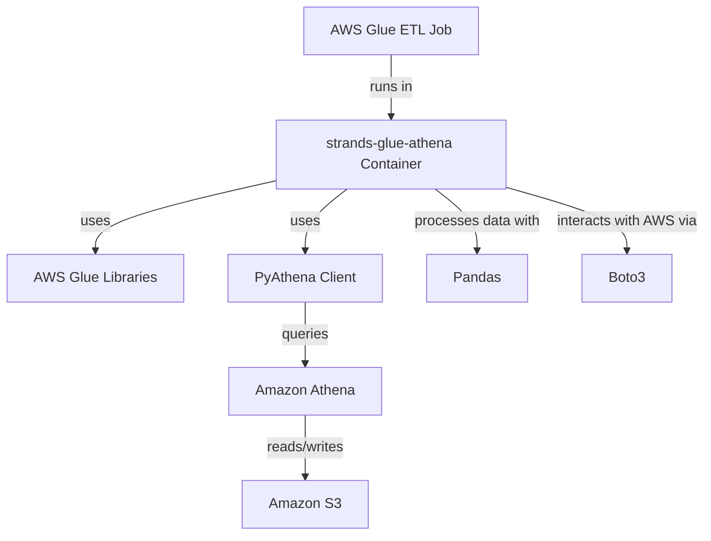
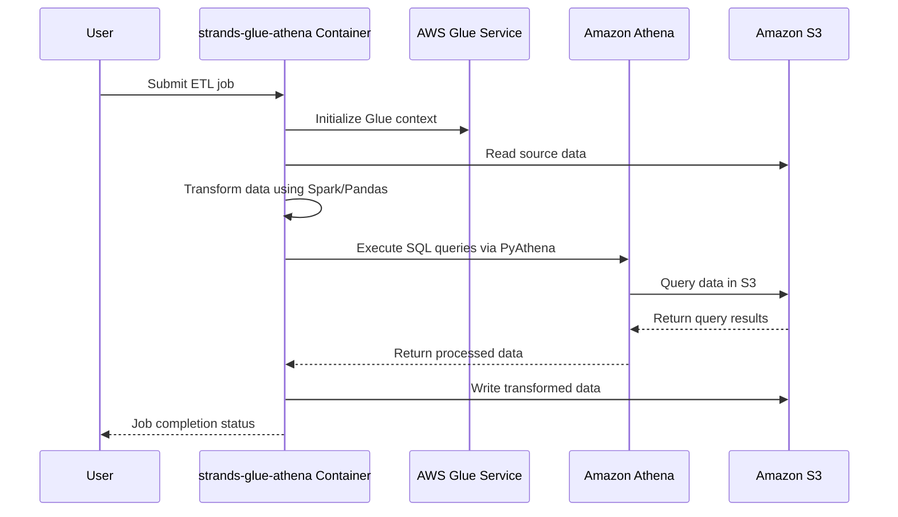

# SUMMARY-docker/strands-glue-athena.md

## Executive Summary

This analysis examines the `docker/strands-glue-athena` folder, which contains a single Dockerfile. The Dockerfile creates a container image designed to run AWS Glue jobs that interact with Amazon Athena. The image is based on Amazon's AWS Glue PySpark image and includes additional configurations and dependencies for Athena connectivity. This container provides a standardized environment for ETL (Extract, Transform, Load) operations that leverage both AWS Glue and Amazon Athena services.

## Implementation Details Breakdown

The Dockerfile in the `strands-glue-athena` folder builds upon the AWS Glue PySpark base image and adds specific configurations for Athena integration. Here's a detailed breakdown of the implementation:

### Base Image Selection
```dockerfile
FROM amazon/aws-glue-libs:glue_libs_4.0.0_image_01
```
- Uses Amazon's official AWS Glue libraries image version 4.0.0
- This base image already includes AWS Glue, Apache Spark, and Python libraries needed for ETL processing

### Environment Configuration
```dockerfile
ENV PYTHONPATH=/home/glue_user/aws-glue-libs/PyGlue.zip:/home/glue_user/spark/python/lib/py4j-0.10.9.5-src.zip:/home/glue_user/spark/python/
```
- Sets the Python path to include necessary libraries for AWS Glue and Spark integration
- Ensures that Python can find the required modules for Glue ETL jobs

### User Setup
```dockerfile
USER root
```
- Switches to the root user to perform privileged operations like installing packages

### Package Installation
```dockerfile
RUN pip3 install boto3 pandas pyathena
```
- Installs three critical Python packages:
  - `boto3`: AWS SDK for Python, enabling interaction with AWS services
  - `pandas`: Data manipulation library for structured data operations
  - `pyathena`: Python client for Amazon Athena, allowing direct query execution

### User Permissions
```dockerfile
RUN chown -R glue_user:glue_user /home/glue_user
USER glue_user
```
- Restores ownership of the home directory to the `glue_user`
- Switches back to the non-privileged `glue_user` for running the container
- This follows security best practices by not running as root

### Working Directory
```dockerfile
WORKDIR /home/glue_user
```
- Sets the default working directory to the glue_user's home directory

## Key Takeaways and Lessons Learned

1. **Integration of AWS Services**: The Dockerfile demonstrates how to create a container that bridges AWS Glue (for ETL processing) with Amazon Athena (for SQL queries on data in S3).

2. **Security Considerations**: The image follows the principle of least privilege by switching to a non-root user after performing necessary setup tasks.

3. **Dependency Management**: The image installs only the essential additional packages needed for Athena integration, keeping the container focused and minimizing bloat.

4. **Standardized Environment**: By containerizing the Glue-Athena integration, the setup ensures consistent execution environments across development, testing, and production.

5. **AWS-Optimized Base Image**: Using Amazon's official Glue image as a base leverages pre-configured optimizations for AWS services.

## Technical Architecture Overview

The container created by this Dockerfile serves as a runtime environment for ETL jobs that need to:
1. Process data using AWS Glue's capabilities
2. Execute SQL queries against data in Amazon S3 via Athena
3. Transform data using Python libraries like pandas



### Sequence Diagram for Typical ETL Flow



## Recommendations or Next Steps

1. **Documentation Enhancement**: Create a README.md file explaining the purpose and usage of this container, including example Glue job scripts that utilize Athena.

2. **Version Pinning**: Consider pinning specific versions of the Python packages (`boto3`, `pandas`, `pyathena`) to ensure reproducible builds.

3. **Health Checks**: Add container health checks to verify the environment is properly configured.

4. **Additional Utilities**: Consider adding common data processing utilities or custom libraries that might be frequently used in Glue-Athena workflows.

5. **CI/CD Integration**: Develop automated build and test processes for this container to ensure it remains compatible with AWS service updates.

6. **Performance Optimization**: Evaluate and configure Spark and JVM parameters for optimal performance with Athena queries, particularly for large datasets.

7. **Logging Configuration**: Add standardized logging configuration to facilitate troubleshooting of ETL jobs.

8. **Security Scanning**: Implement container security scanning as part of the build process to identify potential vulnerabilities.