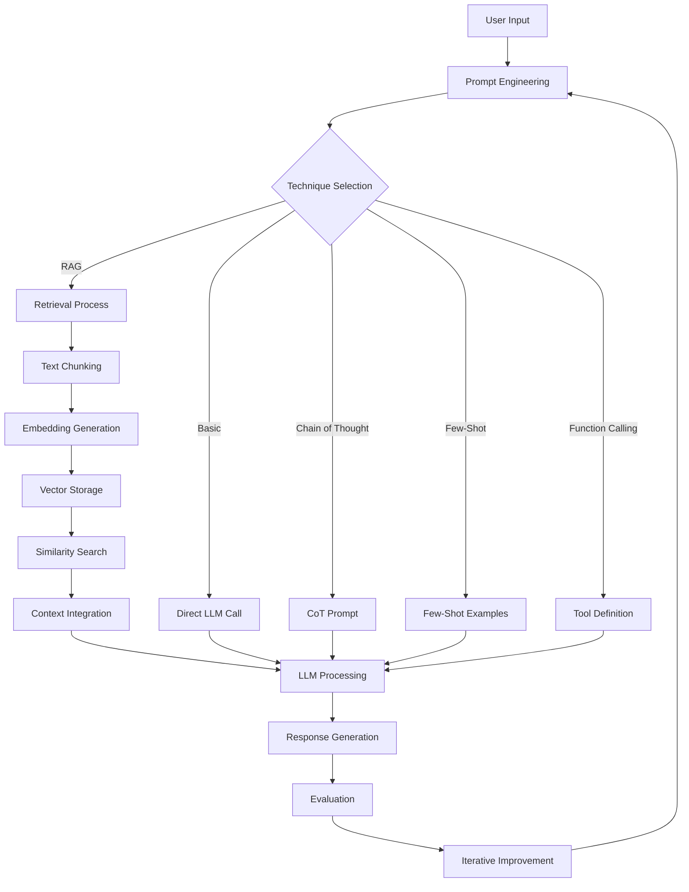
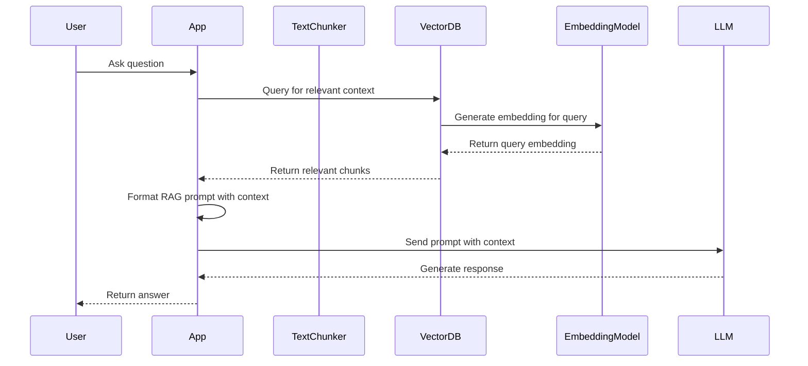
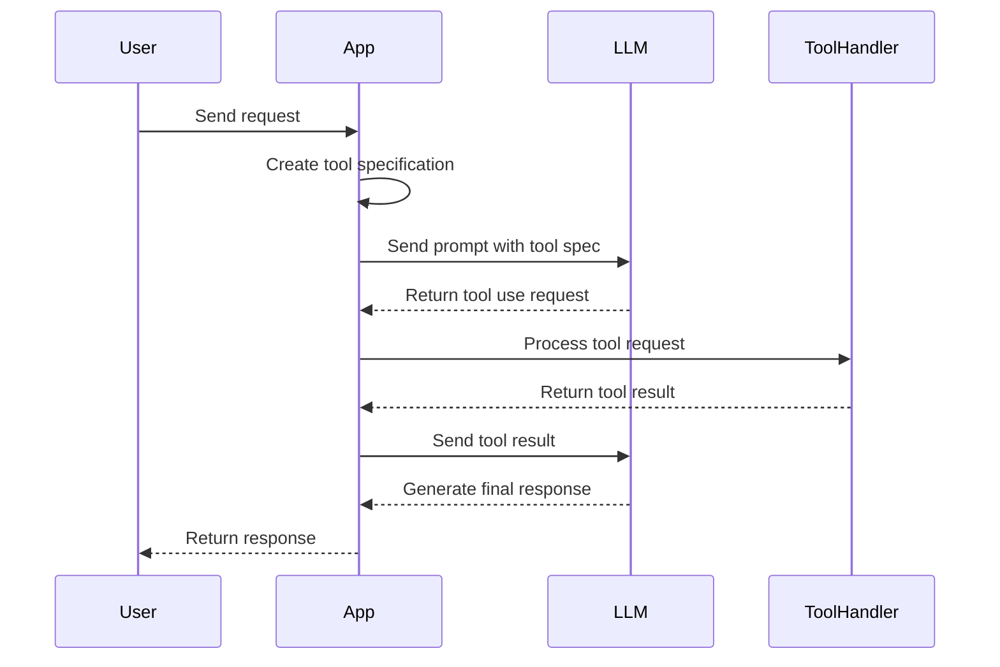

# SUMMARY-labs/module1.md

## Executive Summary

Module 1 of the Amazon Bedrock Workshop focuses on prompt engineering and evaluation techniques for working with Large Language Models (LLMs). The module consists of seven Jupyter notebooks that progressively build upon each other, covering topics from basic model invocation to advanced techniques like Retrieval Augmented Generation (RAG) and function calling. The workshop provides hands-on experience with Amazon Bedrock's Converse API, LangGraph for structured conversation flows, and various prompt engineering strategies to improve model outputs. The module concludes with evaluation techniques to measure and improve prompt effectiveness.

## Implementation Details Breakdown

### 1. Setup and Basics

The first notebook introduces the Amazon Bedrock Converse API, which provides a consistent interface for interacting with different foundation models. Key implementation details include:

```python
# Initialize the Bedrock client
session = boto3.Session()
bedrock = session.client(service_name='bedrock-runtime')

# Basic conversation using Converse API
response = bedrock.converse(
    modelId="us.anthropic.claude-3-5-haiku-20241022-v1:0",
    messages=[{ "role": "user", "content": [{ "text": PROMPT_TEXT }] }],
    inferenceConfig={
        "maxTokens": 2000,
        "temperature": 0
    }
)
```

The response structure includes:
- The model's answer in `output.message`
- Token usage statistics in `usage`
- Performance metrics in `metrics`

### 2. LangGraph Basics

The second notebook introduces LangGraph, a framework for creating stateful, multi-step workflows with LLMs. The implementation creates a simple conversation graph:

```python
from langgraph.graph import START, END, Graph

# Define state type for conversation context
class State(TypedDict):
    messages: List[Dict[str, any]]
    current_message: str

# Create LLM call function
def call_llm(state: State) -> State:
    response = bedrock.converse(
        modelId="us.anthropic.claude-3-5-haiku-20241022-v1:0",
        messages=state["messages"],
        inferenceConfig=inference_config
    )
    state["messages"].append(response['output']['message'])
    return state

# Create and compile the graph
workflow = Graph()
workflow.add_node("llm", call_llm)
workflow.add_edge(START, "llm")
workflow.add_edge("llm", END)
chain = workflow.compile()
```

### 3. Chain of Thought

This notebook implements Chain of Thought (CoT) reasoning, which improves model accuracy by encouraging step-by-step thinking:

```python
SYSTEM_PROMPT = """
You are a helpful assistant that can solve math word problems. 
<instruction>
You think through problems step by step and provide answers.
You place your thinking process in <thinking> tags and your final answer in <response> tags.
</instruction>
"""

# Extract thinking and response sections
thinking = extract_tag_content(model_text, "thinking")
final_answer = extract_tag_content(model_text, "response")
```

### 4. Few-Shot Examples

The fourth notebook demonstrates few-shot learning, where examples are provided to guide the model's responses:

```python
FEW_SHOT_PROMPT = """
Here are some examples of product descriptions in our preferred format:

<examples>
<response>
Product: Blender
Key Features:
1. 1000W motor
2. 6 speed settings
3. 64 oz capacity
Ideal For: Smoothies, soups, sauces
Price Range: $$$
</response>

<response>
Product: Toaster
Key Features:
1. 4 slice capacity
2. Digital controls
3. 7 browning levels
Ideal For: Breakfast, quick meals
Price Range: $$
</response>
</examples>

Now, generate a product description for a coffee maker in the same format and place your response between the <response> tags."
"""
```

### 5. RAG Basics

This notebook implements Retrieval Augmented Generation (RAG) using ChromaDB as a vector database and LlamaIndex for document chunking:

```python
# Create abstraction classes
class RAGChunk(BaseModel):
    id_: str
    text: str
    metadata: Dict[str, Any] = {}

class TextChunker:
    def __init__(self, chunk_size: int = 256, chunk_overlap: int = 20):
        self.chunk_size = chunk_size
        self.chunk_overlap = chunk_overlap
        self.splitter = SentenceSplitter(chunk_size=chunk_size, chunk_overlap=chunk_overlap)
    
    def chunk_text(self, text: str, metadata: Dict = None) -> List[RAGChunk]:
        # Implementation details...

class ChromaDBWrapperClient:
    def __init__(self, chroma_client, collection_name: str, embedding_function: Optional[EmbeddingFunction] = None):
        # Implementation details...
    
    def add_chunks_to_collection(self, chunks: List[RAGChunk]):
        # Implementation details...
        
    def retrieve(self, query_text: str, n_results: int = 1) -> List[RetrievalResult]:
        # Implementation details...

# RAG prompt template
RAG_PROMPT_TEMPLATE: str = """
Using the context below, answer the question.

<context>
{context}
</context>

<question>
{question}
</question>

Remember, if the context doesn't contain the answer, say "I don't know".
"""

# RAG function
def do_rag(input_question: str) -> str:
    retrieval_results = coffee_vector_store.retrieve(input_question)
    context = "\n\n".join([result.document for result in retrieval_results])
    rag_prompt = RAG_PROMPT_TEMPLATE.format(question=input_question, context=context)
    return call_bedrock(rag_prompt)
```

### 6. Function Calling

This notebook demonstrates function calling (tool use) to get structured outputs from LLMs:

```python
# Define tool specification
tool_list = [
    {
        "toolSpec": {
            "name": "calculate",
            "description": "Perform a mathematical calculation.",
            "inputSchema": {
                "json": {
                    "type": "object",
                    "properties": {
                        "operation": {
                            "type": "string",
                            "enum": ["add", "subtract", "multiply", "divide"],
                            "description": "The mathematical operation to perform"
                        },
                        "x": {
                            "type": "number",
                            "description": "First number"
                        },
                        "y": {
                            "type": "number",
                            "description": "Second number"
                        }
                    },
                    "required": ["operation", "x", "y"]
                }
            }
        }
    }
]

# Function to handle calculation requests
def handle_calculation(tool_use):
    input_data = tool_use['input']
    x = input_data['x']
    y = input_data['y']
    
    if input_data['operation'] == 'add':
        result = x + y
    # Other operations...
    
    return {
        "toolResult": {
            "toolUseId": tool_use['toolUseId'],
            "content": [{"json": {"result": result}}]
        }
    }
```

### 7. Evaluation

The final notebook covers evaluation techniques, particularly LLM-As-A-Judge:

```python
# Evaluation prompt template
EVALUATION_PROMPT_TEMPLATE = """
Please evaluate the following response using a decimal scoring system.

<question>
{question}
</question>

<context>
{context}
</context>

<generated_response>
{generated_response}
</generated_response>

<gold_standard>
{gold_standard}
</gold_standard>

Evaluation Criteria:
Each criterion is scored on a scale from 0.0 to 1.0 using ONE decimal place only (e.g., 0.7, not 0.75):

1. Context Utilization (0.0-1.0): How well does the response use the information and follow constraints in the context?
2. Completeness (0.0-1.0): How thoroughly does the response address all aspects of the question?
3. Conciseness (0.0-1.0): Is the response appropriately concise without unnecessary information?
4. Accuracy (0.0-1.0): How factually correct is the information in the response?
5. Clarity (0.0-1.0): How clear, well-organized, and easy to understand is the response?

# Additional instructions...
"""

# Evaluation metrics
class RubricValidator:
    def __init__(self, df):
        self.df = df
        self.human_scores = self.convert_to_float(df['human_grade'])
        self.llm_scores = self.convert_to_float(df['ai_grade'])

    def calculate_metrics(self):
        mse = mean_squared_error(self.human_scores, self.llm_scores)
        rmse = np.sqrt(mse)
        mae = mean_absolute_error(self.human_scores, self.llm_scores)
        r2 = r2_score(self.human_scores, self.llm_scores)
        
        exact_match = np.mean(self.human_scores == self.llm_scores)
        within_1_point = np.mean(np.abs(self.human_scores - self.llm_scores) <= 1)

        return {
            'MSE': mse,
            'RMSE': rmse,
            'MAE': mae,
            'R-squared': r2,
            'Exact Match Ratio': exact_match,
            'Within 1 Point Ratio': within_1_point
        }
```

## Key Takeaways and Lessons Learned

1. **Structured Prompting**: Using XML tags and structured formats significantly improves the consistency and quality of LLM responses.

2. **Chain of Thought**: Encouraging models to show their reasoning process leads to more accurate results for complex problems.

3. **Few-Shot Learning**: Providing examples is more effective than complex instructions for guiding model behavior.

4. **Abstraction Layers**: Creating abstraction layers around frameworks like LlamaIndex and ChromaDB makes code more maintainable and flexible.

5. **RAG Architecture**: Combining retrieval with generation produces more accurate and factual responses by grounding the model in external knowledge.

6. **Function Calling**: Using function calling allows for structured outputs that can be easily integrated into applications.

7. **Evaluation**: Systematic evaluation using LLM-As-A-Judge provides a scalable way to measure and improve prompt quality.

8. **Iterative Improvement**: Prompt engineering is an iterative process that requires continuous testing and refinement.

## Technical Architecture Overview



### RAG Architecture Sequence Diagram



### Function Calling Sequence Diagram



## Recommendations or Next Steps

1. **Prompt Template Library**: Create a reusable library of prompt templates for common tasks to standardize interactions across applications.

2. **Evaluation Framework**: Implement a comprehensive evaluation framework that combines automated metrics with human feedback.

3. **Advanced RAG Techniques**: Explore more sophisticated RAG approaches like hybrid search, re-ranking, and multi-hop retrieval.

4. **Prompt Optimization**: Use techniques like prompt optimization and automated prompt engineering to systematically improve prompts.

5. **Production Deployment**: Move from local vector databases to managed services like Amazon Bedrock Knowledge Bases for production use.

6. **Monitoring System**: Implement a monitoring system to track model performance and detect drift in production.

7. **Guardrails**: Add guardrails and safety measures to prevent harmful or inappropriate outputs.

8. **Multi-Modal Integration**: Extend the techniques to handle multi-modal inputs and outputs (text, images, etc.).

9. **Cost Optimization**: Implement strategies to reduce token usage and optimize for cost-effectiveness.

10. **Explore Agents**: Build on these foundations to create more complex agent-based systems that can perform multi-step tasks.

## Token Utilization Summary

- **Prompt Length**: 70172 characters
- **Estimated Token Count**: ~17543 tokens
- **Context Window Utilization**: ~8.8% of 200K token context window


---

*This summary was generated by Claude 3.7 Sonnet from Anthropic on 2025-07-06 at 21:27:38.*