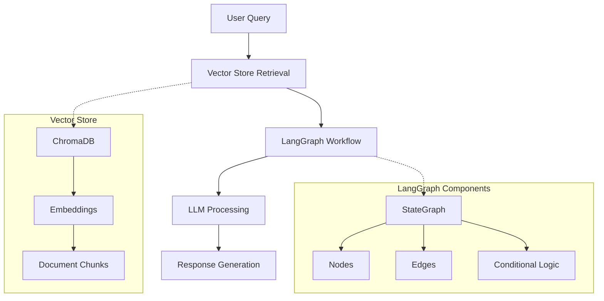
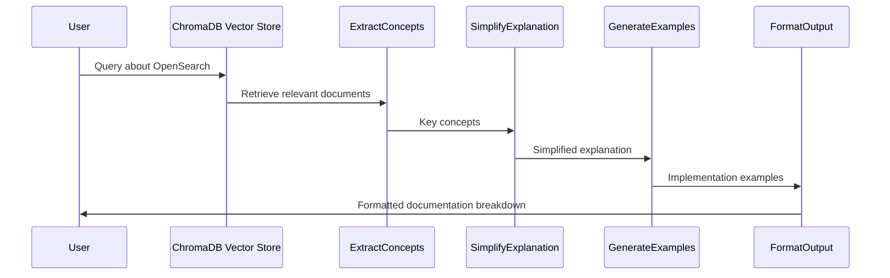
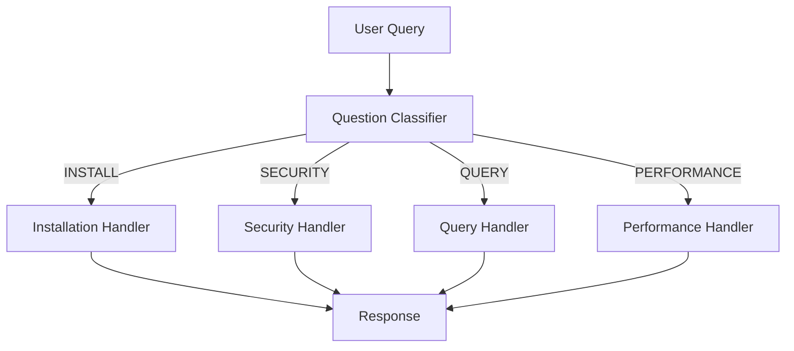
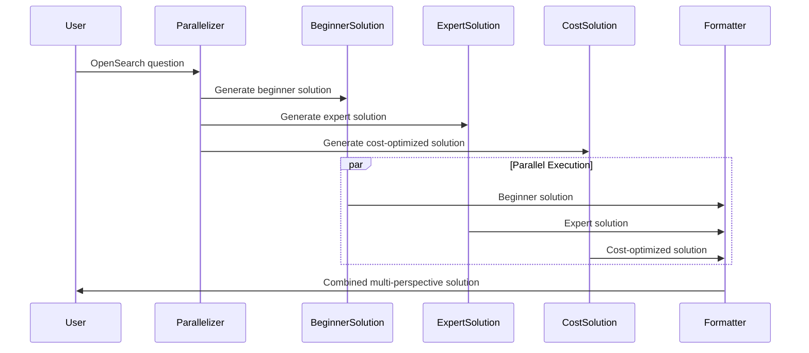
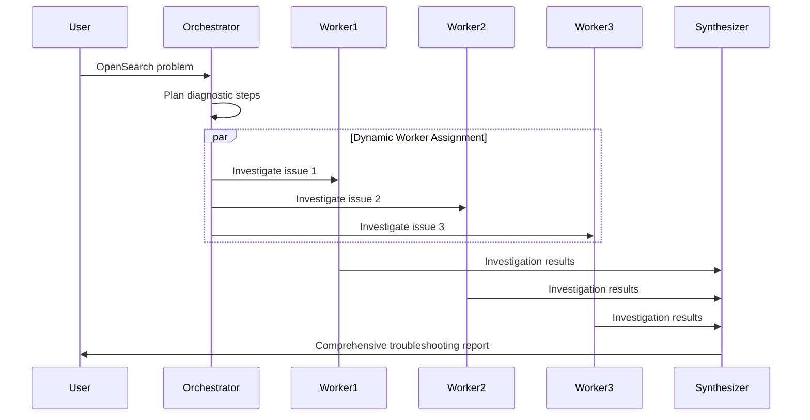
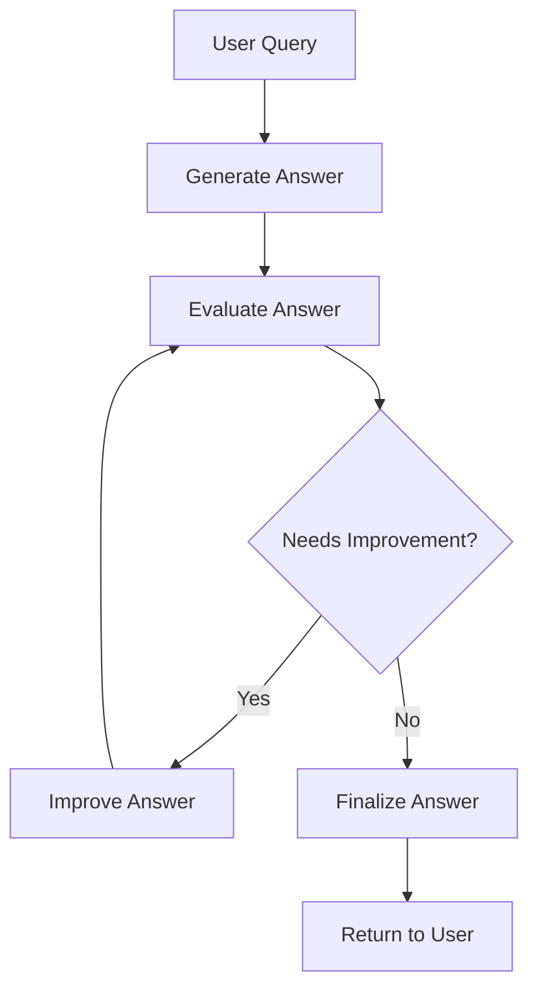

# SUMMARY-labs/module2.md

## Executive Summary

Module 2 of the Amazon Bedrock Workshop focuses on implementing advanced RAG (Retrieval-Augmented Generation) patterns using LangGraph. The module demonstrates how to orchestrate LLMs through different graph patterns to create more sophisticated and effective AI workflows. The workshop uses OpenSearch documentation as a knowledge base and builds various patterns to answer questions about OpenSearch effectively. The patterns demonstrated include prompt chaining, routing, parallelization, orchestrator-worker patterns, and evaluator-optimizer patterns. Each pattern addresses different needs in AI workflow orchestration and showcases how to implement them using LangGraph.

## Implementation Details Breakdown

### Setup and Data Preparation

The module begins with setting up a ChromaDB vector store for OpenSearch documentation:

1. **Data Collection**: Downloads OpenSearch documentation from GitHub
2. **Data Processing**: Chunks the documentation into manageable pieces using a sentence splitter
3. **Vector Embedding**: Creates embeddings using Amazon Titan Embed Text v2
4. **Storage**: Stores the embeddings in a persistent ChromaDB collection

```python
# Example of the chunking strategy implementation
class SentenceSplitterChunkingStrategy:
    def __init__(self, input_dir: str, chunk_size: int = 256, chunk_overlap: int = 128):
        self.input_dir = input_dir
        self.chunk_size = chunk_size
        self.chunk_overlap = chunk_overlap
        self.pipeline = self._create_pipeline()
        
    def _create_pipeline(self) -> IngestionPipeline:
        transformations = [
            SentenceSplitter(chunk_size=self.chunk_size, chunk_overlap=self.chunk_overlap),
        ]
        return IngestionPipeline(transformations=transformations)
```

### Core Utility Classes

The module implements several utility classes that are reused across different patterns:

1. **BasePrompt**: A Pydantic model for creating and formatting prompts with system and user components
2. **ChromaDBRetrievalClient**: A wrapper around ChromaDB for vector retrieval operations
3. **RetrievalResult**: A Pydantic model for representing retrieval results

```python
class BasePrompt(BaseModel):
    system_prompt: str
    user_prompt: str    
    inputs: Dict[str, Any] = Field(default_factory=dict)
    model_id: str = HAIKU_MODEL_ID
    hyperparams: Dict[str, Any] = Field(default_factory=lambda: {
        "temperature": 0.5,
        "maxTokens": 1000
    })
    
    def format(self, inputs: Dict[str, Any] = None) -> None:
        inputs_to_use = inputs if inputs else self.inputs
        try:
            self.system_prompt = self.system_prompt.format(**inputs_to_use)
            self.user_prompt = self.user_prompt.format(**inputs_to_use)
        except KeyError as e:
            raise KeyError(f'Missing input value: {e}')
```

### Pattern 1: Prompt Chaining

The prompt chaining pattern breaks down complex tasks into sequential steps, where each step builds on the output of the previous one:

1. **Extract Concepts**: Identifies key concepts from OpenSearch documentation
2. **Simplify Explanation**: Explains those concepts in simpler terms
3. **Generate Examples**: Provides practical implementation examples
4. **Format Output**: Combines all information into a well-structured response

```python
def create_prompt_chain_workflow() -> StateGraph:
    workflow = StateGraph(ExplainerState)
    
    workflow.add_node("extract_concepts", extract_concepts)
    workflow.add_node("simplify_explanation", simplify_explanation)
    workflow.add_node("generate_examples", generate_examples)
    workflow.add_node("format_output", format_output)
    
    workflow.add_edge(START, "extract_concepts")
    workflow.add_edge("extract_concepts", "simplify_explanation")
    workflow.add_edge("simplify_explanation", "generate_examples")
    workflow.add_edge("generate_examples", "format_output")
    workflow.add_edge("format_output", END)
    
    return workflow.compile()
```

### Pattern 2: Routing

The routing pattern directs questions to specialized handlers based on their category:

1. **Question Classification**: Categorizes questions into installation, security, querying, or performance
2. **Specialized Handlers**: Each category has a dedicated handler with optimized prompts
3. **Conditional Routing**: Uses LangGraph's conditional edges to direct flow based on classification

```python
def create_routing_workflow() -> StateGraph:
    workflow = StateGraph(WorkflowState)
    
    workflow.add_node("classify", classify_question)
    workflow.add_node("install", handle_installation)
    workflow.add_node("security", handle_security)
    workflow.add_node("query", handle_querying)
    workflow.add_node("performance", handle_performance)
    
    workflow.add_edge(START, "classify")
    
    workflow.add_conditional_edges(
        "classify",
        lambda state: state["category"],
        {
            "INSTALL": "install",
            "SECURITY": "security",
            "QUERY": "query",
            "PERFORMANCE": "performance"
        }
    )
    
    workflow.add_edge("install", END)
    workflow.add_edge("security", END)
    workflow.add_edge("query", END)
    workflow.add_edge("performance", END)
    
    return workflow.compile()
```

### Pattern 3: Parallelization

The parallelization pattern runs multiple tasks simultaneously for efficiency:

1. **Parallel Processing**: Generates beginner, expert, and cost-optimized solutions in parallel
2. **Aggregation**: Combines all solutions into a comprehensive response
3. **Synchronization**: Uses LangGraph's edge syntax to wait for all parallel tasks to complete

```python
def create_parallel_workflow() -> StateGraph:
    workflow = StateGraph(WorkflowState)
    
    workflow.add_node("parallelizer", parallel_start)
    workflow.add_node("beginner", generate_beginner_solution)
    workflow.add_node("expert", generate_expert_solution)
    workflow.add_node("cost", generate_cost_solution)
    workflow.add_node("format", format_output)
    
    workflow.add_edge(START, "parallelizer")
    workflow.add_edge("parallelizer", "beginner")
    workflow.add_edge("parallelizer", "expert")
    workflow.add_edge("parallelizer", "cost")
    
    workflow.add_edge(["beginner", "expert", "cost"], "format")
    workflow.add_edge("format", END)
    
    return workflow.compile()
```

### Pattern 4: Orchestrator-Worker

The orchestrator-worker pattern dynamically plans and executes subtasks:

1. **Orchestrator**: Plans diagnostic steps for troubleshooting
2. **Workers**: Investigate specific issues in parallel
3. **Dynamic Task Creation**: Uses LangGraph's Send API to create worker tasks on demand
4. **Result Aggregation**: Combines worker findings into a comprehensive report

```python
def create_troubleshooting_workflow():
    workflow = StateGraph(TroubleshootingState)
    
    workflow.add_node("plan", plan_diagnostics)
    workflow.add_node("investigate_issue", investigate_issue)
    workflow.add_node("synthesize", synthesize_findings)
    
    workflow.add_edge(START, "plan")
    workflow.add_conditional_edges("plan", assign_workers, ["investigate_issue"])
    workflow.add_edge("investigate_issue", "synthesize")
    workflow.add_edge("synthesize", END)
    
    return workflow.compile()
```

### Pattern 5: Evaluator-Optimizer

The evaluator-optimizer pattern continuously improves responses through feedback loops:

1. **Initial Generation**: Creates an initial answer using RAG
2. **Evaluation**: Assesses the answer quality against specific criteria
3. **Decision**: Determines whether improvement is needed
4. **Improvement**: Refines the answer based on evaluation feedback
5. **Iteration**: Repeats the process until quality criteria are met or max iterations reached

```python
def build_evaluator_optimizer_workflow():
    workflow = StateGraph(WorkflowState)

    workflow.add_node("generate", generate_answer)
    workflow.add_node("evaluate", evaluate_answer)
    workflow.add_node("improve", improve_answer)
    workflow.add_node("finalize", finalize_answer)
    
    workflow.add_edge(START, "generate")
    workflow.add_edge("generate", "evaluate")

    decision_map = {
        "IMPROVE": "improve",
        "DONE": "finalize"
    }

    workflow.add_conditional_edges("evaluate", should_improve, decision_map)
    workflow.add_edge("improve", "evaluate")
    workflow.add_edge("finalize", END)
    
    return workflow.compile()
```

## Key Takeaways and Lessons Learned

1. **Modular Design**: LangGraph enables modular workflow design where each node has a clear, focused purpose.

2. **State Management**: Using TypedDict for state management provides type safety and clear structure for workflow data.

3. **Pattern Selection**: Different patterns are suitable for different use cases:
   - Prompt chaining for sequential tasks with clear dependencies
   - Routing for specialized handling of different input types
   - Parallelization for independent subtasks that can run simultaneously
   - Orchestrator-worker for dynamic task planning and execution
   - Evaluator-optimizer for iterative quality improvement

4. **Model Selection**: Different models can be used for different tasks based on their strengths:
   - Claude 3.5 Haiku for most tasks requiring high quality
   - Amazon Nova Micro for faster, less complex tasks in parallel workflows

5. **Reusable Components**: Creating reusable utility classes (BasePrompt, ChromaDBRetrievalClient) enables consistent implementation across patterns.

6. **Testing Strategy**: Each node function can be tested independently before integrating into the workflow graph.

7. **Visualization**: LangGraph provides built-in visualization tools to understand workflow structure and execution paths.

## Technical Architecture Overview

### Overall Architecture



### Prompt Chaining Pattern



### Routing Pattern



### Parallelization Pattern



### Orchestrator-Worker Pattern



### Evaluator-Optimizer Pattern



## Recommendations and Next Steps

1. **Performance Optimization**:
   - Consider using smaller, faster models like Nova Micro for tasks that don't require high reasoning capabilities
   - Implement caching for common queries to reduce latency and costs

2. **Error Handling**:
   - Add robust error handling for API failures and unexpected inputs
   - Implement fallback strategies when specific nodes fail

3. **Evaluation Metrics**:
   - Develop quantitative metrics to measure the effectiveness of each pattern
   - Compare patterns against baseline approaches to quantify improvements

4. **Pattern Combinations**:
   - Explore combining multiple patterns, such as routing + parallelization or orchestrator + evaluator-optimizer
   - Create hybrid workflows that leverage the strengths of each pattern

5. **Production Readiness**:
   - Add logging and monitoring to track workflow execution
   - Implement rate limiting and throttling for API calls
   - Consider containerization for deployment

6. **User Experience**:
   - Add progress indicators for long-running workflows
   - Implement streaming responses for faster perceived performance
   - Provide explanations of the workflow process to users

7. **Knowledge Base Expansion**:
   - Expand beyond OpenSearch documentation to include community forums, Stack Overflow, and other sources
   - Implement regular updates to keep the knowledge base current

8. **Advanced Techniques**:
   - Explore reinforcement learning from human feedback (RLHF) to improve pattern effectiveness
   - Implement adaptive workflows that change patterns based on query complexity or user feedback

By implementing these advanced RAG patterns with LangGraph, developers can create more sophisticated, effective, and efficient AI applications that better serve user needs while making optimal use of LLM capabilities.

## Token Utilization Summary

- **Prompt Length**: 76951 characters
- **Estimated Token Count**: ~19237 tokens
- **Context Window Utilization**: ~9.6% of 200K token context window


---

*This summary was generated by Claude 3.7 Sonnet from Anthropic on 2025-07-06 at 21:47:09.*