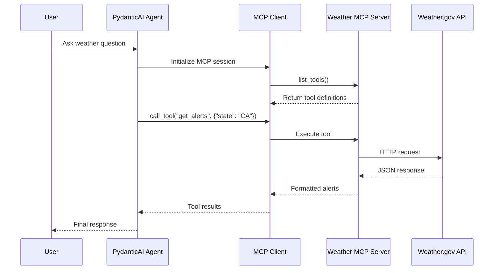
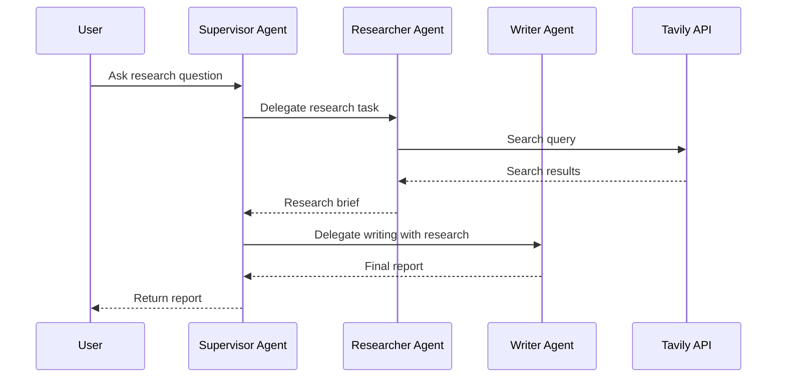
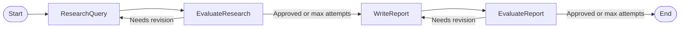
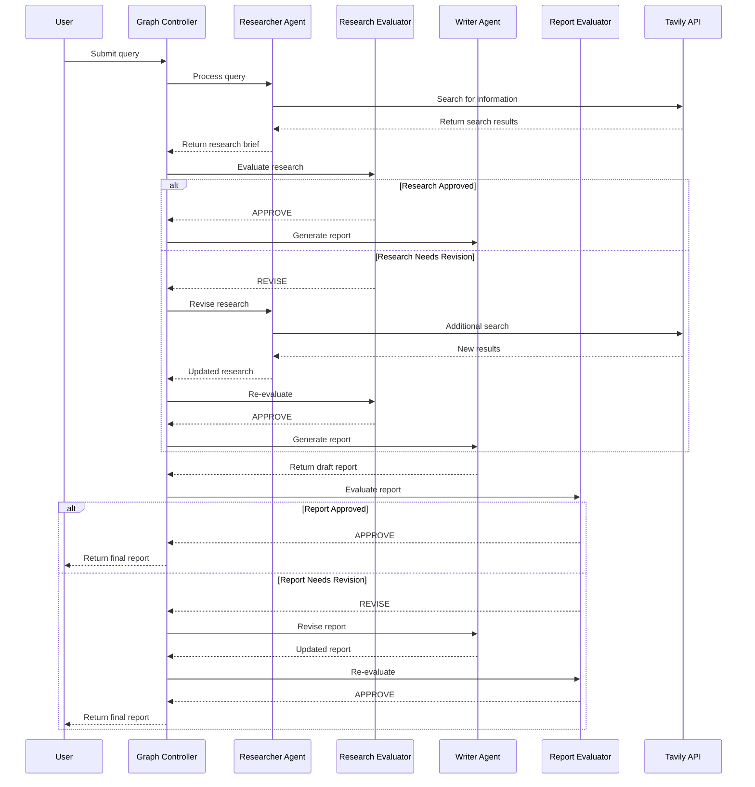

# SUMMARY-labs/module4.md

## Executive Summary

Module 4 of the Amazon Bedrock Workshop focuses on advanced agent features, specifically exploring Model Context Protocol (MCP) and multi-agent systems. The module demonstrates how to create MCP-compatible tool servers, connect agents to multiple MCP servers, and build collaborative multi-agent systems using different orchestration patterns. The labs showcase practical implementations of these concepts through weather data retrieval, research agents, and report generation systems.

The module consists of four main notebooks that progressively build on each other:
1. Setup for advanced agent concepts
2. Model Context Protocol (MCP) implementation
3. Multi-agent delegation using the supervisor pattern
4. Multi-agent orchestration using graph-based workflows

## Implementation Details Breakdown

### 1. Model Context Protocol (MCP)

MCP is an open protocol released by Anthropic that standardizes how applications provide context to LLMs. It creates a unified interface for LLMs to access external data and functionality.

**Key Implementation Components:**

- **MCP Server**: The `WeatherToolServer` class implements an MCP server with two tools:
  - `get_alerts`: Retrieves weather alerts for a US state
  - `get_forecast`: Gets weather forecast for a specific location

```python
class WeatherToolServer:
    def __init__(self, name="weather"):
        self.mcp = FastMCP(name)
        self.API_BASE = "https://api.weather.gov"
        self._register_tools()
    
    def _register_tools(self):
        @self.mcp.tool()
        def get_alerts(state: str) -> str:
            # Implementation...
            
        @self.mcp.tool()
        def get_forecast(latitude: float, longitude: float) -> str:
            # Implementation...
```

- **MCP Client**: The implementation demonstrates connecting to the MCP server using both direct SDK calls and through PydanticAI:

```python
# Direct SDK connection
async with stdio_client(server_params) as (read, write):
    async with ClientSession(read, write) as session:
        await session.initialize()
        tools: ListToolsResult = await session.list_tools()

# PydanticAI integration
custom_weather_mcp_server = PyAIMCPServerStdio(  
    command = 'uv',
    args=['run', 'mcp', 'run', weather_server_path]
)

weather_agent: PyAIAgent = PyAIAgent(
    'bedrock:us.anthropic.claude-3-5-haiku-20241022-v1:0',
    system_prompt='You are a helpful assistant.',
    mcp_servers=[custom_weather_mcp_server]
)
```

### 2. Multi-Agent Delegation (Supervisor Pattern)

This implementation demonstrates how to create a system where one agent (supervisor) coordinates the work of specialized agents.

**Key Components:**

- **Researcher Agent**: Searches the web using Tavily API and organizes findings
- **Writer Agent**: Transforms research into comprehensive reports
- **Supervisor Agent**: Coordinates between the researcher and writer agents

```python
@supervisor_agent.tool
async def research_agent_tool(ctx: RunContext[None]) -> str:
    '''Useful for researching a topic using the internet'''
    results = await research_agent.run(  
        research_prompt.user_prompt,
        usage=ctx.usage,  
    )
    return results.output 

@supervisor_agent.tool
async def writer_agent_tool(ctx: RunContext[None], research_brief: str) -> str:
    '''Useful for writing a report on a research topic provided the research is done.'''
    prompt = f'write a report on the following research brief: {research_brief}'
    results = await writer_agent.run(
        prompt,
        usage=ctx.usage,  
    )
    return results.output
```

### 3. Multi-Agent Graph Orchestration

This implementation improves upon the supervisor pattern by using a graph-based approach for more controlled agent interactions.

**Key Components:**

- **Pydantic Graph**: Defines a workflow with nodes representing different stages
- **Evaluator Nodes**: Replace the supervisor with specialized evaluation steps
- **State Management**: Tracks workflow state and handles transitions

```python
@dataclass
class ResearchFlowState:
    user_query: str
    research_results: str = ""
    research_feedback: str = ""
    final_report: str = ""
    report_feedback: str = ""
    attempts: int = 0
    max_attempts: int = 3

@dataclass
class ResearchQuery(BaseNode[ResearchFlowState]):
    """Processes user query through Research Agent"""
    async def run(self, ctx: GraphRunContext[ResearchFlowState]) -> EvaluateResearch:
        # Implementation...

@dataclass
class EvaluateResearch(BaseNode[ResearchFlowState]):
    """Evaluates research quality using direct LLM call"""
    async def run(self, ctx: GraphRunContext[ResearchFlowState]) -> WriteReport | ResearchQuery:
        # Implementation...
```

## Key Takeaways and Lessons Learned

1. **MCP Standardization**: MCP provides a standardized way for LLMs to interact with tools and data sources, making AI applications more modular and interoperable.

2. **Agent Specialization**: Specialized agents perform better at specific tasks than a single agent trying to do everything.

3. **Orchestration Patterns**:
   - **Supervisor Pattern**: Simple but less efficient, with one agent coordinating others
   - **Graph-based Pattern**: More flexible and controlled, allowing for complex workflows

4. **Not Everything Needs to Be an Agent**: The evaluation components in the graph implementation demonstrate that sometimes a structured prompt with direct LLM calls is more efficient than a full agent.

5. **Framework Interoperability**: The module demonstrates how different frameworks (PydanticAI, MCP) can work together in a cohesive system.

6. **State Management**: The graph implementation shows how to effectively manage state across multiple agent interactions.

## Technical Architecture Overview

### MCP Implementation Architecture



### Multi-Agent Delegation Architecture



### Multi-Agent Graph Architecture



### Research Process Sequence



## Recommendations and Next Steps

1. **Production Deployment Considerations**:
   - Implement proper error handling and retry mechanisms
   - Add monitoring and observability for agent interactions
   - Consider rate limiting and cost management for API calls

2. **Architecture Improvements**:
   - Implement reference passing between agents for more efficient information sharing
   - Add caching for research results to avoid redundant API calls
   - Consider asynchronous processing for long-running research tasks

3. **Framework Selection**:
   - Choose between supervisor pattern and graph-based orchestration based on complexity needs
   - For simple workflows, the supervisor pattern may be sufficient
   - For complex workflows with many decision points, graph-based approaches provide better control

4. **MCP Integration**:
   - Explore third-party MCP servers for additional functionality
   - Consider creating a registry of MCP servers for dynamic tool discovery
   - Implement authentication and authorization for MCP servers in production

5. **Evaluation Refinement**:
   - Develop more sophisticated evaluation criteria for research quality
   - Implement user feedback loops to improve agent performance over time
   - Consider human-in-the-loop approaches for critical evaluations

6. **Scaling Considerations**:
   - Implement connection pooling for MCP servers
   - Consider containerization for deploying MCP servers
   - Explore serverless options for cost-effective scaling

By following these recommendations, you can build more robust, efficient, and scalable multi-agent systems using Amazon Bedrock and the MCP protocol.

## Token Utilization Summary

- **Prompt Length**: 52642 characters
- **Estimated Token Count**: ~13160 tokens
- **Context Window Utilization**: ~6.6% of 200K token context window


---

*This summary was generated by Claude 3.7 Sonnet from Anthropic on 2025-07-06 at 21:48:52.*