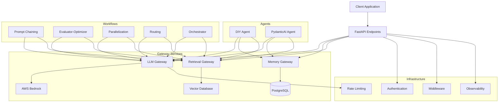
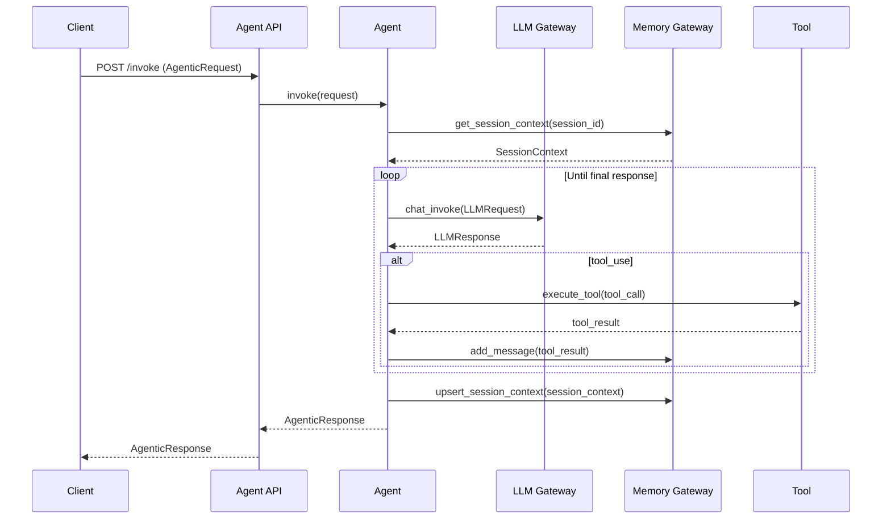
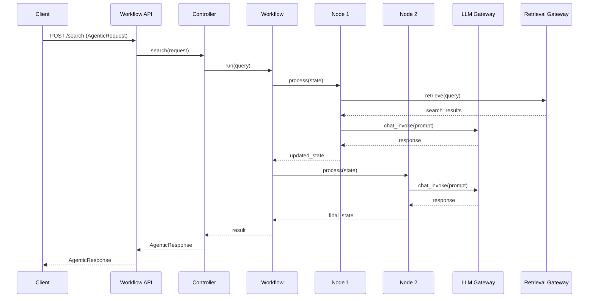

# SUMMARY-src.md

## Executive Summary

The codebase represents a comprehensive agentic platform built on AWS Bedrock, designed to create, deploy, and manage AI agents and workflows. The architecture follows a microservices approach with several key components:

1. **Core Services**: Gateway services for LLM interactions, memory management, and retrieval
2. **Agent Implementations**: DIY and PydanticAI-based agents with tool integration
3. **Workflow Patterns**: Various LangGraph-based workflow implementations (chaining, routing, parallelization, etc.)
4. **Infrastructure**: Authentication, middleware, observability, and database integration

The platform provides a unified interface for building AI applications while abstracting away the complexity of working directly with foundation models. It demonstrates several advanced patterns for AI application development including RAG (Retrieval Augmented Generation), tool use, memory persistence, and complex workflow orchestration.

## Implementation Details Breakdown

### Core Architecture

The platform is built around several gateway services that provide abstracted interfaces to underlying capabilities:

1. **LLM Gateway**: Provides a unified interface to Bedrock models with rate limiting and usage tracking
2. **Memory Gateway**: Manages conversation history and persistent memory using PostgreSQL
3. **Retrieval Gateway**: Handles vector search operations for knowledge retrieval

These gateways are accessed through client libraries that handle authentication, request formatting, and error handling.

### Agent Implementations

Two primary agent implementations are provided:

1. **DIY Agent**: A custom-built agent that handles tool use, memory management, and conversation flow
   ```python
   class DIYAgent:
       def __init__(self, tools: List[Callable]):
           self.tools: List[ToolSpec] = [tool_spec(t) for t in tools]
           self.conversation: SessionContext = SessionContext()
           self.prompt: BasePrompt = DIYAgentPrompt()
           
       def invoke(self, request: AgenticRequest) -> AgenticResponse:
           # Get or create conversation
           # Add user message
           # Call LLM until final response
           # Execute tools if needed
           # Save conversation
           # Return response
   ```

2. **PydanticAI Agent**: Integrates with the PydanticAI framework for agent functionality
   ```python
   class PyAIAgent:
       def __init__(self, tools: List[Callable]):
           self.conversation: SessionContext = SessionContext()
           # Configure PydanticAI agent with Bedrock
           self.agent: Agent = Agent(
               model=model,
               system_prompt='You are a helpful assistant.',
           )
           # Add tools
           [self.agent.tool_plain(func) for func in tools]
   ```

### Workflow Patterns

The platform implements several LangGraph-based workflow patterns:

1. **Prompt Chaining**: Sequential execution of specialized prompts
2. **Evaluator-Optimizer**: Generate, evaluate, and improve solutions iteratively
3. **Parallelization**: Execute multiple tasks concurrently
4. **Routing**: Direct requests to specialized handlers
5. **Orchestrator**: Coordinate complex multi-step workflows

Example of a workflow definition:
```python
def _build_workflow(self):
    workflow = StateGraph(WorkflowState)
    
    # Add nodes to the graph
    workflow.add_node("extract_concepts", extract_concepts)
    workflow.add_node("simplify_explanation", simplify_explanation)
    workflow.add_node("generate_examples", generate_examples)
    workflow.add_node("format_output", format_output)
    
    # Define the workflow edges
    workflow.add_edge(START, "extract_concepts")
    workflow.add_edge("extract_concepts", "simplify_explanation")
    workflow.add_edge("simplify_explanation", "generate_examples")
    workflow.add_edge("generate_examples", "format_output")
    workflow.add_edge("format_output", END)
    
    return workflow.compile()
```

### Infrastructure Components

1. **Authentication**: JWT-based authentication with Cognito integration
2. **Middleware**: Request context, path transformation, telemetry
3. **Database**: PostgreSQL with pgvector for vector storage
4. **Observability**: OpenTelemetry integration for tracing, metrics, and logging
5. **Rate Limiting**: Redis-based rate limiting for API usage

### Tools Integration

The platform includes a tool specification system that converts Python functions to LLM-compatible tools:

```python
@tool_spec
def retrieve_and_answer(input_data: RAGInput) -> str:
    """Search the knowledge base for relevant information based on a query."""
    # Perform search
    # Process results
    # Return answer
```

Tools include:
- Calculator
- Weather reporting
- Knowledge retrieval

## Key Takeaways and Lessons Learned

1. **Abstraction Layers**: The platform uses multiple abstraction layers to separate concerns:
   - Models layer for data structures
   - Client layer for service communication
   - Controller layer for business logic
   - API layer for external interfaces

2. **Standardized Patterns**: Common patterns are standardized across the codebase:
   - Request/response models
   - Error handling
   - Authentication
   - Middleware configuration

3. **Flexibility Through Composition**: The platform achieves flexibility through composition:
   - Tools can be composed into agents
   - Nodes can be composed into workflows
   - Services can be composed into applications

4. **Observability First**: The platform integrates observability from the ground up:
   - Request context tracking
   - Telemetry middleware
   - Unified logging, metrics, and tracing

5. **Security Integration**: Authentication and authorization are integrated throughout:
   - Token verification
   - Context-based access
   - Service-to-service authentication

## Technical Architecture Overview



### Agent Request/Response Flow



### Workflow Execution Flow



## Recommendations and Next Steps

1. **Enhanced Testing**: Implement comprehensive unit and integration tests for all components.

2. **Deployment Automation**: Create CI/CD pipelines for automated testing and deployment.

3. **Monitoring and Alerting**: Set up monitoring dashboards and alerting for key metrics:
   - LLM latency and error rates
   - Memory usage and database performance
   - Rate limit utilization

4. **Scalability Improvements**:
   - Implement caching for frequently accessed data
   - Add horizontal scaling for gateway services
   - Optimize database queries and indexing

5. **Feature Enhancements**:
   - Add support for streaming responses
   - Implement fine-tuning capabilities
   - Expand the tool ecosystem
   - Add support for multi-modal inputs and outputs

6. **Documentation**:
   - Create comprehensive API documentation
   - Add usage examples and tutorials
   - Document deployment and configuration options

7. **Security Enhancements**:
   - Implement content filtering
   - Add input validation and sanitization
   - Conduct security audits and penetration testing

8. **Cost Optimization**:
   - Implement token usage optimization strategies
   - Add cost allocation tracking
   - Create usage dashboards and reporting

The platform provides a solid foundation for building AI applications with AWS Bedrock, with a focus on modularity, extensibility, and best practices in software engineering.

## Token Utilization Summary

- **Prompt Length**: 258243 characters
- **Estimated Token Count**: ~64560 tokens
- **Context Window Utilization**: ~32.3% of 200K token context window


---

*This summary was generated by Claude 3.7 Sonnet from Anthropic on 2025-07-06 at 22:36:46.*