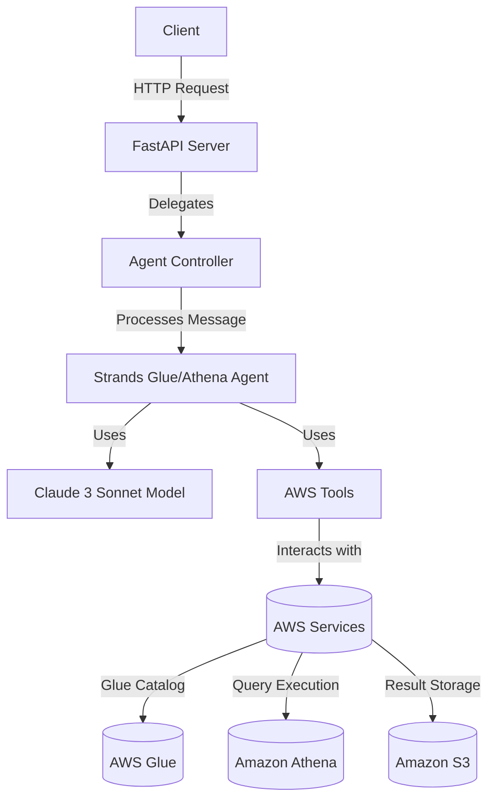
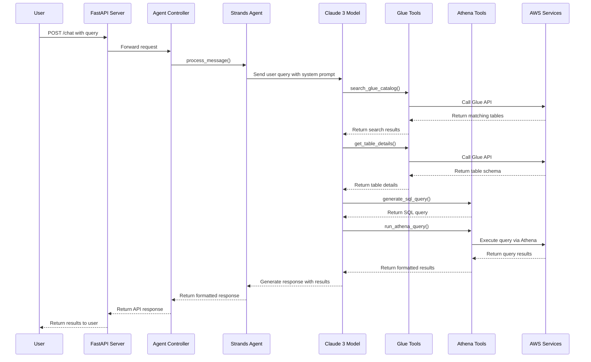
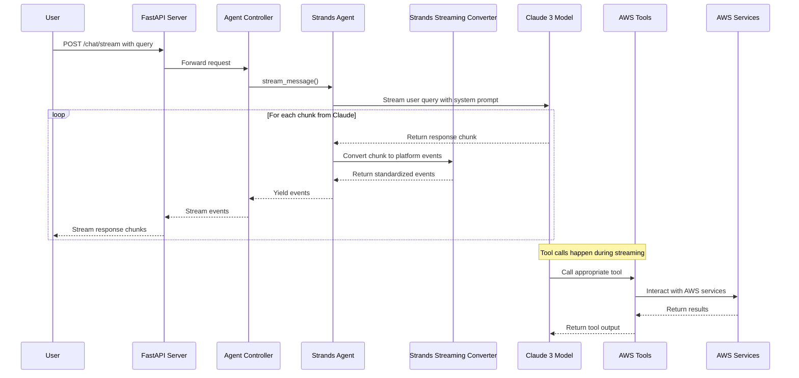

# SUMMARY-src/agentic_platform/agent/strands_glue_athena.md

## Executive Summary

The Strands Glue/Athena agent is a specialized AI assistant that helps users discover and query data stored in AWS. It leverages Amazon Bedrock's Claude model through the Strands framework to provide a natural language interface for interacting with AWS Glue data catalogs and executing Athena queries. The agent allows users to search for tables, explore their structure, and run SQL queries against them without needing to write complex SQL or understand the underlying data architecture.

The implementation follows a clean architecture with separation of concerns between the API layer (server), controller logic, agent service, and specialized AWS tools. The agent is equipped with eight tools that enable it to search the Glue catalog, retrieve table details, list databases and tables, run Athena queries, generate SQL from natural language, and manage query executions.

## Implementation Details Breakdown

### Core Components

1. **Server Layer (`server.py`)**
   - Implements a FastAPI application with endpoints for chat, streaming chat, and health checks
   - Handles HTTP requests and delegates processing to the controller
   - Includes middleware for configuration and error handling

2. **Controller Layer (`agent_controller.py`)**
   - Abstracts the Strands-specific implementation from the rest of the system
   - Processes incoming requests and formats responses according to the platform's standard
   - Handles both synchronous and streaming interactions

3. **Service Layer (`agent_service.py`)**
   - Initializes and manages the Strands Agent with the Claude model
   - Configures the agent with the system prompt and available tools
   - Processes messages and handles streaming responses

4. **AWS Tools**
   - **Glue Tools (`glue_tools.py`)**: Functions for interacting with AWS Glue catalog
   - **Athena Tools (`athena_tools.py`)**: Functions for running and managing Athena queries

### Key Features

1. **Natural Language Table Search**
   - Uses fuzzy matching to find relevant tables based on names, columns, and descriptions
   - Scores and ranks results by relevance

2. **SQL Generation**
   - Converts natural language queries into SQL statements
   - Handles basic query patterns like "select all", "count", and filtered queries

3. **Query Execution and Results Retrieval**
   - Executes SQL queries against Athena
   - Manages asynchronous query execution with configurable wait times
   - Formats results into structured data for easy consumption

4. **Streaming Responses**
   - Supports streaming responses for better user experience
   - Converts Strands streaming format to the platform's standard event format

## Key Takeaways and Lessons Learned

1. **Separation of Concerns**
   - The codebase demonstrates clean separation between API handling, business logic, and AWS interactions
   - This makes the code more maintainable and testable

2. **Framework Abstraction**
   - The controller layer abstracts away Strands-specific details, allowing for potential future framework changes
   - Provides "2-way" compatibility between different frameworks

3. **Tool-based Architecture**
   - Breaking functionality into discrete tools allows the LLM to choose the appropriate action
   - Each tool has a clear purpose and well-defined inputs/outputs

4. **Error Handling**
   - Comprehensive error handling at multiple levels ensures robustness
   - Errors are captured, formatted, and returned in a user-friendly manner

5. **Streaming Support**
   - The implementation handles both synchronous and streaming interactions
   - Streaming provides a more responsive user experience for longer queries

## Technical Architecture Overview

### Sequence Diagram for Query Flow

### Streaming Response Flow

## Recommendations or Next Steps

1. **Enhanced Error Handling and Retries**
   - Implement more sophisticated retry mechanisms for AWS API calls
   - Add circuit breakers for improved resilience

2. **Performance Optimization**
   - Add caching for frequently accessed Glue catalog information
   - Implement pagination controls for large result sets

3. **Security Enhancements**
   - Add more granular IAM permissions for the agent role
   - Implement data access controls based on user identity

4. **User Experience Improvements**
   - Add support for query history and saved queries
   - Implement visualization capabilities for query results

5. **Advanced SQL Generation**
   - Enhance the SQL generation capability to handle more complex queries
   - Add support for joins, aggregations, and window functions

6. **Testing and Monitoring**
   - Add comprehensive unit and integration tests
   - Implement monitoring for query performance and error rates

7. **Multi-User Support**
   - Add user context to enable personalized experiences
   - Implement user-specific query history and preferences

8. **Documentation**
   - Create user documentation with example queries
   - Add developer documentation for extending the agent's capabilities

## Token Utilization Summary

- **Prompt Length**: 34690 characters
- **Estimated Token Count**: ~8672 tokens
- **Context Window Utilization**: ~4.3% of 200K token context window

---

*This summary was generated by Claude 3.7 Sonnet from Anthropic on 2025-08-18 at 13:41:48.*