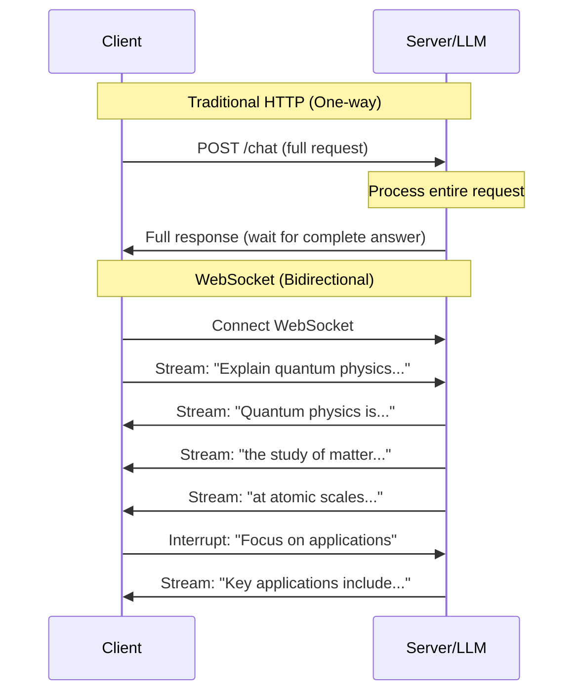
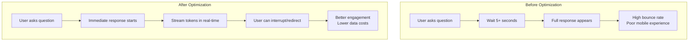

Great question! Let me explain each streaming optimization with practical examples, especially relevant for **real-time LLM agent interactions**.

## **1. WebSocket Support for Bidirectional Communication**

### **Traditional HTTP vs WebSocket**



### **Before: Traditional HTTP Streaming**
```python
# Client waits for complete response
import requests

def traditional_chat():
    response = requests.post('/api/chat', json={
        "message": "Write a long essay about AI"
    })
    
    # User waits 30+ seconds for complete response
    full_response = response.json()['message']
    print(full_response)  # Everything appears at once
```

### **After: WebSocket Bidirectional Streaming**
```python
import asyncio
import websockets
import json

class StreamingLLMClient:
    def __init__(self):
        self.websocket = None
        
    async def connect(self):
        self.websocket = await websockets.connect("ws://llm-agent:8080/stream")
        
    async def stream_conversation(self):
        # Send message and receive streaming response
        await self.websocket.send(json.dumps({
            "type": "user_message",
            "content": "Write a long essay about AI",
            "stream": True
        }))
        
        async for message in self.websocket:
            data = json.loads(message)
            
            if data['type'] == 'token':
                # Display tokens as they arrive (like ChatGPT)
                print(data['content'], end='', flush=True)
                
            elif data['type'] == 'thinking':
                # Show agent's reasoning process
                print(f"\n[Agent thinking: {data['step']}]")
                
            elif data['type'] == 'tool_call':
                # Real-time tool usage updates
                print(f"\n[Using tool: {data['tool_name']}]")
                
            elif data['type'] == 'user_interrupt':
                # User can interrupt mid-response
                await self.websocket.send(json.dumps({
                    "type": "interrupt",
                    "new_instruction": "Make it shorter"
                }))

# Server-side WebSocket handler
import asyncio
import websockets
from bedrock_agent import BedrockAgent

class StreamingLLMServer:
    async def handle_client(self, websocket, path):
        agent = BedrockAgent()
        
        async for message in websocket:
            data = json.loads(message)
            
            if data['type'] == 'user_message':
                # Stream response back to client
                async for chunk in agent.stream_response(data['content']):
                    await websocket.send(json.dumps({
                        "type": chunk['type'],
                        "content": chunk['content']
                    }))
                    
            elif data['type'] == 'interrupt':
                # Handle real-time interruptions
                agent.interrupt_and_redirect(data['new_instruction'])

# Benefits of bidirectional streaming:
benefits = {
    "user_experience": "Immediate feedback, like human conversation",
    "interruptions": "Users can redirect mid-response",
    "real_time_feedback": "Show agent thinking/tool usage",
    "reduced_latency": "No waiting for complete response"
}
```

## **2. Compression for Bandwidth Optimization**

### **Problem: Large JSON Payloads**
```python
# Typical LLM response without compression
uncompressed_response = {
    "message": "Very long detailed response about artificial intelligence..." * 1000,
    "metadata": {
        "tokens_used": 2000,
        "model": "claude-3-sonnet",
        "reasoning_steps": ["step1", "step2", "step3"] * 100
    },
    "tool_calls": [
        {"tool": "web_search", "results": ["result1", "result2"] * 50}
    ]
}

# Size: ~500KB per response
```

### **Solution: Multiple Compression Strategies**

```python
import gzip
import json
import lz4.frame
from websockets.extensions import permessage_deflate

class CompressedStreamingClient:
    def __init__(self):
        # WebSocket with built-in compression
        self.compression_extensions = [
            permessage_deflate.ClientPerMessageDeflateExtension(
                server_max_window_bits=15,  # Better compression
                client_max_window_bits=15,
                server_max_no_context_takeover=False,
                client_max_no_context_takeover=False,
            )
        ]
    
    async def connect_compressed(self):
        # Automatic WebSocket compression
        self.websocket = await websockets.connect(
            "ws://llm-agent:8080/stream",
            extensions=self.compression_extensions
        )
    
    def compress_payload(self, data):
        # For non-WebSocket scenarios
        json_str = json.dumps(data)
        
        # Method 1: gzip (good general purpose)
        gzip_compressed = gzip.compress(json_str.encode())
        
        # Method 2: LZ4 (faster, good for real-time)
        lz4_compressed = lz4.frame.compress(json_str.encode())
        
        return {
            "original_size": len(json_str),
            "gzip_size": len(gzip_compressed),  # ~80% reduction
            "lz4_size": len(lz4_compressed),    # ~70% reduction, faster
            "gzip_data": gzip_compressed,
            "lz4_data": lz4_compressed
        }

# Server-side compression
class CompressedLLMServer:
    async def send_compressed_response(self, websocket, response_data):
        # Automatic compression via WebSocket extension
        await websocket.send(json.dumps(response_data))
        # WebSocket handles compression transparently
        
    def adaptive_compression(self, data_size, connection_speed):
        if connection_speed == "mobile":
            return "lz4"  # Faster decompression
        elif data_size > 100_000:  # 100KB+
            return "gzip"  # Better compression ratio
        else:
            return "none"  # Small payloads, skip compression overhead

# Real-world compression results
compression_results = {
    "typical_llm_response": {
        "original": "125KB",
        "gzip": "23KB",      # 82% reduction
        "lz4": "31KB",       # 75% reduction
        "bandwidth_saved": "100KB per response"
    },
    "mobile_impact": {
        "4g_load_time": "3.2s → 0.6s",
        "data_usage": "125MB/hour → 25MB/hour"
    }
}
```

## **3. Client Libraries for Common Frameworks**

### **Before: Manual Integration**
```python
# Every developer writes their own integration
class ManualLLMIntegration:
    def __init__(self):
        self.websocket = None
        # 50+ lines of WebSocket handling code
        # 30+ lines of compression handling  
        # 40+ lines of error handling/reconnection
        # 20+ lines of message parsing
        # Total: 140+ lines just for basic connectivity
```

### **After: Framework-Specific Libraries**

#### **React Client Library**
```javascript
// npm install @yourcompany/llm-streaming-react
import { useLLMStream } from '@yourcompany/llm-streaming-react';

function ChatComponent() {
    const { 
        messages, 
        isStreaming, 
        sendMessage, 
        interrupt 
    } = useLLMStream({
        endpoint: 'ws://api.yourcompany.com/stream',
        compression: true,
        autoReconnect: true
    });

    return (
        <div>
            {messages.map(msg => (
                <div key={msg.id}>
                    {msg.content}
                    {msg.isStreaming && <StreamingCursor />}
                </div>
            ))}
            
            <button onClick={() => sendMessage("Explain AI")}>
                Send Message
            </button>
            
            {isStreaming && (
                <button onClick={interrupt}>
                    Stop Generation
                </button>
            )}
        </div>
    );
}
```

#### **Python Client Library**
```python
# pip install yourcompany-llm-client
from yourcompany_llm import StreamingLLMClient

# Simple usage
async def main():
    client = StreamingLLMClient(
        endpoint="ws://api.yourcompany.com/stream",
        compression="auto",  # Automatic compression selection
        api_key="your-key"
    )
    
    # One-liner for streaming chat
    async for chunk in client.stream_chat("Explain quantum physics"):
        print(chunk.content, end='', flush=True)
        
        # Built-in interruption support
        if user_wants_to_interrupt():
            await client.interrupt("Make it simpler")

# Advanced usage with callbacks
class MyLLMHandler:
    async def on_token(self, token):
        print(token, end='', flush=True)
    
    async def on_tool_call(self, tool_name, args):
        print(f"\n[Using {tool_name}]")
    
    async def on_error(self, error):
        print(f"Error: {error}")
        # Library handles automatic reconnection

client = StreamingLLMClient(
    endpoint="ws://api.yourcompany.com/stream",
    handler=MyLLMHandler()
)
```

#### **Node.js/Express Middleware**
```javascript
// npm install @yourcompany/llm-streaming-express
const { llmStreaming } = require('@yourcompany/llm-streaming-express');

app.use('/api/chat', llmStreaming({
    endpoint: 'ws://internal-llm-service:8080',
    compression: true,
    rateLimit: {
        tokensPerMinute: 10000,
        requestsPerMinute: 100
    },
    // Automatic error handling and fallbacks
    fallback: {
        service: 'backup-llm-endpoint',
        timeout: 5000
    }
}));

// Now your Express app has streaming LLM support with 2 lines!
```

## **Real-World Performance Impact**

### **User Experience Improvements**
```python
performance_comparison = {
    "time_to_first_token": {
        "http_polling": "2-5 seconds",
        "websocket_streaming": "100-300ms"
    },
    "bandwidth_usage": {
        "uncompressed": "500KB per response",
        "compressed": "100KB per response",
        "mobile_savings": "80% less data usage"
    },
    "development_time": {
        "manual_integration": "2-3 weeks",
        "client_library": "2-3 hours",
        "maintenance_overhead": "90% reduction"
    }
}
```

### **Business Impact**


**Bottom Line**: These optimizations transform LLM interactions from "submit and wait" to "real-time conversation", dramatically improving user experience while reducing bandwidth costs and development complexity!