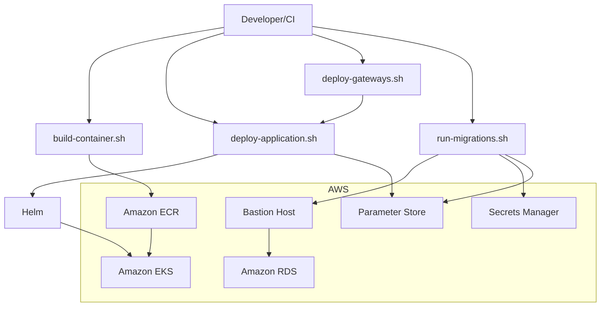
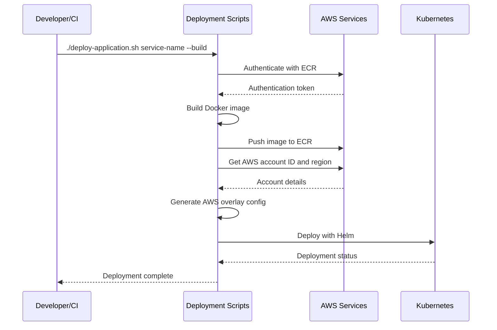
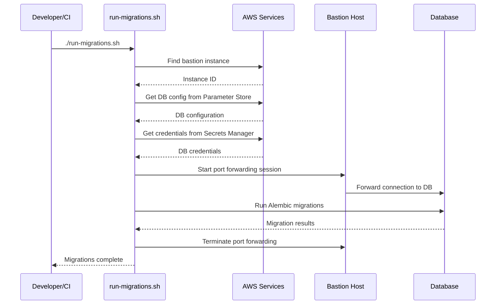

# SUMMARY-deploy.md

## Executive Summary

The `deploy` folder contains a set of shell scripts designed to automate the deployment of applications and gateways for the Agentic Platform. These scripts handle container building, Kubernetes deployments, and database migrations, working seamlessly in both local development and CI/CD environments. The deployment process is designed to be modular, allowing for individual service deployments or bulk gateway deployments. The scripts integrate with AWS services including ECR, EKS, Secrets Manager, and Parameter Store to provide a comprehensive deployment solution.

## Implementation Details Breakdown

### Container Building (`build-container.sh`)

This script builds and pushes Docker containers to Amazon ECR:

1. **Environment Detection**: Works in both local development (using AWS CLI config) and CI/CD environments (using environment variables)
2. **ECR Repository Management**: Automatically creates repositories if they don't exist
3. **Docker Build Process**: Builds images for linux/amd64 platform
4. **Authentication**: Handles ECR authentication automatically

Key code snippet:
```bash
# Build Docker image
echo "Building Docker image..."
docker build --platform linux/amd64 -t "$ECR_REPO_URI:$IMAGE_TAG" -f "$DOCKERFILE_PATH" .

# Push to ECR
echo "Pushing to ECR..."
docker push "$ECR_REPO_URI:$IMAGE_TAG"
```

### Application Deployment (`deploy-application.sh`)

This script deploys services to Kubernetes using Helm:

1. **AWS Configuration**: Generates an AWS overlay configuration file with account ID, region, and stack prefix
2. **Optional Container Building**: Can trigger container builds before deployment
3. **Helm Deployment**: Uses Helm to deploy services with appropriate values files

Key code snippet:
```bash
# Deploy with Helm using values files
helm upgrade --install $SERVICE_NAME ./k8s/helm/charts/agentic-service \
  -f k8s/helm/values/applications/${SERVICE_NAME}-values.yaml \
  -f k8s/helm/values/overlay/aws-overlay-values.yaml
```

### Gateway Deployment (`deploy-gateways.sh`)

This script provides a convenient way to deploy all gateway services at once:

1. **Service List**: Maintains a list of gateway services (`llm-gateway`, `memory-gateway`, `retrieval-gateway`)
2. **Batch Processing**: Iterates through the list and deploys each gateway
3. **Build Option**: Supports optional container building for all gateways

### Database Migrations (`run-migrations.sh` and `run-migrations-on-bastion.sh`)

These scripts handle database migrations:

1. **Infrastructure Discovery**: Automatically finds the bastion instance and database cluster
2. **Credential Management**: Retrieves database credentials from AWS Secrets Manager
3. **Port Forwarding**: Sets up port forwarding through the bastion to access the private database
4. **Migration Execution**: Runs Alembic migrations against the database
5. **Cleanup**: Automatically cleans up resources after completion

## Key Takeaways and Lessons Learned

1. **Infrastructure as Code Integration**: The deployment scripts integrate seamlessly with the Terraform-provisioned infrastructure, demonstrating a well-designed DevOps pipeline.

2. **Security Best Practices**: Credentials are never hardcoded; instead, they're retrieved from AWS Secrets Manager and Parameter Store at runtime.

3. **Automation First Approach**: The scripts automate complex tasks like port forwarding through bastion hosts and ECR repository creation, reducing manual steps.

4. **Environment Flexibility**: The same scripts work in both local development and CI/CD environments, providing consistency across deployment scenarios.

5. **Modular Design**: Services can be deployed individually or in groups, allowing for flexible deployment strategies.

6. **Error Handling**: The scripts include proper error checking and cleanup procedures to ensure reliable execution.

## Technical Architecture Overview

The deployment architecture consists of several interconnected components:



### Deployment Sequence



### Database Migration Sequence



## Recommendations and Next Steps

1. **Enhanced Error Recovery**: Add more sophisticated error recovery mechanisms, particularly for the database migration scripts, to handle transient network issues.

2. **Parameterized Environments**: Extend the scripts to explicitly support multiple environments (dev, staging, prod) with environment-specific configurations.

3. **Deployment Verification**: Add post-deployment verification steps to confirm services are running correctly.

4. **Rollback Mechanism**: Implement automated rollback procedures in case deployments fail.

5. **Parallel Deployments**: Enhance the gateway deployment script to support parallel deployments for faster execution.

6. **Monitoring Integration**: Add integration with monitoring systems to track deployment success and service health.

7. **Documentation**: Create more detailed documentation about each service's specific deployment requirements and configuration options.

8. **Versioning Strategy**: Implement a more sophisticated versioning strategy beyond using 'latest' tags for container images.

9. **Secret Rotation**: Add support for credential rotation in the database migration scripts.

10. **Deployment Metrics**: Collect and report metrics about deployment frequency, duration, and success rates.

The deployment scripts provide a solid foundation for managing the Agentic Platform's services. With the recommended enhancements, they could evolve into an even more robust deployment system capable of handling more complex scenarios and providing better feedback to developers and operators.
