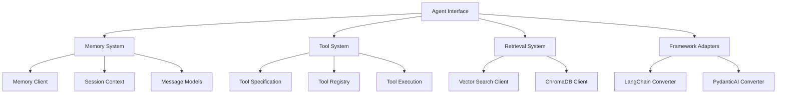
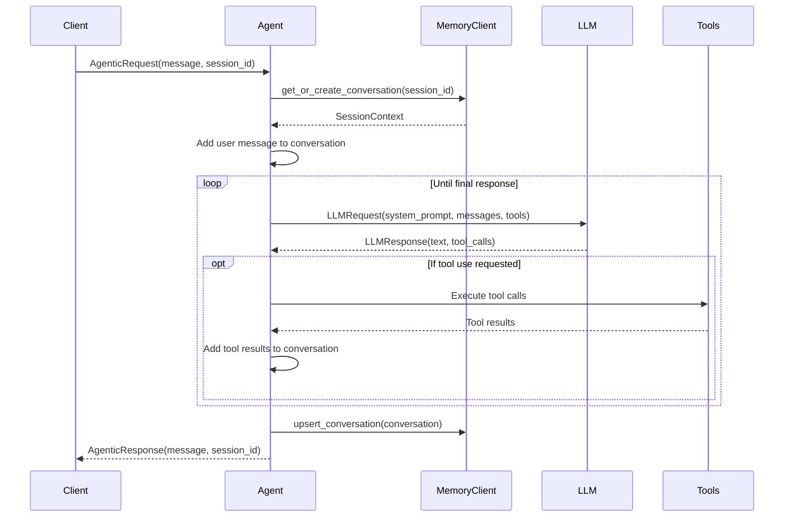
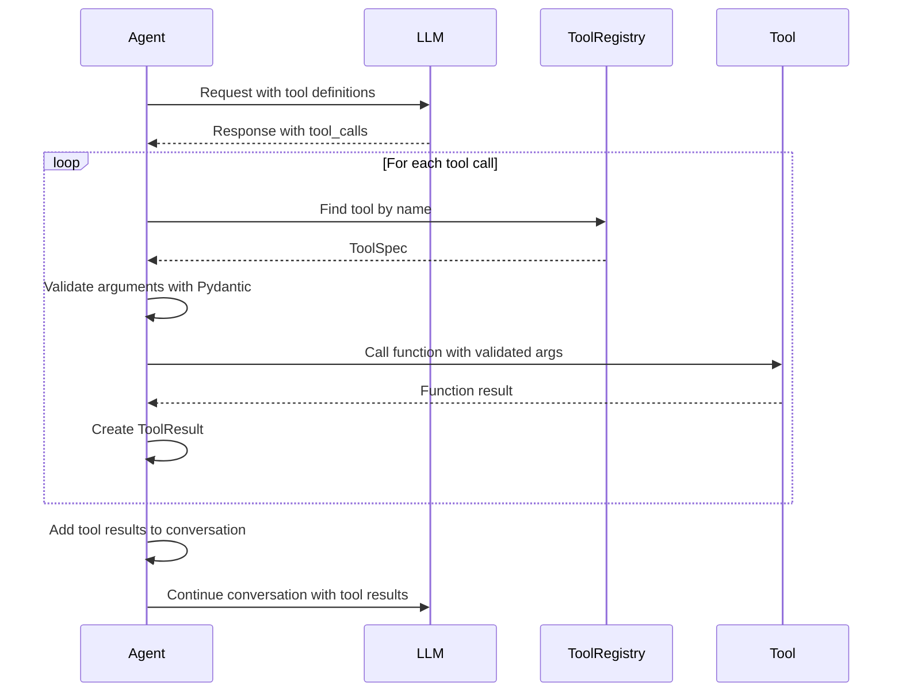

# SUMMARY-labs/module3.md

## Executive Summary

Module 3 of the Amazon Bedrock Workshop focuses on building framework-agnostic agent abstractions. The module demonstrates how to create robust, reusable components for autonomous agents that can work across different frameworks. The workshop covers essential agent capabilities including memory systems, tool integration, retrieval mechanisms, and framework comparisons.

The key insight of this module is the importance of creating clean abstractions that decouple your business logic from specific frameworks or LLM providers. By owning your own types and creating conversion layers, you can build flexible agent systems that allow for easy switching between frameworks like LangChain, LangGraph, or PydanticAI without major refactoring.

```
Own your own types - altering the underlying framework ==> new framework adapter and off you go!!

```

## Implementation Details Breakdown

### Core Abstractions

The module builds several key abstractions:

1. **Message and Conversation Models**: Custom Pydantic models for representing messages and conversation history
2. **Memory Client**: A simple key-value store for maintaining conversation state
3. **Tool Specifications**: A framework-agnostic way to define tools that LLMs can use
4. **Retrieval Client**: An abstraction over vector databases for knowledge retrieval
5. **Agent Request/Response Types**: Standardized interfaces for agent interactions

### Memory Implementation

The memory system uses a `SessionContext` class to maintain conversation history:

```python
class MemoryClient:
    """Manages conversations"""
    def __init__(self):
        self.conversations: Dict[str, SessionContext] = {}

    def upsert_conversation(self, conversation: SessionContext) -> bool:
        self.conversations[conversation.session_id] = conversation

    def get_or_create_conversation(self, conversation_id: str=None) -> SessionContext:
        return self.conversations.get(conversation_id, SessionContext()) if conversation_id else SessionContext()
```

This simple implementation stores conversations in memory, but the interface could be extended to use persistent storage like DynamoDB.

### Tool Calling System

Tools are defined using a `ToolSpec` class that combines:
- A Pydantic model for the tool's input parameters
- A function implementation
- Metadata like name and description

```python
class ToolSpec:
    model: Type[BaseModel]  # Pydantic model for input validation
    name: str               # Tool name
    description: str        # Tool description
    function: Callable      # The actual function implementation
```

The agent can then use these tools through a standardized interface:

```python
def execute_tools(self, llm_response: LLMResponse) -> List[ToolResult]:
    tool_results: List[ToolResult] = []
    for tool_invocation in llm_response.tool_calls:
        tool: ToolSpec = next((t for t in self.tools if t.name == tool_invocation.name), None)
        input_data: BaseModel = tool.model.model_validate(tool_invocation.arguments)
        function_result: str = str(tool.function(input_data))
        tool_response: ToolResult = ToolResult(
            id=tool_invocation.id,
            content=[TextContent(text=function_result)],
            isError=False
        )
        tool_results.append(tool_response)
    return tool_results
```

### Retrieval System

The retrieval system provides an abstraction over ChromaDB:

```python
class VectorSearchClient:
    """Client for vector search."""
    def __init__(self):
        self.client: ChromaDBRetrievalClient = get_chroma_os_docs_collection()

    def search(self, request: VectorSearchRequest) -> VectorSearchResult:
        response: List[RetrievalResult] = self.client.retrieve(request.query, n_results=1)
        results: List[VectorSearchResult] = []
        for result in response:
            results.append(VectorSearchResult(text=result.document, score=result.distance, metadata=result.metadata))
        return VectorSearchResponse(results=results)
```

This is then integrated as a tool for the agent to use:

```python
def retrieve_and_answer(input: RagInput) -> str:
    """Search the knowledge base for relevant information based on a query."""
    response: VectorSearchResponse = vector_search_client.search(VectorSearchRequest(query=input.query_text))
    context: str = "\n".join([result.text for result in response.results])
    # Create RAG prompt and call LLM...
    return rag_response.text
```

### Framework Integration

The module demonstrates how to integrate with popular frameworks while maintaining your abstractions:

```python
class LangChainAgent:
    def __init__(self, tools: List[Callable], base_prompt: BasePrompt):
        llm: ChatBedrockConverse = ChatBedrockConverse(
            model=base_prompt.model_id,
            temperature=temp
        )
        self.agent: Graph = create_react_agent(model=llm, tools=tools)
        
    def invoke(self, request: AgenticRequest) -> AgenticResponse:
        # Convert to langchain format
        inputs = {"messages": [("user", request.message.text)]}
        response = self.agent.invoke(inputs)
        # Convert back to our format
        messages: List[Message] = LangChainMessageConverter.convert_langchain_messages(response['messages'])
        # Return standardized response
        return AgenticResponse(
            session_id=self.conversation.session_id,
            message=self.conversation.messages[-1]
        )
```

## Key Takeaways and Lessons Learned

1. **Own Your Types**: Creating your own type definitions for messages, tools, and agent interactions provides flexibility and reduces framework lock-in.

2. **Converters Over Direct Dependencies**: Building converter layers between your types and framework-specific types makes it easier to swap frameworks later.

3. **ReACT Pattern Implementation**: The module demonstrates how to implement the ReACT (Reasoning and Acting) pattern with a simple while loop:

```python
def invoke(self, request: AgenticRequest) -> AgenticResponse:
    # Add user message to conversation
    self.conversation.add_message(request.message)
    
    # Keep calling LLM until we get a final response
    while True:
        # Call the LLM
        response: LLMResponse = self.call_llm()
        
        # If the model wants to use tools
        if response.stop_reason == "tool_use":
            # Execute the tools
            self.execute_tools(response)
            # Continue the loop to get final response
            continue
        
        # If we get here, it's a final response 
        break
        
    return AgenticResponse(...)
```

4. **Framework Comparison**: The module compares different frameworks:
   - **LangChain/LangGraph**: Mature ecosystem with many integrations, but can lead to tight coupling
   - **PydanticAI**: Newer framework with strong type safety, works well with Pydantic models

5. **Two-Way Door Decisions**: Proper abstractions create "two-way door decisions" that are reversible, allowing you to change frameworks without major refactoring.

## Technical Architecture Overview



### Agent Request/Response Flow



### Tool Calling Flow



## Recommendations and Next Steps

1. **Production-Ready Memory Store**: Replace the in-memory `MemoryClient` with a persistent database like DynamoDB for production use.

2. **Enhanced Tool Validation**: Add more robust validation and error handling for tool calls, including timeouts and rate limiting.

3. **Structured Response Handling**: Extend the system to better handle structured responses from tools, especially for complex nested objects.

4. **Framework Evaluation**: Continue evaluating frameworks based on your specific needs:
   - Use LangChain/LangGraph for complex workflows with many integrations
   - Consider PydanticAI for type-safe applications with complex data models
   - Explore CrewAI for multi-agent systems

5. **Standardization with MCP**: Follow the Model Context Protocol (MCP) initiative to standardize tool specifications and message formats across providers.

6. **Multi-Agent Systems**: Extend the architecture to support multiple agents working together, as mentioned for Module 4.

7. **Performance Optimization**: Implement caching and batching strategies for LLM calls to reduce latency and costs.

8. **Security Considerations**: Add security measures for tool execution, including input sanitization and permission models.

The module provides a solid foundation for building flexible, maintainable agent systems that can evolve with the rapidly changing LLM ecosystem. By focusing on clean abstractions and framework-agnostic design, you can create agents that are both powerful and adaptable to future needs.