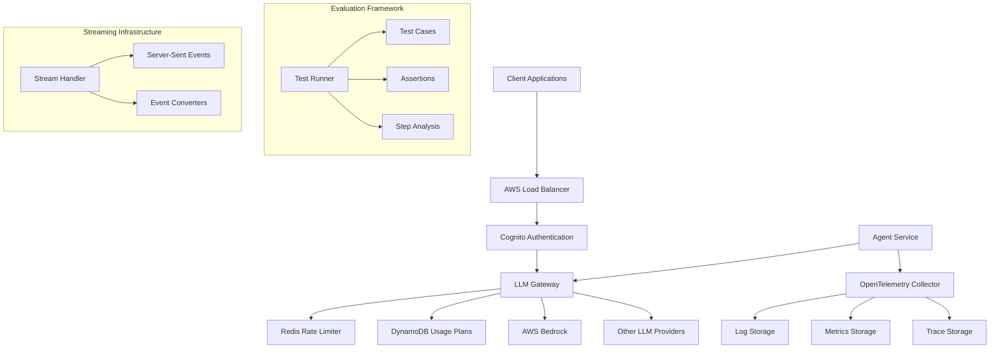
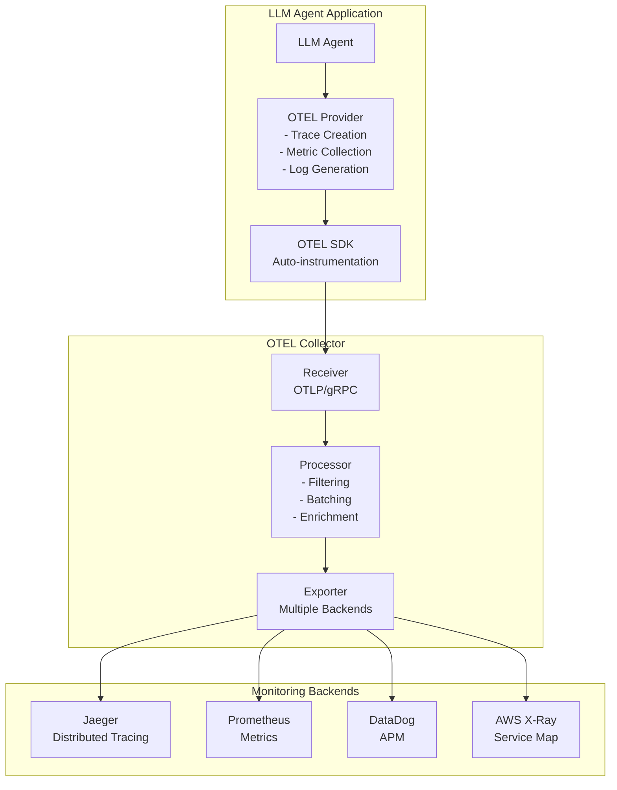
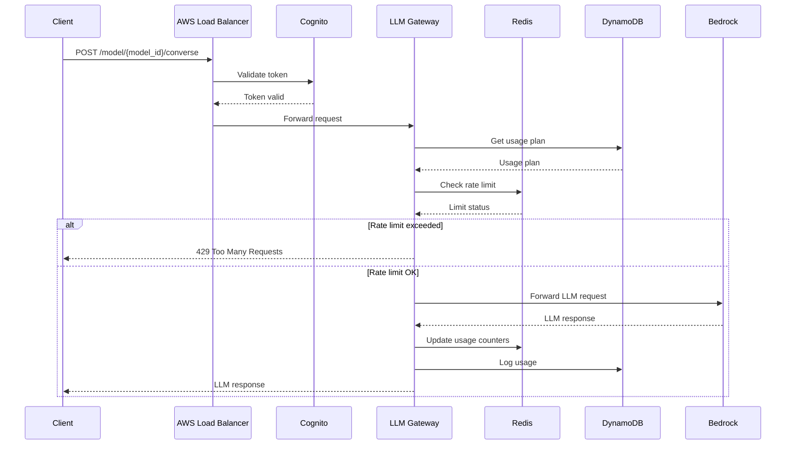
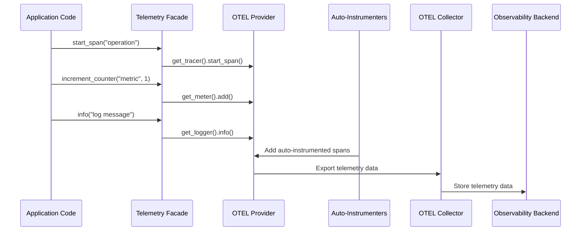
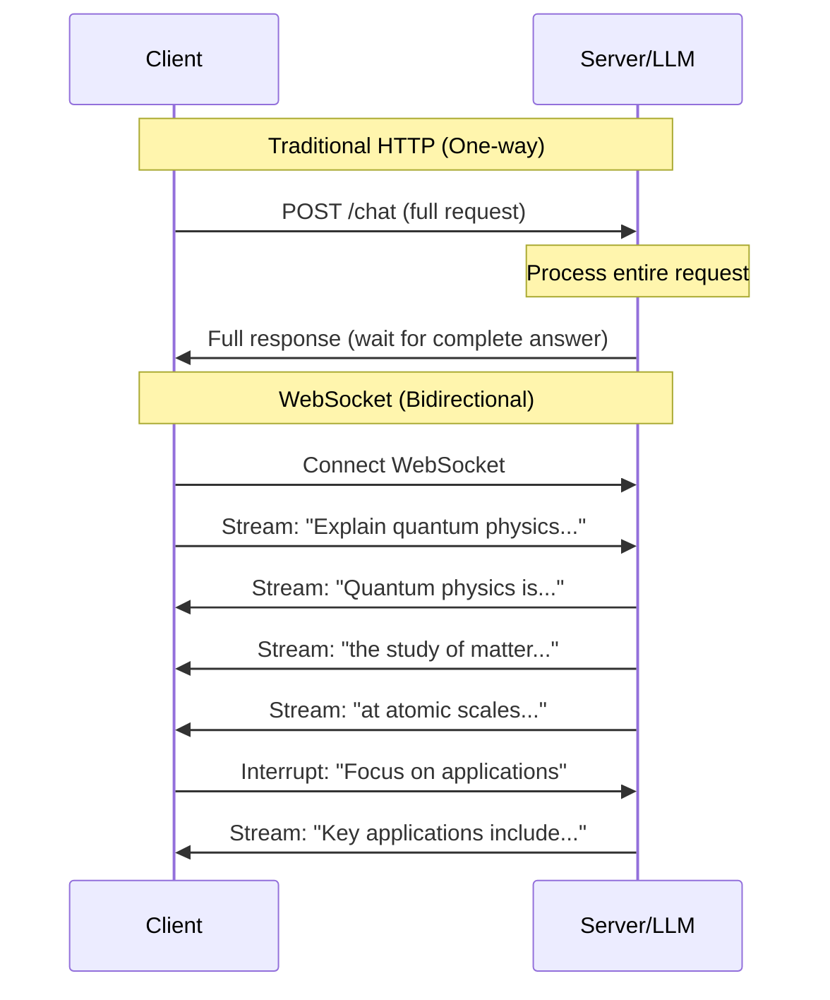
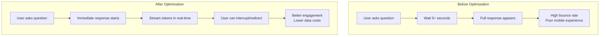

# SUMMARY-labs/module5.md

# Module 5: Production Infrastructure for Agentic Systems

## Executive Summary

Module 5 focuses on building robust, production-ready infrastructure for agentic systems. The module covers four key areas essential for running agents in production environments:

1. **Observability and Telemetry**: Implementing OpenTelemetry (OTEL) for comprehensive tracing, metrics, and logging
2. **LLM Gateway**: Creating a centralized service for managing LLM requests with rate limiting and usage tracking
3. **Agent Evaluation**: Building frameworks to measure and improve agent performance
4. **Streaming**: Implementing real-time streaming of agent responses and intermediate steps

The module provides practical implementations of these components with a focus on production-ready patterns, abstraction layers, and scalable architecture.

## Implementation Details Breakdown

### 1. Observability and Telemetry

The telemetry implementation follows a facade pattern to abstract the underlying observability providers:

```python
class BaseObservabilityProvider(ABC):
    @abstractmethod
    def get_tracer(self, name: str) -> Tracer:
        """Get a tracer for creating spans."""
        pass
    
    @abstractmethod
    def get_meter(self, name: str) -> Meter:
        """Get a meter for recording metrics."""
        pass
    
    @abstractmethod
    def get_logger(self, name: str) -> Logger:
        """Get a logger for recording logs."""
        pass
```

The implementation includes:

1. **Provider Abstraction**: A base class that can be implemented by different telemetry providers
2. **Console Provider**: For local development and testing
3. **OpenTelemetry Provider**: For production use with OTEL collectors
4. **Facade Pattern**: A unified interface for all telemetry signals (traces, metrics, logs)
5. **Auto-Instrumentation**: Integration with existing frameworks like FastAPI, Bedrock, and LangChain

The telemetry system captures:
- Spans for API requests and LLM calls
- Custom metrics for agent operations
- Contextual logging tied to trace context

### 2. LLM Gateway

The LLM Gateway serves as a centralized service for managing LLM requests with:

1. **Usage Plans**: Defined in DynamoDB with entity-based rate limits
   ```python
   class UsagePlan(BaseModel):
       entity_id: str
       entity_type: UsagePlanEntityType
       tenant_id: str = 'SYSTEM'
       budget_id: Optional[str] = None
       model_permissions: List[str]
       active: bool = Field(default=True)
       default_limits: RateLimits = Field(default_factory=RateLimits)
       model_limits: Dict[str, RateLimits] = Field(default_factory=dict)
   ```

2. **Rate Limiting**: Implemented with Redis for efficient sliding window limits
3. **Multi-tenancy**: Support for different entity types (users, services, departments)
4. **Request Tracking**: Usage logging in DynamoDB
5. **Authentication**: OAuth integration with Cognito
6. **Model Unification**: Standardized request/response types across providers

The gateway is deployed as a Kubernetes service with:
- AWS Load Balancer integration
- Cognito authentication
- SDK compatibility with boto3 clients

### 3. Agent Evaluation

The evaluation framework provides:

1. **Assertion-based Testing**: Verifying agent outputs against expected results
   ```python
   class TestCase(BaseModel):
       name: str
       query: str
       assertions: List[str]
   ```

2. **Step-based Analysis**: Evaluating the efficiency of agent workflows
3. **LLM-based Evaluation**: Using Claude to assess qualitative aspects of responses
4. **Structured Results**: Comprehensive metrics on success rates and efficiency
   ```python
   class TestResult(BaseModel):
       name: str
       query: str
       assertions_results: List[AssertionResult]
       agent_failed: bool = False
       agent_error: str = None
   ```

5. **Parallel Execution**: Multi-threaded evaluation for efficiency

### 4. Streaming

The streaming implementation provides real-time feedback on agent operations:

1. **Event Types**: Structured events for different agent activities
   ```python
   # Event types include:
   # - TextDeltaEvent
   # - TextDoneEvent
   # - ThinkingEvent
   # - ToolCallEvent
   # - ToolResultEvent
   # - ErrorEvent
   # - DoneEvent
   ```

2. **Server-Sent Events (SSE)**: Standard protocol for streaming updates
3. **Framework Integration**: Converters for PydanticAI and other frameworks
4. **Metadata Enrichment**: Session tracking and usage statistics

## Key Takeaways and Lessons Learned

1. **Two-way Door Decisions**: Using abstraction layers (facades) allows changing underlying implementations without refactoring application code

2. **Auto-instrumentation**: Leveraging existing instrumentation libraries reduces custom code while providing comprehensive observability

3. **Rate Limiting Complexity**: LLM rate limiting requires multiple dimensions (RPM, TPM) and entity-based policies

4. **Evaluation Challenges**: Agent evaluation is an open research area requiring both quantitative metrics and qualitative assessment

5. **Streaming Benefits**: Real-time feedback significantly improves user experience by masking latency in agentic systems

6. **Infrastructure as Code**: Deploying components to Kubernetes with proper authentication and networking is essential for production readiness

## Technical Architecture Overview



### OpenTelemetry Architecture



### Request/Response Flow for LLM Gateway



### Telemetry Flow



## Recommendations and Next Steps

1. **Extend the Telemetry Framework**:
   - Add more auto-instrumenters for agent-specific frameworks
   - Implement custom metrics for agent performance (e.g., hallucination rate)
   - Create dashboards for agent monitoring

2. **Enhance the LLM Gateway**:
   - Implement caching for common requests
   - Add model-specific routing logic
   - Implement cost tracking and budgeting features
   - Add support for more LLM providers

3. **Improve the Evaluation Framework**:
   - Create a CI/CD pipeline for automated agent testing
   - Implement human feedback collection
   - Develop more sophisticated evaluation metrics
   - Build a UI for reviewing evaluation results

4. **Optimize Streaming**:
   - Implement WebSocket support for bidirectional communication
   - Add compression for bandwidth optimization
   - Create client libraries for common frameworks

5. **Security Enhancements**:
   - Implement fine-grained access control
   - Add content filtering and safety measures
   - Implement audit logging for compliance

6. **Scalability Improvements**:
   - Implement horizontal scaling for the gateway
   - Add distributed tracing for complex agent workflows
   - Optimize database access patterns for high throughput

By implementing these production infrastructure components, organizations can build robust, observable, and scalable agentic systems that can be reliably deployed in production environments.

# Appendix 

Streaming optimizations with practical examples, especially relevant for **real-time LLM agent interactions**.

## **1. WebSocket Support for Bidirectional Communication**

### **Traditional HTTP vs WebSocket**



### **Before: Traditional HTTP Streaming**
```python
# Client waits for complete response
import requests

def traditional_chat():
    response = requests.post('/api/chat', json={
        "message": "Write a long essay about AI"
    })
    
    # User waits 30+ seconds for complete response
    full_response = response.json()['message']
    print(full_response)  # Everything appears at once
```

### **After: WebSocket Bidirectional Streaming**
```python
import asyncio
import websockets
import json

class StreamingLLMClient:
    def __init__(self):
        self.websocket = None
        
    async def connect(self):
        self.websocket = await websockets.connect("ws://llm-agent:8080/stream")
        
    async def stream_conversation(self):
        # Send message and receive streaming response
        await self.websocket.send(json.dumps({
            "type": "user_message",
            "content": "Write a long essay about AI",
            "stream": True
        }))
        
        async for message in self.websocket:
            data = json.loads(message)
            
            if data['type'] == 'token':
                # Display tokens as they arrive (like ChatGPT)
                print(data['content'], end='', flush=True)
                
            elif data['type'] == 'thinking':
                # Show agent's reasoning process
                print(f"\n[Agent thinking: {data['step']}]")
                
            elif data['type'] == 'tool_call':
                # Real-time tool usage updates
                print(f"\n[Using tool: {data['tool_name']}]")
                
            elif data['type'] == 'user_interrupt':
                # User can interrupt mid-response
                await self.websocket.send(json.dumps({
                    "type": "interrupt",
                    "new_instruction": "Make it shorter"
                }))

# Server-side WebSocket handler
import asyncio
import websockets
from bedrock_agent import BedrockAgent

class StreamingLLMServer:
    async def handle_client(self, websocket, path):
        agent = BedrockAgent()
        
        async for message in websocket:
            data = json.loads(message)
            
            if data['type'] == 'user_message':
                # Stream response back to client
                async for chunk in agent.stream_response(data['content']):
                    await websocket.send(json.dumps({
                        "type": chunk['type'],
                        "content": chunk['content']
                    }))
                    
            elif data['type'] == 'interrupt':
                # Handle real-time interruptions
                agent.interrupt_and_redirect(data['new_instruction'])

# Benefits of bidirectional streaming:
benefits = {
    "user_experience": "Immediate feedback, like human conversation",
    "interruptions": "Users can redirect mid-response",
    "real_time_feedback": "Show agent thinking/tool usage",
    "reduced_latency": "No waiting for complete response"
}
```

## **2. Compression for Bandwidth Optimization**

### **Problem: Large JSON Payloads**
```python
# Typical LLM response without compression
uncompressed_response = {
    "message": "Very long detailed response about artificial intelligence..." * 1000,
    "metadata": {
        "tokens_used": 2000,
        "model": "claude-3-sonnet",
        "reasoning_steps": ["step1", "step2", "step3"] * 100
    },
    "tool_calls": [
        {"tool": "web_search", "results": ["result1", "result2"] * 50}
    ]
}

# Size: ~500KB per response
```

### **Solution: Multiple Compression Strategies**

```python
import gzip
import json
import lz4.frame
from websockets.extensions import permessage_deflate

class CompressedStreamingClient:
    def __init__(self):
        # WebSocket with built-in compression
        self.compression_extensions = [
            permessage_deflate.ClientPerMessageDeflateExtension(
                server_max_window_bits=15,  # Better compression
                client_max_window_bits=15,
                server_max_no_context_takeover=False,
                client_max_no_context_takeover=False,
            )
        ]
    
    async def connect_compressed(self):
        # Automatic WebSocket compression
        self.websocket = await websockets.connect(
            "ws://llm-agent:8080/stream",
            extensions=self.compression_extensions
        )
    
    def compress_payload(self, data):
        # For non-WebSocket scenarios
        json_str = json.dumps(data)
        
        # Method 1: gzip (good general purpose)
        gzip_compressed = gzip.compress(json_str.encode())
        
        # Method 2: LZ4 (faster, good for real-time)
        lz4_compressed = lz4.frame.compress(json_str.encode())
        
        return {
            "original_size": len(json_str),
            "gzip_size": len(gzip_compressed),  # ~80% reduction
            "lz4_size": len(lz4_compressed),    # ~70% reduction, faster
            "gzip_data": gzip_compressed,
            "lz4_data": lz4_compressed
        }

# Server-side compression
class CompressedLLMServer:
    async def send_compressed_response(self, websocket, response_data):
        # Automatic compression via WebSocket extension
        await websocket.send(json.dumps(response_data))
        # WebSocket handles compression transparently
        
    def adaptive_compression(self, data_size, connection_speed):
        if connection_speed == "mobile":
            return "lz4"  # Faster decompression
        elif data_size > 100_000:  # 100KB+
            return "gzip"  # Better compression ratio
        else:
            return "none"  # Small payloads, skip compression overhead

# Real-world compression results
compression_results = {
    "typical_llm_response": {
        "original": "125KB",
        "gzip": "23KB",      # 82% reduction
        "lz4": "31KB",       # 75% reduction
        "bandwidth_saved": "100KB per response"
    },
    "mobile_impact": {
        "4g_load_time": "3.2s → 0.6s",
        "data_usage": "125MB/hour → 25MB/hour"
    }
}
```

## **3. Client Libraries for Common Frameworks**

### **Before: Manual Integration**
```python
# Every developer writes their own integration
class ManualLLMIntegration:
    def __init__(self):
        self.websocket = None
        # 50+ lines of WebSocket handling code
        # 30+ lines of compression handling  
        # 40+ lines of error handling/reconnection
        # 20+ lines of message parsing
        # Total: 140+ lines just for basic connectivity
```

### **After: Framework-Specific Libraries**

#### **React Client Library**
```javascript
// npm install @yourcompany/llm-streaming-react
import { useLLMStream } from '@yourcompany/llm-streaming-react';

function ChatComponent() {
    const { 
        messages, 
        isStreaming, 
        sendMessage, 
        interrupt 
    } = useLLMStream({
        endpoint: 'ws://api.yourcompany.com/stream',
        compression: true,
        autoReconnect: true
    });

    return (
        <div>
            {messages.map(msg => (
                <div key={msg.id}>
                    {msg.content}
                    {msg.isStreaming && <StreamingCursor />}
                </div>
            ))}
            
            <button onClick={() => sendMessage("Explain AI")}>
                Send Message
            </button>
            
            {isStreaming && (
                <button onClick={interrupt}>
                    Stop Generation
                </button>
            )}
        </div>
    );
}
```

#### **Python Client Library**
```python
# pip install yourcompany-llm-client
from yourcompany_llm import StreamingLLMClient

# Simple usage
async def main():
    client = StreamingLLMClient(
        endpoint="ws://api.yourcompany.com/stream",
        compression="auto",  # Automatic compression selection
        api_key="your-key"
    )
    
    # One-liner for streaming chat
    async for chunk in client.stream_chat("Explain quantum physics"):
        print(chunk.content, end='', flush=True)
        
        # Built-in interruption support
        if user_wants_to_interrupt():
            await client.interrupt("Make it simpler")

# Advanced usage with callbacks
class MyLLMHandler:
    async def on_token(self, token):
        print(token, end='', flush=True)
    
    async def on_tool_call(self, tool_name, args):
        print(f"\n[Using {tool_name}]")
    
    async def on_error(self, error):
        print(f"Error: {error}")
        # Library handles automatic reconnection

client = StreamingLLMClient(
    endpoint="ws://api.yourcompany.com/stream",
    handler=MyLLMHandler()
)
```

#### **Node.js/Express Middleware**
```javascript
// npm install @yourcompany/llm-streaming-express
const { llmStreaming } = require('@yourcompany/llm-streaming-express');

app.use('/api/chat', llmStreaming({
    endpoint: 'ws://internal-llm-service:8080',
    compression: true,
    rateLimit: {
        tokensPerMinute: 10000,
        requestsPerMinute: 100
    },
    // Automatic error handling and fallbacks
    fallback: {
        service: 'backup-llm-endpoint',
        timeout: 5000
    }
}));

// Now your Express app has streaming LLM support with 2 lines!
```

## **Real-World Performance Impact**

### **User Experience Improvements**
```python
performance_comparison = {
    "time_to_first_token": {
        "http_polling": "2-5 seconds",
        "websocket_streaming": "100-300ms"
    },
    "bandwidth_usage": {
        "uncompressed": "500KB per response",
        "compressed": "100KB per response",
        "mobile_savings": "80% less data usage"
    },
    "development_time": {
        "manual_integration": "2-3 weeks",
        "client_library": "2-3 hours",
        "maintenance_overhead": "90% reduction"
    }
}
```

### **Business Impact**


**Bottom Line**: These optimizations transform LLM interactions from "submit and wait" to "real-time conversation", dramatically improving user experience while reducing bandwidth costs and development complexity!


## Token Utilization Summary

- **Prompt Length**: 86247 characters
- **Estimated Token Count**: ~21561 tokens
- **Context Window Utilization**: ~10.8% of 200K token context window


---

*This summary was generated by Claude 3.7 Sonnet from Anthropic on 2025-07-06 at 21:49:39.*
