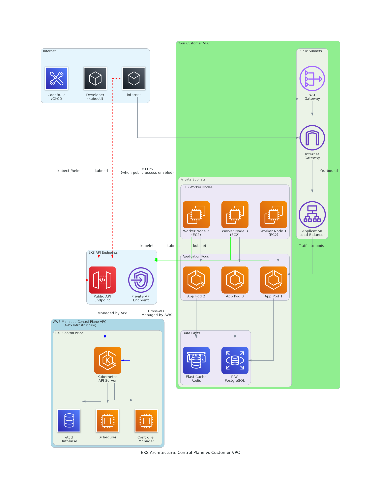
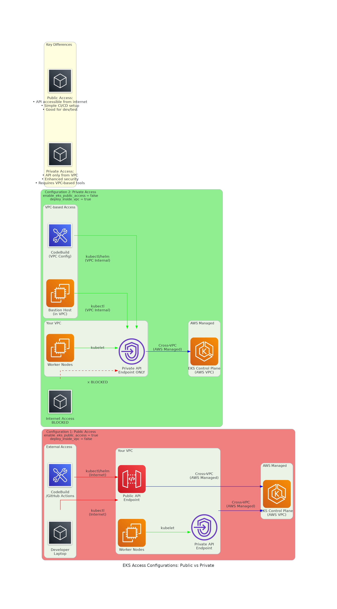

I've created two comprehensive diagrams that visualize the EKS architecture and answer your question about where components run:

**Diagram 1: Complete EKS Architecture** (`generated-diagrams/diagram_7f9315c4.png`)
- Shows the AWS-managed control plane running in AWS's separate VPC
- Illustrates your customer VPC containing worker nodes, pods, and data services
- Demonstrates the cross-VPC networking managed by AWS

**Diagram 2: Access Configuration Comparison** (`generated-diagrams/diagram_90fce1de.png`)
- Compares public vs private access configurations
- Shows how the `enable_eks_public_access` and `deploy_inside_vpc` settings affect access patterns
- Clarifies that these settings only control API access, not where the cluster runs

**Key Points Clarified:**
1. The EKS control plane (API server, etcd, scheduler, controller manager) runs in **AWS's own VPC**, not your customer VPC
2. Your worker nodes, application pods, and data services run in **your customer VPC**
3. AWS manages secure cross-VPC networking between the control plane and your worker nodes
4. The access configuration settings only determine **how you connect to the API server** (via internet or VPC-only), not where components are deployed

The diagrams are saved in your project directory and clearly show the separation between AWS-managed infrastructure and your customer resources.