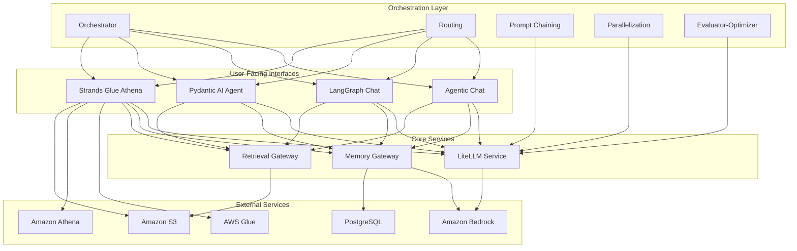
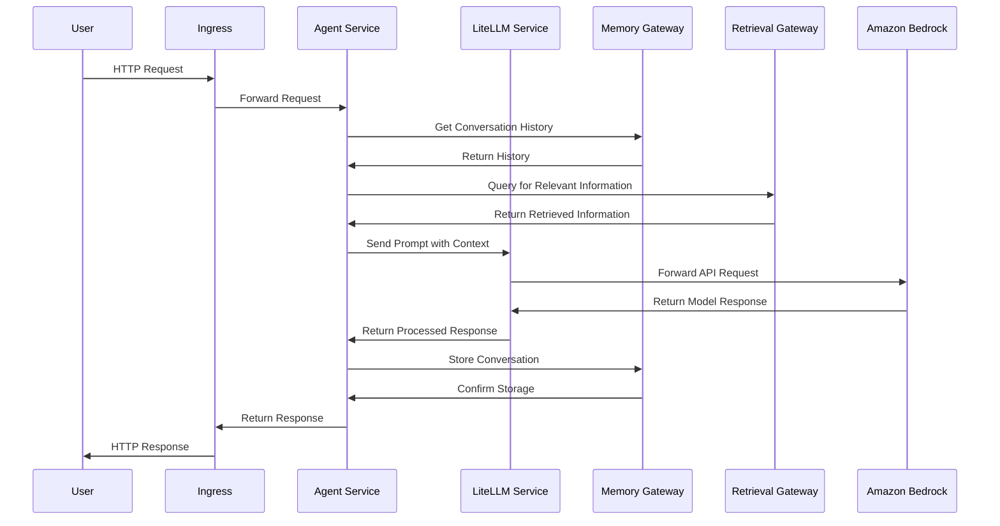

# SUMMARY-k8s/helm/values/applications.md

## 1. Executive Summary

The `k8s/helm/values/applications` directory contains Helm value files for deploying various microservices that make up an agentic platform built on Amazon Bedrock. These YAML files define the configuration for Kubernetes deployments of different AI agent components, including chat interfaces, memory systems, retrieval systems, and orchestration services. The platform appears to be a comprehensive solution for building and deploying AI agents with capabilities like memory persistence, knowledge retrieval, prompt chaining, and parallel processing.

The architecture follows a microservices pattern where specialized components handle different aspects of AI agent functionality, all interconnected through internal service endpoints. The configuration files show a consistent deployment pattern with standardized resource allocations, service definitions, and IAM role-based security.

## 2. Implementation Details Breakdown

### Common Configuration Patterns

All services share several common configuration elements:

1. **Namespace Configuration**: Default namespace is "default" but can be overridden
2. **Resource Allocation**: Consistent resource requests (100m CPU, 256Mi memory) and limits (512Mi memory)
3. **Service Configuration**: ClusterIP services exposing port 80 and targeting port 8000
4. **Ingress Configuration**: Each service has an ingress path matching its name
5. **Service Account**: Each service has its own service account with IAM roles for AWS service access
6. **Environment Variables**: PYTHONPATH set to /app for all services
7. **Default Endpoints**: Most services reference the same set of internal endpoints:
   - LITELLM_API_ENDPOINT
   - RETRIEVAL_GATEWAY_ENDPOINT
   - MEMORY_GATEWAY_ENDPOINT

### Key Components

#### Core Gateway Services

1. **Memory Gateway**
   - Provides memory persistence for agents
   - Configurable to use either Bedrock Agent Core or PostgreSQL as backend
   - Exposes a standardized API for memory operations

2. **Retrieval Gateway**
   - Handles knowledge retrieval operations
   - Requires specific IAM permissions for accessing knowledge bases
   - Provides a unified interface for retrieving information

#### Agent Implementations

1. **Agentic Chat**
   - Basic chat interface using Amazon Bedrock
   - Requires LiteLLM secret for API access

2. **LangGraph Chat**
   - More sophisticated chat implementation using LangGraph
   - Integrates with memory and retrieval gateways

3. **Pydantic AI Agent**
   - Uses Pydantic for structured data validation
   - Provides schema-based interactions with LLMs

4. **Strands Glue Athena**
   - Specialized agent for AWS Glue and Athena integration
   - Has extensive IAM permissions for database operations
   - Can execute Athena queries and access S3 results

#### Orchestration and Processing

1. **Orchestrator**
   - Coordinates workflows between different agents
   - Central component for managing complex agent interactions

2. **Parallelization**
   - Handles parallel processing of LLM tasks
   - Improves efficiency for batch operations

3. **Prompt Chaining**
   - Implements sequential prompt processing
   - Allows for multi-step reasoning

4. **Routing**
   - Directs requests to appropriate agent components
   - Provides traffic management between services

5. **Evaluator-Optimizer**
   - Evaluates agent performance
   - Optimizes prompts and configurations

## 3. Key Takeaways and Lessons Learned

1. **Microservices Architecture**: The platform uses a well-defined microservices approach, with each component having a specific responsibility. This promotes maintainability and scalability.

2. **Standardized Configuration**: Consistent configuration patterns across services simplify management and deployment.

3. **IAM Role-Based Security**: The use of IAM roles for service accounts (IRSA) provides fine-grained security control for AWS service access.

4. **Gateway Pattern**: The platform implements gateway services for cross-cutting concerns like memory and retrieval, providing abstraction layers over underlying implementations.

5. **Resource Efficiency**: The resource allocations are modest, suggesting the services are designed to be lightweight and efficient.

6. **Kubernetes-Native Design**: The platform is designed to leverage Kubernetes features like service discovery, ingress routing, and configuration management.

7. **Flexible Backend Options**: Services like the Memory Gateway support multiple backend options, allowing for deployment flexibility.

## 4. Technical Architecture Overview

### Service Interaction Sequence

## 5. Recommendations and Next Steps

1. **Documentation Enhancement**: Create detailed documentation for each service's API and interaction patterns to facilitate developer onboarding.

2. **Monitoring and Observability**: Add configuration for metrics collection, logging, and tracing to improve operational visibility.

3. **Horizontal Pod Autoscaling**: Implement HPA configurations based on CPU/memory usage to handle varying loads efficiently.

4. **Secret Management**: Consider using a more sophisticated secret management solution like AWS Secrets Manager or HashiCorp Vault for managing API keys and credentials.

5. **Health Checks**: Add liveness and readiness probes to improve Kubernetes service management.

6. **Network Policies**: Implement Kubernetes network policies to restrict communication between services to only what's necessary.

7. **Resource Optimization**: After initial deployment, monitor actual resource usage and adjust requests/limits for optimal performance and cost efficiency.

8. **High Availability**: Consider increasing replica counts for critical services to ensure high availability.

9. **Backup Strategy**: Implement backup strategies for stateful components, particularly for the Memory Gateway when using PostgreSQL.

10. **CI/CD Integration**: Develop CI/CD pipelines for automated testing and deployment of the services.

11. **Version Management**: Implement a more explicit versioning strategy instead of using "latest" tags for production deployments.

12. **Multi-Region Deployment**: Consider configurations for multi-region deployment for disaster recovery and reduced latency.