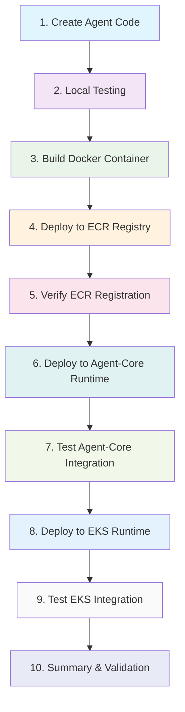
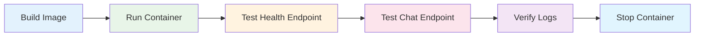
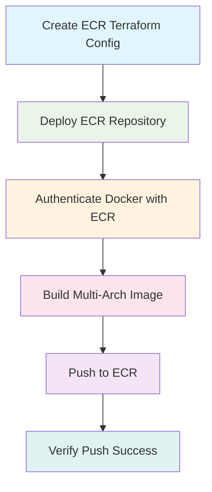
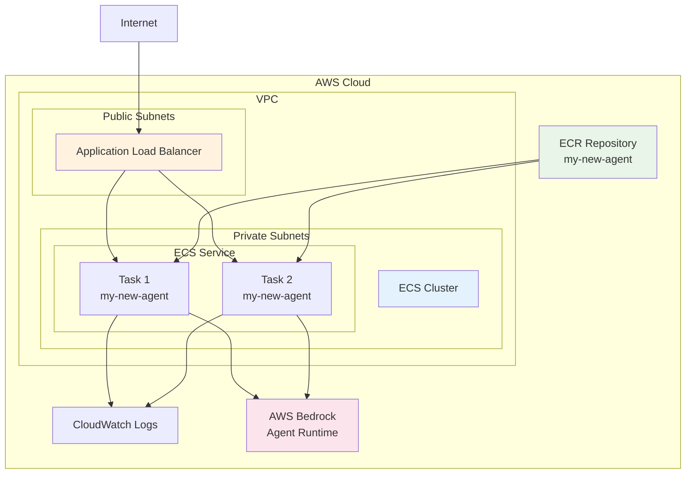
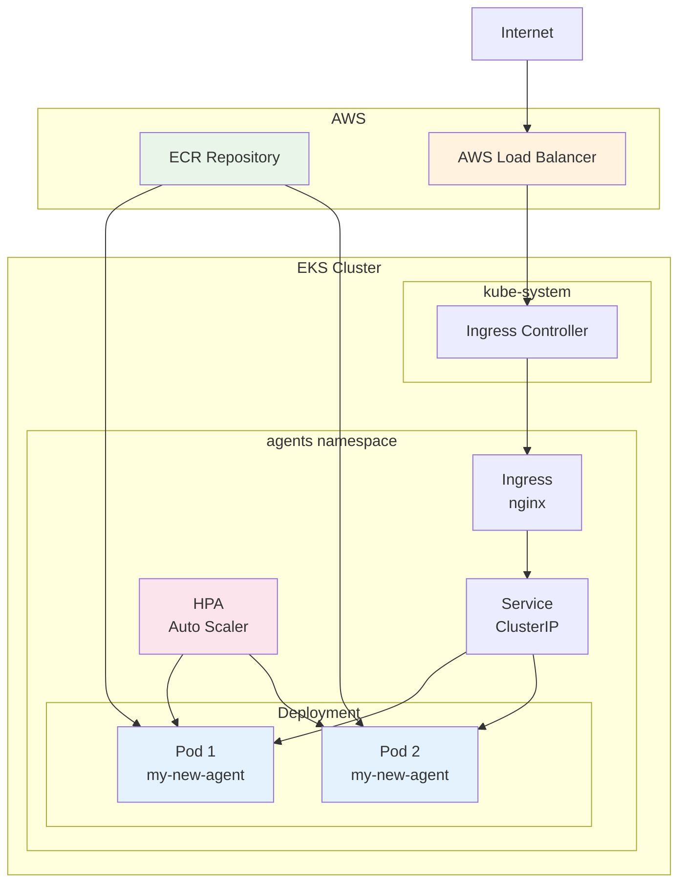
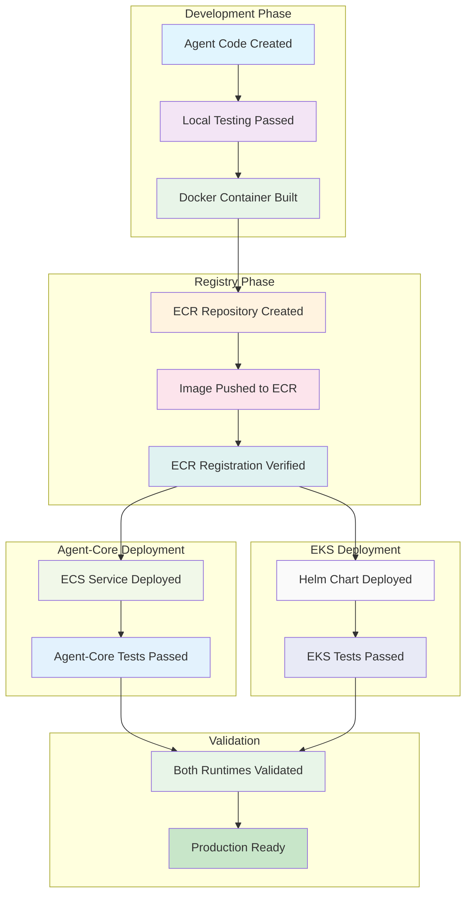

# New Agent Deployment Guide

This comprehensive guide walks you through building and deploying a new agent on the Agentic Platform, from initial development to production deployment on both Agent-Core and EKS runtimes.

## Overview



## Prerequisites

- AWS CLI configured with appropriate permissions
- Docker installed and running
- Terraform installed
- Python 3.11+ environment
- Access to the platform's AWS account and ECR registry

---

## Step 1: Create Agent Code Structure

Create your new agent in the platform's agent directory structure.

### 1.1 Create Agent Directory

```bash
mkdir -p src/agentic_platform/agent/my-new-agent
cd src/agentic_platform/agent/my-new-agent
```

### 1.2 Required Agent Structure

Your agent must follow this directory structure:

```
src/agentic_platform/agent/my-new-agent/
├── Dockerfile                    # Container definition
├── requirements.txt             # Python dependencies
├── server.py                   # FastAPI server entry point
├── agent/                      # Core agent logic
│   └── my_new_agent.py        # Main agent implementation
├── controller/                 # API controllers
│   └── my_new_agent_controller.py
├── prompt/                     # Agent prompts
│   └── system_prompt.py
└── streaming/                  # Streaming utilities (optional)
    └── streaming_utils.py
```

### 1.3 Create Core Files

**server.py** (FastAPI entry point):
```python
import uvicorn
from fastapi import FastAPI
from fastapi.middleware.cors import CORSMiddleware
from controller.my_new_agent_controller import router

app = FastAPI(title="My New Agent", version="1.0.0")

app.add_middleware(
    CORSMiddleware,
    allow_origins=["*"],
    allow_credentials=True,
    allow_methods=["*"],
    allow_headers=["*"],
)

app.include_router(router, prefix="/api/v1")

if __name__ == "__main__":
    uvicorn.run(app, host="0.0.0.0", port=8000)
```

**requirements.txt**:
```txt
fastapi==0.104.1
uvicorn[standard]==0.24.0
pydantic==2.5.0
boto3==1.34.0
langchain==0.1.0
# Add your specific dependencies here
```

**Dockerfile**:
```dockerfile
FROM python:3.11-slim

WORKDIR /app

# Copy requirements and install dependencies
COPY requirements.txt .
RUN pip install --no-cache-dir -r requirements.txt

# Copy application code
COPY . .

# Expose port
EXPOSE 8000

# Run the application
CMD ["python", "server.py"]
```

**agent/my_new_agent.py** (Core agent logic):
```python
from typing import Dict, Any, List
import boto3
from langchain.llms import Bedrock

class MyNewAgent:
    def __init__(self):
        self.bedrock_client = boto3.client('bedrock-runtime')
        
    async def process_request(self, user_input: str, context: Dict[str, Any] = None) -> Dict[str, Any]:
        """
        Process user request and return agent response
        """
        try:
            # Implement your agent logic here
            response = {
                "message": f"Processed: {user_input}",
                "status": "success",
                "context": context or {}
            }
            return response
        except Exception as e:
            return {
                "message": f"Error processing request: {str(e)}",
                "status": "error"
            }
```

**controller/my_new_agent_controller.py** (API endpoints):
```python
from fastapi import APIRouter, HTTPException
from pydantic import BaseModel
from typing import Dict, Any
from agent.my_new_agent import MyNewAgent

router = APIRouter()
agent = MyNewAgent()

class ChatRequest(BaseModel):
    message: str
    context: Dict[str, Any] = {}

class ChatResponse(BaseModel):
    response: str
    status: str

@router.post("/chat", response_model=ChatResponse)
async def chat_endpoint(request: ChatRequest):
    try:
        result = await agent.process_request(request.message, request.context)
        return ChatResponse(
            response=result["message"],
            status=result["status"]
        )
    except Exception as e:
        raise HTTPException(status_code=500, detail=str(e))

@router.get("/health")
async def health_check():
    return {"status": "healthy", "agent": "my-new-agent"}
```

---

## Step 2: Local Testing

Test your agent locally before containerization.

### 2.1 Set Up Local Environment

```bash
# Create virtual environment
python -m venv venv
source venv/bin/activate  # On Windows: venv\Scripts\activate

# Install dependencies
cd src/agentic_platform/agent/my-new-agent
pip install -r requirements.txt
```

### 2.2 Run Local Server

```bash
python server.py
```

The server will start on `http://localhost:8000`

### 2.3 Test API Endpoints

```bash
# Health check
curl http://localhost:8000/api/v1/health

# Chat endpoint
curl -X POST http://localhost:8000/api/v1/chat \
  -H "Content-Type: application/json" \
  -d '{"message": "Hello, agent!", "context": {}}'
```

### 2.4 Create Local Test Script

Create `tests/local-test/local-test-my-new-agent.py`:

```python
import asyncio
import aiohttp
import json

async def test_agent_locally():
    """Test the agent running locally"""
    base_url = "http://localhost:8000/api/v1"
    
    async with aiohttp.ClientSession() as session:
        # Test health endpoint
        async with session.get(f"{base_url}/health") as response:
            health_data = await response.json()
            print(f"Health Check: {health_data}")
            assert response.status == 200
        
        # Test chat endpoint
        chat_payload = {
            "message": "Test message for my new agent",
            "context": {"test": True}
        }
        
        async with session.post(
            f"{base_url}/chat",
            json=chat_payload
        ) as response:
            chat_data = await response.json()
            print(f"Chat Response: {chat_data}")
            assert response.status == 200
            assert chat_data["status"] == "success"

if __name__ == "__main__":
    asyncio.run(test_agent_locally())
```

Run the test:
```bash
python tests/local-test/local-test-my-new-agent.py
```

---

## Step 3: Build Docker Container

Build and test your agent in a containerized environment.

### 3.1 Build Container Locally

```bash
# From project root
cd /path/to/sample-agentic-platform

# Build the container
docker build -t my-new-agent:latest -f src/agentic_platform/agent/my-new-agent/Dockerfile .
```

### 3.2 Test Container Locally

```bash
# Run container
docker run -p 8000:8000 my-new-agent:latest

# Test in another terminal
curl http://localhost:8000/api/v1/health
```

### 3.3 Container Testing Flow



---

## Step 4: Deploy Docker Container to ECR Registry

Deploy your container to AWS ECR for use in both runtimes.

### 4.1 Configure ECR Repository

Create Terraform configuration for your agent's ECR repository:

**infrastructure/stacks/ecr-agent/my-new-agent.tfvars**:
```hcl
# ECR Configuration for My New Agent
agent_name = "my-new-agent"
ecr_region = "us-east-1"  # Change to your desired region

# Repository settings
enable_image_scanning = true
image_mutability = "MUTABLE"

# Lifecycle policy
max_image_count = 10

# Tags
tags = {
  Environment = "production"
  Agent       = "my-new-agent"
  ManagedBy   = "terraform"
}
```

### 4.2 Deploy ECR Repository

```bash
cd infrastructure/stacks/ecr-agent

# Initialize Terraform
terraform init

# Plan deployment
terraform plan -var-file="my-new-agent.tfvars"

# Apply configuration
terraform apply -var-file="my-new-agent.tfvars"
```

### 4.3 Build and Push to ECR

Use the platform's build script:

```bash
# From project root
./deploy/build-container.sh my-new-agent agent
```

This script will:
- Authenticate with ECR
- Create repository if it doesn't exist
- Build multi-architecture image (AMD64/ARM64)
- Push to ECR registry

### 4.4 ECR Deployment Flow



---

## Step 5: Verify ECR Registration

Confirm your container is properly registered in ECR.

### 5.1 List ECR Repositories

```bash
aws ecr describe-repositories --region us-east-1 --repository-names agentic-platform-my-new-agent
```

### 5.2 List Images in Repository

```bash
aws ecr list-images --region us-east-1 --repository-name agentic-platform-my-new-agent
```

### 5.3 Get Image Details

```bash
aws ecr describe-images --region us-east-1 --repository-name agentic-platform-my-new-agent --image-ids imageTag=latest
```

### 5.4 Test Image Pull

```bash
# Get ECR login
aws ecr get-login-password --region us-east-1 | docker login --username AWS --password-stdin <account-id>.dkr.ecr.us-east-1.amazonaws.com

# Pull image
docker pull <account-id>.dkr.ecr.us-east-1.amazonaws.com/agentic-platform-my-new-agent:latest

# Test pulled image
docker run -p 8001:8000 <account-id>.dkr.ecr.us-east-1.amazonaws.com/agentic-platform-my-new-agent:latest
```

---

## Step 6: Deploy ECR Container to Agent-Core Runtime

Deploy your agent to the Agent-Core (ECS) runtime environment.

### 6.1 Create Agent-Core Configuration

**infrastructure/stacks/agentcore-runtime/my-new-agent.tfvars**:
```hcl
# Agent-Core Runtime Configuration
agent_name = "my-new-agent"
agent_description = "My new agent for the platform"

# ECR Configuration
ecr_region = "us-east-1"
ecr_repository_name = "agentic-platform-my-new-agent"
image_tag = "latest"

# ECS Configuration
cpu = 512
memory = 1024
desired_count = 1

# Auto Scaling
enable_autoscaling = true
min_capacity = 1
max_capacity = 3
target_cpu_utilization = 70

# Health Check
health_check_path = "/api/v1/health"
health_check_interval = 30

# Environment Variables
environment_variables = {
  AGENT_NAME = "my-new-agent"
  LOG_LEVEL = "INFO"
}

# Tags
tags = {
  Environment = "production"
  Agent       = "my-new-agent"
  Runtime     = "agent-core"
}
```

### 6.2 Deploy to Agent-Core

```bash
cd infrastructure/stacks/agentcore-runtime

# Initialize Terraform
terraform init

# Plan deployment
terraform plan -var-file="my-new-agent.tfvars"

# Apply configuration
terraform apply -var-file="my-new-agent.tfvars"
```

### 6.3 Agent-Core Deployment Architecture



---

## Step 7: End-to-End Integration Testing on Agent-Core Runtime

Test your deployed agent on the Agent-Core runtime.

### 7.1 Get Agent-Core Endpoint

```bash
# Get the load balancer DNS name
terraform output -state=infrastructure/stacks/agentcore-runtime/terraform.tfstate alb_dns_name
```

### 7.2 Create Agent-Core Integration Test

**tests/integ/workflows/my_new_agent/run_my_new_agent_agentcore_test.py**:
```python
import asyncio
import aiohttp
import json
import boto3
from datetime import datetime

class AgentCoreIntegrationTest:
    def __init__(self, agent_endpoint: str):
        self.agent_endpoint = agent_endpoint
        self.bedrock_agent_runtime = boto3.client('bedrock-agent-runtime')
    
    async def test_health_endpoint(self):
        """Test agent health endpoint"""
        print("Testing Agent-Core health endpoint...")
        
        async with aiohttp.ClientSession() as session:
            async with session.get(f"{self.agent_endpoint}/api/v1/health") as response:
                assert response.status == 200
                data = await response.json()
                print(f"Health check passed: {data}")
                return True
    
    async def test_chat_endpoint(self):
        """Test agent chat functionality"""
        print("Testing Agent-Core chat endpoint...")
        
        test_message = "Hello from Agent-Core integration test"
        payload = {
            "message": test_message,
            "context": {
                "test_type": "agent_core_integration",
                "timestamp": datetime.now().isoformat()
            }
        }
        
        async with aiohttp.ClientSession() as session:
            async with session.post(
                f"{self.agent_endpoint}/api/v1/chat",
                json=payload
            ) as response:
                assert response.status == 200
                data = await response.json()
                print(f"Chat response: {data}")
                assert data["status"] == "success"
                return True
    
    async def test_bedrock_agent_integration(self):
        """Test integration with AWS Bedrock Agent Runtime"""
        print("Testing Bedrock Agent Runtime integration...")
        
        try:
            # This would be configured based on your Bedrock Agent setup
            response = self.bedrock_agent_runtime.invoke_agent(
                agentId='your-agent-id',
                agentAliasId='your-alias-id',
                sessionId='test-session',
                inputText='Test message for Bedrock integration'
            )
            print("Bedrock Agent Runtime integration successful")
            return True
        except Exception as e:
            print(f"Bedrock integration test skipped: {e}")
            return True  # Skip if not configured
    
    async def run_all_tests(self):
        """Run all Agent-Core integration tests"""
        print(f"Starting Agent-Core integration tests for endpoint: {self.agent_endpoint}")
        
        tests = [
            self.test_health_endpoint(),
            self.test_chat_endpoint(),
            self.test_bedrock_agent_integration()
        ]
        
        results = await asyncio.gather(*tests, return_exceptions=True)
        
        passed = sum(1 for result in results if result is True)
        total = len(results)
        
        print(f"\nAgent-Core Integration Test Results: {passed}/{total} tests passed")
        
        if passed == total:
            print("✅ All Agent-Core integration tests passed!")
        else:
            print("❌ Some Agent-Core integration tests failed")
            for i, result in enumerate(results):
                if isinstance(result, Exception):
                    print(f"Test {i+1} failed: {result}")

async def main():
    # Replace with your actual Agent-Core endpoint
    agent_endpoint = "https://your-alb-dns-name.us-east-1.elb.amazonaws.com"
    
    test_runner = AgentCoreIntegrationTest(agent_endpoint)
    await test_runner.run_all_tests()

if __name__ == "__main__":
    asyncio.run(main())
```

### 7.3 Run Agent-Core Integration Tests

```bash
python tests/integ/workflows/my_new_agent/run_my_new_agent_agentcore_test.py
```

---

## Step 8: Deploy ECR Container to EKS Runtime

Deploy your agent to the EKS runtime environment.

### 8.1 Create Helm Values Configuration

**k8s/helm/values/applications/my-new-agent-values.yaml**:
```yaml
# Helm values for my-new-agent on EKS
replicaCount: 2

image:
  repository: <account-id>.dkr.ecr.us-east-1.amazonaws.com/agentic-platform-my-new-agent
  tag: "latest"
  pullPolicy: Always

service:
  type: ClusterIP
  port: 80
  targetPort: 8000

ingress:
  enabled: true
  className: "nginx"
  annotations:
    nginx.ingress.kubernetes.io/rewrite-target: /
  hosts:
    - host: my-new-agent.your-domain.com
      paths:
        - path: /
          pathType: Prefix
  tls: []

resources:
  limits:
    cpu: 500m
    memory: 512Mi
  requests:
    cpu: 250m
    memory: 256Mi

autoscaling:
  enabled: true
  minReplicas: 2
  maxReplicas: 10
  targetCPUUtilizationPercentage: 80

nodeSelector: {}
tolerations: []
affinity: {}

# Environment variables
env:
  - name: AGENT_NAME
    value: "my-new-agent"
  - name: LOG_LEVEL
    value: "INFO"

# Health checks
livenessProbe:
  httpGet:
    path: /api/v1/health
    port: 8000
  initialDelaySeconds: 30
  periodSeconds: 10

readinessProbe:
  httpGet:
    path: /api/v1/health
    port: 8000
  initialDelaySeconds: 5
  periodSeconds: 5
```

### 8.2 Deploy to EKS

```bash
# Add the platform's Helm repository (if applicable)
helm repo add agentic-platform ./k8s/helm/charts

# Install or upgrade the agent
helm upgrade --install my-new-agent agentic-platform/agent \
  -f k8s/helm/values/applications/my-new-agent-values.yaml \
  --namespace agents \
  --create-namespace
```

### 8.3 Verify EKS Deployment

```bash
# Check pod status
kubectl get pods -n agents -l app=my-new-agent

# Check service
kubectl get svc -n agents -l app=my-new-agent

# Check ingress
kubectl get ingress -n agents

# View logs
kubectl logs -n agents -l app=my-new-agent --tail=100
```

### 8.4 EKS Deployment Architecture



---

## Step 9: End-to-End Integration Testing on EKS Runtime

Test your deployed agent on the EKS runtime.

### 9.1 Get EKS Endpoint

```bash
# Get ingress endpoint
kubectl get ingress -n agents my-new-agent -o jsonpath='{.status.loadBalancer.ingress[0].hostname}'

# Or use port-forward for testing
kubectl port-forward -n agents svc/my-new-agent 8080:80
```

### 9.2 Create EKS Integration Test

**tests/integ/workflows/my_new_agent/run_my_new_agent_eks_test_with_auth.py**:
```python
import asyncio
import aiohttp
import json
import boto3
from datetime import datetime

class EKSIntegrationTest:
    def __init__(self, agent_endpoint: str):
        self.agent_endpoint = agent_endpoint
        self.cognito_client = boto3.client('cognito-idp')
    
    async def get_m2m_token(self):
        """Get machine-to-machine token for authentication"""
        try:
            # Configure based on your Cognito setup
            response = self.cognito_client.initiate_auth(
                ClientId='your-client-id',
                AuthFlow='CLIENT_CREDENTIALS',
                AuthParameters={
                    'client_id': 'your-client-id',
                    'client_secret': 'your-client-secret'
                }
            )
            return response['AuthenticationResult']['AccessToken']
        except Exception as e:
            print(f"Failed to get M2M token: {e}")
            return None
    
    async def test_health_endpoint(self, headers=None):
        """Test agent health endpoint"""
        print("Testing EKS health endpoint...")
        
        async with aiohttp.ClientSession() as session:
            async with session.get(
                f"{self.agent_endpoint}/api/v1/health",
                headers=headers
            ) as response:
                assert response.status == 200
                data = await response.json()
                print(f"Health check passed: {data}")
                return True
    
    async def test_chat_endpoint(self, headers=None):
        """Test agent chat functionality"""
        print("Testing EKS chat endpoint...")
        
        test_message = "Hello from EKS integration test"
        payload = {
            "message": test_message,
            "context": {
                "test_type": "eks_integration",
                "timestamp": datetime.now().isoformat()
            }
        }
        
        async with aiohttp.ClientSession() as session:
            async with session.post(
                f"{self.agent_endpoint}/api/v1/chat",
                json=payload,
                headers=headers
            ) as response:
                assert response.status == 200
                data = await response.json()
                print(f"Chat response: {data}")
                assert data["status"] == "success"
                return True
    
    async def test_load_balancing(self, headers=None):
        """Test load balancing across multiple pods"""
        print("Testing EKS load balancing...")
        
        responses = []
        async with aiohttp.ClientSession() as session:
            for i in range(5):
                async with session.get(
                    f"{self.agent_endpoint}/api/v1/health",
                    headers=headers
                ) as response:
                    data = await response.json()
                    responses.append(data)
        
        print(f"Load balancing test completed: {len(responses)} responses")
        return True
    
    async def test_auto_scaling(self, headers=None):
        """Test auto-scaling behavior under load"""
        print("Testing EKS auto-scaling (light load test)...")
        
        # Send multiple concurrent requests
        tasks = []
        async with aiohttp.ClientSession() as session:
            for i in range(20):
                task = session.post(
                    f"{self.agent_endpoint}/api/v1/chat",
                    json={"message": f"Load test message {i}"},
                    headers=headers
                )
                tasks.append(task)
            
            responses = await asyncio.gather(*tasks, return_exceptions=True)
            successful = sum(1 for r in responses if not isinstance(r, Exception))
            print(f"Auto-scaling test: {successful}/{len(responses)} requests successful")
        
        return True
    
    async def run_all_tests(self):
        """Run all EKS integration tests"""
        print(f"Starting EKS integration tests for endpoint: {self.agent_endpoint}")
        
        # Get authentication token
        token = await self.get_m2m_token()
        headers = {"Authorization": f"Bearer {token}"} if token else None
        
        tests = [
            self.test_health_endpoint(headers),
            self.test_chat_endpoint(headers),
            self.test_load_balancing(headers),
            self.test_auto_scaling(headers)
        ]
        
        results = await asyncio.gather(*tests, return_exceptions=True)
        
        passed = sum(1 for result in results if result is True)
        total = len(results)
        
        print(f"\nEKS Integration Test Results: {passed}/{total} tests passed")
        
        if passed == total:
            print("✅ All EKS integration tests passed!")
        else:
            print("❌ Some EKS integration tests failed")
            for i, result in enumerate(results):
                if isinstance(result, Exception):
                    print(f"Test {i+1} failed: {result}")

async def main():
    # Replace with your actual EKS endpoint
    agent_endpoint = "https://my-new-agent.your-domain.com"
    # Or use port-forward: "http://localhost:8080"
    
    test_runner = EKSIntegrationTest(agent_endpoint)
    await test_runner.run_all_tests()

if __name__ == "__main__":
    asyncio.run(main())
```

### 9.3 Run EKS Integration Tests

```bash
python tests/integ/workflows/my_new_agent/run_my_new_agent_eks_test_with_auth.py
```

---

## Step 10: Summary of Activities and Validation

Comprehensive summary of the deployment process and validation checklist.

### 10.1 Deployment Summary



### 10.2 Validation Checklist

#### ✅ Development Phase
- [ ] Agent code structure follows platform conventions
- [ ] All required files created (server.py, Dockerfile, requirements.txt)
- [ ] Local testing passes all test cases
- [ ] Container builds successfully
- [ ] Container runs locally without errors

#### ✅ Registry Phase
- [ ] ECR repository created via Terraform
- [ ] Multi-architecture image built (AMD64/ARM64)
- [ ] Image pushed to ECR successfully
- [ ] ECR repository contains the latest image
- [ ] Image can be pulled from ECR

#### ✅ Agent-Core Deployment
- [ ] Agent-Core Terraform configuration created
- [ ] ECS service deployed successfully
- [ ] Load balancer health checks passing
- [ ] Agent accessible via ALB endpoint
- [ ] CloudWatch logs showing healthy operation
- [ ] Auto-scaling configured and functional

#### ✅ EKS Deployment
- [ ] Helm values configuration created
- [ ] Kubernetes deployment successful
- [ ] Pods running and healthy
- [ ] Service and ingress configured
- [ ] Auto-scaling (HPA) configured
- [ ] Load balancing across pods working

#### ✅ Integration Testing
- [ ] Local tests pass (health + chat endpoints)
- [ ] Agent-Core integration tests pass
- [ ] EKS integration tests pass
- [ ] Authentication working (if required)
- [ ] Load balancing verified
- [ ] Auto-scaling behavior validated

### 10.3 Key Benefits Achieved

#### Single ECR Repository Strategy
✅ **Cost Efficiency**: One repository serves both runtimes, reducing storage costs
✅ **Consistency**: Same image across all environments ensures identical behavior
✅ **Simplified CI/CD**: Single build pipeline for multiple deployment targets
✅ **Reduced Complexity**: Less infrastructure to manage and monitor

#### Multi-Runtime Deployment
✅ **Flexibility**: Agent can run on both Agent-Core (ECS) and EKS
✅ **Scalability**: Different scaling strategies for different use cases
✅ **Resilience**: Multiple deployment options provide redundancy
✅ **Performance**: Choose optimal runtime for specific workloads

#### Comprehensive Testing
✅ **Quality Assurance**: Multi-layer testing ensures reliability
✅ **Early Detection**: Issues caught before production deployment
✅ **Automated Validation**: Consistent testing across environments
✅ **Confidence**: Thorough validation before go-live

### 10.4 Troubleshooting Common Issues

#### Build Issues
```bash
# Check Docker daemon
docker info

# Verify AWS credentials
aws sts get-caller-identity

# Check ECR permissions
aws ecr describe-repositories --region us-east-1
```

#### Deployment Issues
```bash
# Agent-Core (ECS) troubleshooting
aws ecs describe-services --cluster your-cluster --services your-service
aws logs describe-log-groups --log-group-name-prefix /ecs/

# EKS troubleshooting
kubectl describe pod -n agents -l app=my-new-agent
kubectl logs -n agents -l app=my-new-agent --previous
```

#### Network Issues
```bash
# Test connectivity
curl -v https://your-endpoint/api/v1/health

# Check security groups (Agent-Core)
aws ec2 describe-security-groups --group-ids sg-xxxxxxxxx

# Check ingress (EKS)
kubectl describe ingress -n agents my-new-agent
```

### 10.5 Performance Optimization

#### Resource Tuning
- **Agent-Core**: Adjust CPU/Memory in Terraform configuration
- **EKS**: Modify resource requests/limits in Helm values
- **Auto-scaling**: Fine-tune scaling thresholds based on load patterns

#### Monitoring Setup
```bash
# CloudWatch metrics for Agent-Core
aws cloudwatch get-metric-statistics --namespace AWS/ECS

# Kubernetes metrics for EKS
kubectl top pods -n agents
kubectl get hpa -n agents
```

### 10.6 Security Considerations

#### ECR Security
- Enable image scanning for vulnerability detection
- Use least-privilege IAM policies
- Implement lifecycle policies for image cleanup

#### Runtime Security
- **Agent-Core**: Security groups restrict network access
- **EKS**: Network policies control pod-to-pod communication
- **Both**: Use AWS IAM roles for service authentication

### 10.7 Maintenance and Updates

#### Image Updates
```bash
# Build and push new version
./deploy/build-container.sh my-new-agent agent

# Update Agent-Core deployment
terraform apply -var-file="my-new-agent.tfvars"

# Update EKS deployment
helm upgrade my-new-agent agentic-platform/agent \
  -f k8s/helm/values/applications/my-new-agent-values.yaml
```

#### Monitoring Health
- Set up CloudWatch alarms for both runtimes
- Configure log aggregation and analysis
- Implement health check endpoints

---

## Conclusion

You have successfully deployed your new agent to both Agent-Core and EKS runtimes using a single ECR repository. This approach provides:

- **Operational Efficiency**: Single source of truth for your agent image
- **Cost Optimization**: Reduced infrastructure overhead
- **Deployment Flexibility**: Choose the right runtime for your use case
- **Scalability**: Auto-scaling capabilities in both environments
- **Reliability**: Comprehensive testing and monitoring

Your agent is now production-ready and can handle traffic on both runtime environments. The single ECR repository strategy ensures consistency while providing the flexibility to leverage the unique benefits of each runtime platform.

### Next Steps

1. **Monitor Performance**: Set up dashboards and alerts
2. **Optimize Resources**: Adjust scaling parameters based on usage
3. **Implement CI/CD**: Automate the deployment pipeline
4. **Add Features**: Extend your agent with additional capabilities
5. **Scale Horizontally**: Deploy additional agents using the same pattern

### Additional Resources

- [ECR Region Configuration Guide](./ECR_REGION_CONFIGURATION.md)
- [ECR Deployment Strategy](./ECR_DEPLOYMENT_STRATEGY.md)
- [Testing Guide for Agentic Chat Enhanced](./TESTING_GUIDE_AGENTIC_CHAT_ENHANCED.md)
- [Platform Documentation](../README.md)

---

*This guide provides a complete walkthrough for deploying agents on the Agentic Platform. For questions or issues, refer to the troubleshooting section or consult the platform documentation.*
