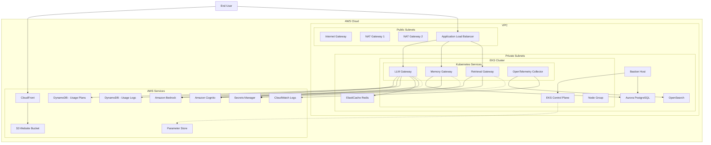
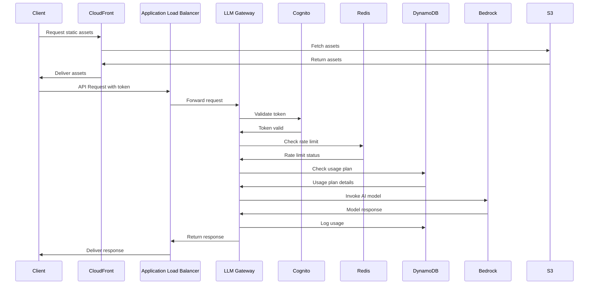
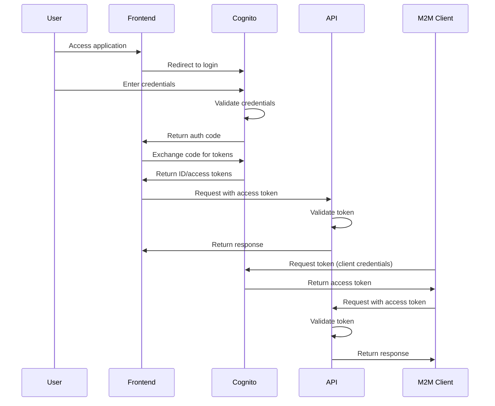

# SUMMARY-infrastructure.md

## Executive Summary

The infrastructure folder contains a comprehensive Terraform codebase that deploys a complete AWS-based platform for building and running AI agent applications. The infrastructure is designed with security, scalability, and observability in mind, leveraging AWS managed services including:

- Amazon EKS for container orchestration
- Amazon Cognito for authentication and authorization
- Amazon RDS (Aurora PostgreSQL) for relational database storage
- Amazon DynamoDB for usage tracking and rate limiting
- Amazon ElastiCache (Redis) for caching and rate limiting
- Amazon OpenSearch for observability and logging
- Amazon Bedrock for AI model access and knowledge base integration
- Amazon S3 and CloudFront for static web hosting

The architecture follows AWS best practices with a focus on security, including private networking, IAM roles with least privilege, encryption at rest and in transit, and proper separation of concerns.

## Implementation Details Breakdown

### Networking and Security

The infrastructure establishes a secure VPC with public and private subnets across two availability zones:

```hcl
resource "aws_vpc" "main" {
  cidr_block           = "10.0.0.0/16"
  enable_dns_support   = true
  enable_dns_hostnames = true
}
```

Key security features include:

- Private subnets for all compute resources
- NAT gateways for outbound internet access
- VPC flow logs for network traffic monitoring
- Security groups with least privilege access
- Default security group configured to deny all traffic

### Compute Infrastructure (EKS)

The platform runs on Amazon EKS with the following configuration:

- EKS cluster with private API endpoint
- Node groups using t3.medium instances
- Multiple AWS EKS add-ons:
  - VPC CNI for networking
  - CoreDNS for service discovery
  - Kube-proxy for network proxying
  - AWS Load Balancer Controller for ingress
  - EBS CSI Driver for persistent storage
  - AWS Distro for OpenTelemetry (ADOT) for observability
  - Cert Manager for certificate management

IAM Roles for Service Accounts (IRSA) is extensively used to grant Kubernetes pods fine-grained AWS permissions:

```hcl
resource "aws_iam_role" "llm_gateway_role" {
  name = "${local.name_prefix}llm-gateway-role"

  assume_role_policy = jsonencode({
    Version = "2012-10-17"
    Statement = [
      {
        Effect = "Allow"
        Principal = {
          Federated = "arn:aws:iam::${data.aws_caller_identity.current.account_id}:oidc-provider/${replace(aws_eks_cluster.main.identity[0].oidc[0].issuer, "https://", "")}"
        }
        Action = "sts:AssumeRoleWithWebIdentity"
        Condition = {
          StringEquals = {
            "${replace(aws_eks_cluster.main.identity[0].oidc[0].issuer, "https://", "")}:sub": "system:serviceaccount:default:llm-gateway-sa"
          }
        }
      }
    ]
  })
}
```

### Authentication and Authorization

Amazon Cognito provides identity management with:

- User pools for end-user authentication
- Identity pools for federated identities
- App clients for web and machine-to-machine authentication
- User groups for role-based access control
- OAuth 2.0 flows for secure token-based authentication

Machine-to-machine (M2M) credentials are stored securely in AWS Secrets Manager:

```hcl
resource "aws_secretsmanager_secret_version" "m2m_credentials" {
  secret_id     = aws_secretsmanager_secret.m2m_credentials.id
  secret_string = jsonencode({
    client_id     = aws_cognito_user_pool_client.m2m_client.id
    client_secret = aws_cognito_user_pool_client.m2m_client.client_secret
    token_url     = "${var.use_custom_domain && var.domain_name != "" ? "https://${var.environment}.${var.domain_name}" : "https://${aws_cognito_user_pool_domain.main.domain}.auth.${var.aws_region}.amazoncognito.com"}/oauth2/token"
    scopes        = join(" ", [
      "${aws_cognito_resource_server.api.identifier}/read",
      "${aws_cognito_resource_server.api.identifier}/write",
    ])
  })
}
```

### Data Storage

The platform uses multiple data storage services:

1. **Aurora PostgreSQL** for relational data:
   - Multi-AZ deployment for high availability
   - Automated backups and point-in-time recovery
   - IAM authentication for secure access
   - Enhanced monitoring and performance insights

2. **DynamoDB** for usage tracking and rate limiting:
   - Two tables: `usage_plans` and `usage_logs`
   - Global secondary indexes for efficient queries
   - Point-in-time recovery and server-side encryption

3. **ElastiCache (Redis)** for caching and rate limiting:
   - Multi-AZ replication group
   - Transit encryption and encryption at rest
   - Authentication via token stored in Secrets Manager

### Observability

The platform includes comprehensive observability:

- **OpenSearch** for log aggregation and analysis:
  - Multi-node deployment across availability zones
  - Encryption at rest and in transit
  - Fine-grained access control

- **CloudWatch Logs** for system logs:
  - EKS control plane logs
  - VPC flow logs
  - RDS logs
  - OpenSearch logs

- **AWS Distro for OpenTelemetry** for metrics and traces:
  - Deployed as an EKS add-on
  - IAM roles for sending telemetry to AWS services

### AI Integration

Amazon Bedrock integration provides AI capabilities:

- Knowledge base for retrieval-augmented generation (RAG)
- IAM roles for secure model invocation
- Integration with custom services via IRSA

### Developer Experience

The infrastructure includes a bastion host for secure cluster access:

```hcl
resource "aws_instance" "bastion" {
  ami                    = data.aws_ami.ubuntu.id
  instance_type          = "t3.large"
  subnet_id              = aws_subnet.private_1.id
  vpc_security_group_ids = [aws_security_group.bastion_sg.id]
  iam_instance_profile   = aws_iam_instance_profile.bastion_profile.name
  
  # Security settings
  ebs_optimized = true
  monitoring    = true
  
  metadata_options {
    http_endpoint               = "enabled"
    http_tokens                 = "required"
    http_put_response_hop_limit = 1
  }
  
  # User data installs development tools and configures access
  user_data = <<-EOF
    #!/bin/bash
    # Installation and configuration commands...
  EOF
}
```

This bastion host includes:
- Code-server (VS Code in browser)
- kubectl for Kubernetes management
- AWS CLI for AWS resource management
- Docker for container management
- Development tools for Python and Node.js

### Frontend Hosting

The infrastructure includes static website hosting:

- S3 bucket for static assets
- CloudFront distribution for global content delivery
- HTTPS enforcement and security headers
- SPA routing support via custom error responses

## Key Takeaways and Lessons Learned

1. **Security-First Design**: The infrastructure implements defense-in-depth with multiple security layers:
   - Private networking with controlled ingress/egress
   - IAM roles with least privilege
   - Encryption at rest and in transit
   - Security groups with minimal access
   - Token-based authentication and authorization

2. **Scalable Architecture**: The platform can scale horizontally:
   - EKS node groups can scale based on demand
   - Multi-AZ deployment for high availability
   - CloudFront for global content delivery
   - Separate services for different concerns (LLM Gateway, Memory Gateway, etc.)

3. **Operational Excellence**: The infrastructure includes:
   - Comprehensive monitoring and logging
   - Automated backups and recovery
   - Infrastructure as Code for reproducibility
   - Parameter Store for configuration management

4. **Cost Optimization**: The infrastructure balances cost and performance:
   - Right-sized instances (t3.medium for EKS nodes)
   - Serverless components where appropriate
   - Shared resources where possible

5. **Developer Experience**: The platform provides tools for efficient development:
   - Bastion host with development tools
   - IAM roles for secure access
   - Kubernetes service accounts with appropriate permissions

## Technical Architecture Overview



### API Request Flow



### Authentication Flow



## Recommendations or Next Steps

1. **Enhanced Monitoring and Alerting**
   - Implement custom CloudWatch dashboards for key metrics
   - Set up alarms for critical thresholds
   - Create automated incident response workflows

2. **Cost Optimization**
   - Implement auto-scaling based on actual usage patterns
   - Consider Spot Instances for non-critical workloads
   - Implement lifecycle policies for S3 and database backups

3. **Security Enhancements**
   - Implement AWS WAF for the CloudFront distribution
   - Add GuardDuty for threat detection
   - Implement regular security scanning and compliance checks

4. **Operational Improvements**
   - Set up CI/CD pipelines for infrastructure updates
   - Implement Infrastructure as Code testing
   - Create runbooks for common operational tasks

5. **Feature Enhancements**
   - Add support for custom domains and ACM certificates
   - Implement cross-region disaster recovery
   - Add support for additional AI models and services

6. **Performance Optimization**
   - Implement caching strategies for frequently accessed data
   - Optimize database queries and indexes
   - Consider read replicas for database scaling

7. **Developer Experience**
   - Create developer environments that mirror production
   - Implement feature flags for controlled rollouts
   - Enhance debugging and troubleshooting tools
