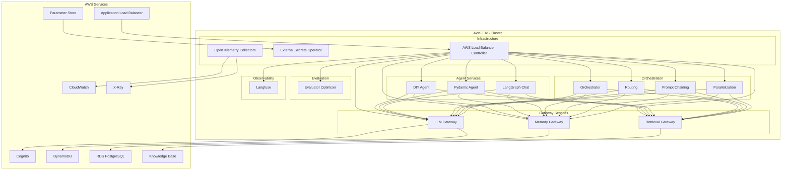
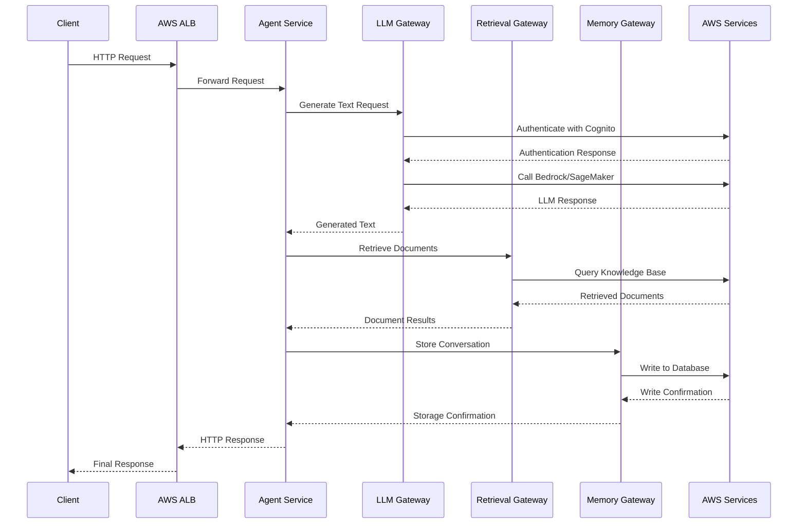

# SUMMARY-k8s.md

## Executive Summary

The `k8s` folder contains a comprehensive set of Kubernetes configuration files organized as Helm charts for deploying and managing the Agentic Platform on Kubernetes. The codebase represents a well-structured microservices architecture with multiple specialized services that work together to provide AI agent capabilities.

The infrastructure is designed to run on AWS EKS (Elastic Kubernetes Service) with tight integration to AWS services like AWS Load Balancer Controller, AWS Parameter Store for configuration management, and AWS OpenTelemetry for observability. The system uses Helm charts for deployment management, with a modular approach that separates core infrastructure components from application services.

Key components include:
- Core infrastructure services (external-secrets, load balancer controller, observability)
- Gateway services (LLM, Retrieval, Memory)
- Specialized AI agent services (DIY Agent, Orchestrator, Routing, etc.)
- Observability and monitoring setup

## Implementation Details Breakdown

### Core Infrastructure Components

#### 1. External Secrets Management

The platform uses the External Secrets Operator to securely manage configuration:

```yaml
apiVersion: external-secrets.io/v1
kind: ClusterSecretStore
metadata:
  name: {{ .Values.parameterStore.name }}
spec:
  provider:
    aws:
      service: ParameterStore
      region: {{ .Values.aws.region }}
      auth:
        jwt:
          serviceAccountRef:
            name: external-secrets-sa
            namespace: external-secrets-system
```

This setup allows the platform to securely fetch configuration from AWS Parameter Store and expose it as Kubernetes secrets, providing a centralized configuration management solution.

#### 2. AWS Load Balancer Controller

The platform integrates with AWS Load Balancer Controller for managing ingress:

```yaml
aws-load-balancer-controller:
  clusterName: ""  # Set during installation
  region: ""       # Set during installation
  vpcId: ""        # Set during installation
  
  serviceAccount:
    create: true
    name: aws-load-balancer-controller
    annotations:
      eks.amazonaws.com/role-arn: ""  # Set during installation
```

This controller manages AWS Application Load Balancers for the Kubernetes cluster, providing external access to services.

#### 3. OpenTelemetry Observability

The platform includes a comprehensive observability setup using OpenTelemetry:

```yaml
apiVersion: opentelemetry.io/v1beta1
kind: OpenTelemetryCollector
metadata:
  name: logs
  namespace: {{ .Values.namespace }}
spec:
  mode: daemonset
  serviceAccount: {{ .Values.serviceAccount.name }}
  # ... configuration for log collection
```

The observability stack includes collectors for:
- Logs (sent to CloudWatch Logs)
- Metrics (sent to CloudWatch using EMF format)
- Traces (sent to AWS X-Ray)

### Application Services Architecture

The platform consists of multiple microservices, each with its own Helm chart:

1. **Gateway Services**:
   - `llm-gateway`: Manages LLM (Large Language Model) interactions
   - `retrieval-gateway`: Handles document retrieval operations
   - `memory-gateway`: Manages conversation memory and persistence

2. **Agent Services**:
   - `diy-agent`: Custom agent implementation
   - `pydanticai-agent`: Agent using Pydantic for structured data
   - `langgraph-chat`: Chat implementation using LangGraph

3. **Orchestration Services**:
   - `orchestrator`: Coordinates agent workflows
   - `routing`: Handles request routing between components
   - `prompt-chaining`: Manages sequences of prompts
   - `parallelization`: Handles parallel execution of tasks

4. **Evaluation Services**:
   - `evaluator-optimizer`: Evaluates and optimizes agent performance

### Common Service Structure

Each service follows a consistent deployment pattern:

```yaml
apiVersion: apps/v1
kind: Deployment
metadata:
  name: {{ include "app.name" . }}
  namespace: {{ include "app.namespace" . }}
spec:
  replicas: {{ .Values.replicaCount | default 1 }}
  selector:
    matchLabels:
      app: {{ include "app.name" . }}
  template:
    metadata:
      labels:
        app: {{ include "app.name" . }}
    spec:
      serviceAccountName: {{ .Values.serviceAccount.name }}
      containers:
        - name: {{ .Chart.Name }}
          image: "{{ include "app.image" . }}"
          # ... container configuration
```

Services are exposed through Kubernetes Services and optionally through Ingress:

```yaml
apiVersion: v1
kind: Service
metadata:
  name: {{ include "app.name" . }}
  namespace: {{ include "app.namespace" . }}
spec:
  type: {{ .Values.service.type | default "ClusterIP" }}
  ports:
    - port: {{ .Values.service.port | default 80 }}
      targetPort: {{ .Values.service.targetPort | default 8000 }}
  selector:
    app: {{ include "app.name" . }}
```

### IAM Integration

The platform uses IAM Roles for Service Accounts (IRSA) to securely access AWS services:

```yaml
apiVersion: v1
kind: ServiceAccount
metadata:
  name: {{ .Values.serviceAccount.name }}
  namespace: {{ .Values.namespace }}
  {{- if .Values.serviceAccount.irsaRoleName }}
  annotations:
    eks.amazonaws.com/role-arn: {{ include "app.irsaRoleArn" . }}
  {{- end }}
```

This allows services to authenticate with AWS services without storing credentials in the cluster.

## Key Takeaways and Lessons Learned

1. **Modular Architecture**: The platform uses a highly modular architecture with specialized services for different aspects of AI agent functionality. This promotes separation of concerns and allows for independent scaling and deployment.

2. **Infrastructure as Code**: The entire platform is defined as code using Helm charts, making it reproducible and maintainable.

3. **AWS Integration**: The platform is tightly integrated with AWS services, leveraging managed services where possible rather than running everything in-cluster.

4. **Centralized Configuration**: The use of External Secrets Operator with AWS Parameter Store provides a secure and centralized configuration management solution.

5. **Comprehensive Observability**: The platform includes a robust observability setup with logs, metrics, and traces, enabling effective monitoring and troubleshooting.

6. **Security-First Approach**: The platform uses IRSA for secure AWS authentication, minimizing the need for storing credentials.

7. **Standardized Service Pattern**: All services follow a consistent deployment pattern, making it easier to understand and maintain the codebase.

## Technical Architecture Overview



### API Request Flow



## Recommendations and Next Steps

1. **Documentation Enhancement**: Create comprehensive documentation for each service, including API specifications and interaction patterns.

2. **Resource Optimization**: Review resource requests and limits for each service to ensure optimal resource utilization.

3. **High Availability Configuration**: Implement multi-AZ deployment for critical services to improve availability.

4. **Autoscaling**: Configure Horizontal Pod Autoscaler (HPA) for services that may experience variable load.

5. **Security Hardening**:
   - Implement network policies to restrict communication between services
   - Review and minimize RBAC permissions for service accounts
   - Consider implementing Pod Security Standards

6. **CI/CD Integration**: Develop CI/CD pipelines for automated testing and deployment of the platform.

7. **Disaster Recovery**: Implement backup and restore procedures for stateful components.

8. **Cost Optimization**: Review AWS resource usage and implement cost optimization strategies.

9. **Performance Testing**: Conduct load testing to identify bottlenecks and optimize performance.

10. **Monitoring and Alerting**: Implement alerting based on metrics collected by the observability stack.

The Agentic Platform represents a well-architected Kubernetes application with strong AWS integration. By following the recommendations above, the platform can be further enhanced for production use.

