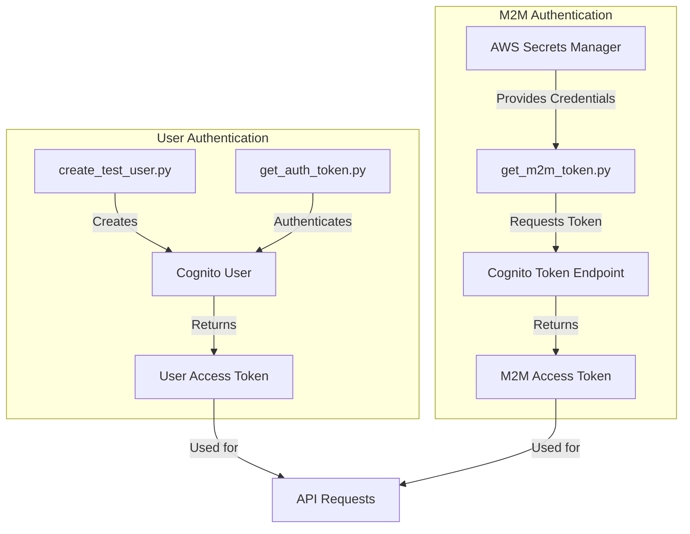
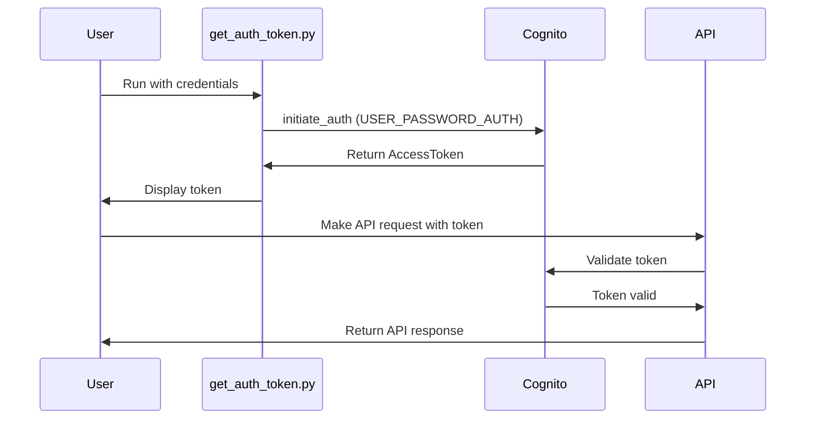
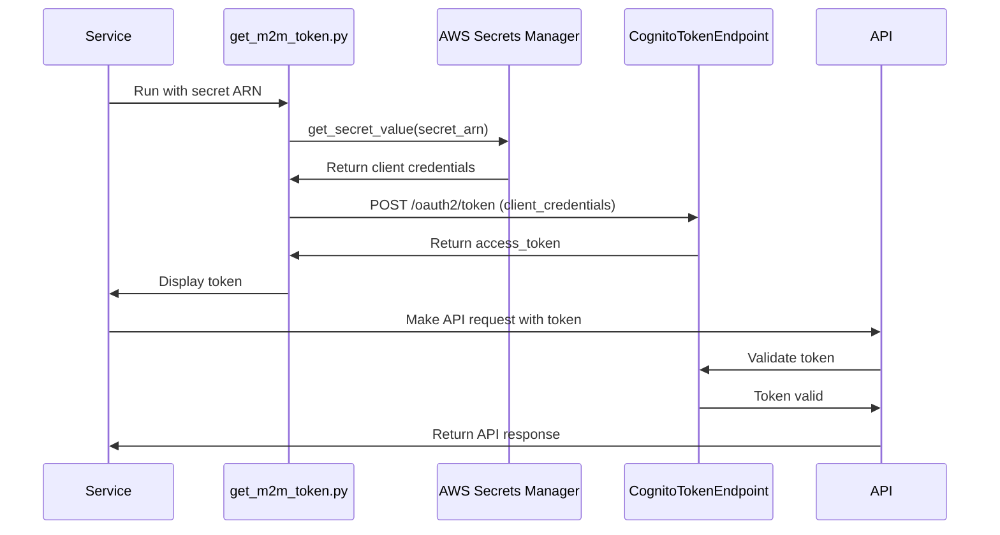

# SUMMARY-script.md

## Executive Summary

The script folder contains three Python utilities designed to facilitate authentication with AWS Cognito for an Amazon Bedrock workshop. These scripts handle:

1. **User Creation** (`create_test_user.py`): Creates test users in a Cognito user pool with configurable options
2. **User Authentication** (`get_auth_token.py`): Obtains access tokens for user authentication flows
3. **Machine-to-Machine Authentication** (`get_m2m_token.py`): Implements the OAuth 2.0 client credentials flow for service-to-service authentication

Together, these scripts provide a comprehensive toolkit for managing authentication in AWS Cognito-protected applications, particularly those integrating with Amazon Bedrock services. They offer both command-line interfaces and programmatic usage options, with flexible configuration through command-line arguments, environment variables, or AWS Secrets Manager.

## Implementation Details Breakdown

### 1. User Creation (`create_test_user.py`)

This script creates test users in an AWS Cognito user pool with the following features:

```python
def create_test_user(
    user_pool_id=None,
    email=None, 
    password=None, 
    auto_confirm=True, 
    set_permanent_password=True
):
```

**Key functionality:**
- Generates random emails and secure passwords if not provided
- Creates users in the specified Cognito user pool
- Optionally auto-confirms users (sets email_verified attribute)
- Optionally sets permanent passwords (vs. temporary ones requiring reset)
- Returns user information for subsequent authentication

The script uses boto3 to interact with the Cognito service and provides detailed output about the created user:

```python
# Create the user
client.admin_create_user(
    UserPoolId=user_pool_id,
    Username=email,
    TemporaryPassword=temporary_password,
    UserAttributes=[
        {
            'Name': 'email',
            'Value': email
        },
        {
            'Name': 'email_verified',
            'Value': 'true' if auto_confirm else 'false'
        }
    ],
    MessageAction='SUPPRESS'  # Don't send welcome email
)
```

### 2. User Authentication (`get_auth_token.py`)

This script obtains access tokens for user authentication using the USER_PASSWORD_AUTH flow:

```python
def get_token(client_id=None, username=None, password=None):
    # ...
    response = client.initiate_auth(
        ClientId=client_id,
        AuthFlow='USER_PASSWORD_AUTH',
        AuthParameters={
            'USERNAME': username,
            'PASSWORD': password
        }
    )
    
    token = response['AuthenticationResult']['AccessToken']
```

**Key functionality:**
- Accepts credentials via arguments or environment variables
- Uses boto3 to authenticate against Cognito
- Returns and displays the access token
- Provides example curl commands for API usage

### 3. Machine-to-Machine Authentication (`get_m2m_token.py`)

This script implements the OAuth 2.0 client credentials flow for service-to-service authentication:

```python
def get_m2m_token(client_id=None, client_secret=None, scopes=None, token_url=None, secret_arn=None, export_env=False):
    # ...
    response = requests.post(
        token_url,
        data={
            'grant_type': 'client_credentials',
            'client_id': client_id,
            'client_secret': client_secret,
            'scope': scopes
        },
        headers={
            'Content-Type': 'application/x-www-form-urlencoded'
        },
        timeout=10.0
    )
```

**Key functionality:**
- Supports credential retrieval from AWS Secrets Manager
- Implements the OAuth 2.0 client credentials flow
- Provides detailed request/response debugging information
- Optionally exports credentials to environment variables
- Returns and displays the access token with usage examples

## Key Takeaways and Lessons Learned

1. **Flexible Authentication Options**: The scripts demonstrate multiple authentication patterns (user-based and machine-to-machine) that are common in modern cloud applications.

2. **Security Best Practices**:
   - Credentials can be stored in AWS Secrets Manager
   - Passwords are generated with sufficient complexity
   - Detailed error handling prevents leaking sensitive information
   - Option to suppress email notifications for test users

3. **Developer Experience**:
   - Scripts provide clear usage instructions and examples
   - Multiple configuration options (CLI args, environment variables, secrets)
   - Detailed output helps with debugging authentication issues

4. **AWS Service Integration**:
   - Demonstrates boto3 usage for Cognito operations
   - Shows OAuth 2.0 implementation with AWS Cognito
   - Illustrates AWS Secrets Manager integration

## Technical Architecture Overview

### Authentication Flow Diagram



### User Authentication Sequence



### M2M Authentication Sequence



## Recommendations and Next Steps

1. **Error Handling Enhancements**:
   - Add more specific error handling for common authentication failures
   - Implement retry logic for transient errors

2. **Security Improvements**:
   - Add token validation functionality
   - Implement token caching to reduce authentication calls
   - Add support for refresh tokens in the user authentication flow

3. **Feature Extensions**:
   - Add support for MFA authentication flows
   - Implement token introspection to check token validity and permissions
   - Create a unified authentication library that combines these scripts

4. **Documentation**:
   - Create comprehensive documentation with examples for different use cases
   - Add examples for integrating with Amazon Bedrock specifically
   - Document the expected Cognito configuration (user pool settings, app client settings)

5. **Testing**:
   - Add unit tests for each authentication function
   - Create integration tests that verify end-to-end authentication flows

6. **Integration with Amazon Bedrock**:
   - Add specific examples showing how to use these tokens with Amazon Bedrock APIs
   - Create helper functions for common Bedrock operations that require authentication

These scripts provide a solid foundation for authentication in AWS Cognito-protected applications and can be extended to support more complex authentication scenarios as needed for the Amazon Bedrock workshop.
