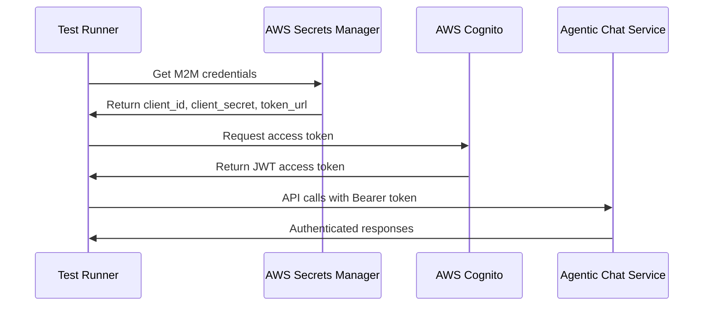

# Agentic Chat Agent EKS Integration Tests

This directory contains end-to-end integration tests for the Agentic Chat Agent deployed on Amazon EKS.

## Test File

**`run_agentic_chat_eks_test_with_auth.py`** - Complete EKS integration test with authentication support

This is the **production-ready** test that includes:
- ✅ **Machine-to-Machine (M2M) authentication** using AWS Cognito
- ✅ **Complete end-to-end testing** with authentication
- ✅ **Real-world authentication scenarios**
- ✅ **Comprehensive test coverage**

## Usage

```bash
# Run the authenticated EKS integration test
python run_agentic_chat_eks_test_with_auth.py
```

## Prerequisites

1. **EKS Cluster Access**: Ensure `kubectl` is configured for your EKS cluster
2. **Agentic Chat Service**: The `agentic-chat` service must be deployed on EKS
3. **AWS Credentials**: Required for M2M token authentication
4. **Dependencies**: Install required packages:
   ```bash
   pip install httpx boto3 asyncio requests
   ```

## Test Coverage

### Infrastructure Tests
- ✅ EKS cluster connectivity
- ✅ Agentic Chat service existence and configuration
- ✅ Pod health and readiness status
- ✅ Service logs and activity monitoring

### Authentication Tests
- ✅ M2M token retrieval from AWS Secrets Manager
- ✅ JWT token validation and refresh
- ✅ Authenticated API access

### API Endpoint Tests
- ✅ `/health` - Health check endpoint (no auth required)
- ✅ `/invoke` - Main chat interface (with auth)
- ✅ `/stream` - Streaming chat interface (with auth)

### Functional Tests
- ✅ **Simple queries** (e.g., "What is 25 + 17?")
- ✅ **Streaming responses** (e.g., "Count from 1 to 3")
- ✅ **Response validation** and intelligent content verification
- ✅ **Authentication flow** testing

## Test Results

When working correctly, you should see:
```
🚀 EKS Integration Tests for Agentic Chat Agent (With Auth)
======================================================================
✅ PASS EKS Cluster Connection
✅ PASS Agentic Chat Service Exists  
✅ PASS Agentic Chat Pods Running
✅ PASS Service Logs
✅ PASS Health Endpoint (No Auth)
✅ PASS Invoke Endpoint (With Auth)
✅ PASS Streaming Endpoint (With Auth)

Results: 7/7 tests passed
🎉 All EKS integration tests passed!
```

## Key Differences from LangGraph Chat

The Agentic Chat Agent has different endpoints and authentication requirements:

### Endpoints
- **Health**: `/health` (no authentication required)
- **Invoke**: `/invoke` (authentication required)
- **Streaming**: `/stream` (authentication required)

### Port Forwarding
- Uses port **8003** (vs 8004 for LangGraph Chat)
- Maps to service port 80: `localhost:8003 -> service:80`

### Authentication
- **Health endpoint**: No authentication required
- **Chat endpoints**: M2M token authentication required
- **Token source**: AWS Secrets Manager with predefined secret ARN

## Troubleshooting

### Common Issues
- **kubectl not configured**: Ensure your kubeconfig points to the correct EKS cluster
- **Service not found**: Verify the `agentic-chat` service is deployed
- **Authentication failures**: Check AWS credentials and Secrets Manager access
- **Port forwarding issues**: The test automatically manages port forwarding to localhost:8003

### Debug Commands
```bash
# Check EKS connection
kubectl cluster-info

# Check service status
kubectl get service agentic-chat

# Check pod status  
kubectl get pods -l app=agentic-chat

# View service logs
kubectl logs -l app=agentic-chat --tail=20
```

## Architecture

The test uses **port forwarding** to securely access the EKS service:
```
Test → kubectl port-forward → EKS Service → Agentic Chat Pods
```

This approach:
- ✅ Works with private EKS clusters
- ✅ Doesn't require LoadBalancer or Ingress setup
- ✅ Uses secure kubectl authentication
- ✅ Tests the actual deployed service (not mocks)

## Authentication Flow




The authenticated version (`run_agentic_chat_eks_test_with_auth.py`) provides all the same functionality plus production-ready authentication, making it the single source of truth for EKS integration testing.

## Service Configuration

The test expects the following Kubernetes resources:
- **Service**: `agentic-chat` with selector `app=agentic-chat`
- **Pods**: Running pods with label `app=agentic-chat`
- **Port**: Service running on port 80
- **Health**: Service responds to `/health` endpoint
- **Authentication**: Service validates JWT tokens for `/invoke` and `/stream` endpoints
