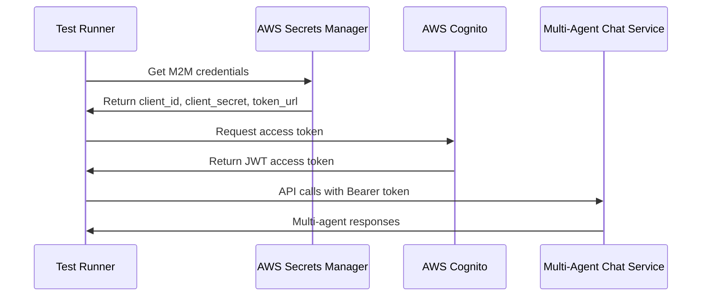
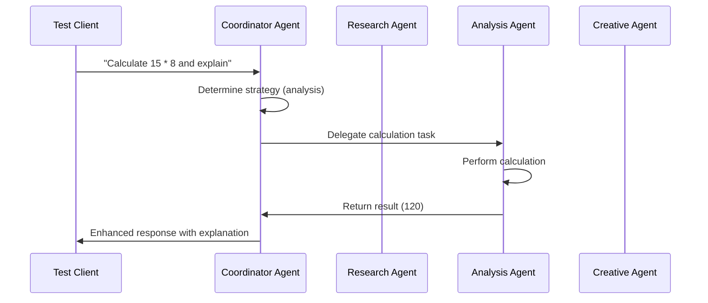

# My New Multi Agent Chat Agent EKS Integration Tests

This directory contains end-to-end integration tests for the My New Multi Agent Chat Agent deployed on Amazon EKS.

## Test File

**`run_my_new_multi_agent_chat_eks_test_with_auth.py`** - Complete EKS integration test with authentication support

This is the **production-ready** test that includes:
- ✅ **Machine-to-Machine (M2M) authentication** using AWS Cognito
- ✅ **Complete end-to-end testing** with authentication
- ✅ **Real-world authentication scenarios**
- ✅ **Multi-agent system testing**
- ✅ **Comprehensive test coverage**

## Usage

```bash
# Run the authenticated EKS integration test
python run_my_new_multi_agent_chat_eks_test_with_auth.py
```

## Prerequisites

1. **EKS Cluster Access**: Ensure `kubectl` is configured for your EKS cluster
2. **My New Multi Agent Chat Service**: The `my-new-multi-agent-chat` service must be deployed on EKS
3. **AWS Credentials**: Required for M2M token authentication
4. **Dependencies**: Install required packages:
   ```bash
   pip install httpx boto3 asyncio requests
   ```

## Test Coverage

### Infrastructure Tests
- ✅ EKS cluster connectivity
- ✅ My New Multi Agent Chat service existence and configuration
- ✅ Pod health and readiness status
- ✅ Service logs and activity monitoring

### Authentication Tests
- ✅ M2M token retrieval from AWS Secrets Manager
- ✅ JWT token validation and refresh
- ✅ Authenticated API access

### API Endpoint Tests
- ✅ `/health` - Health check endpoint (no auth required)
- ✅ `/invoke` - Main multi-agent chat interface (with auth)
- ✅ `/stream` - Streaming multi-agent chat interface (with auth)

### Multi-Agent Functional Tests
- ✅ **Mathematical queries** (e.g., "Calculate 15 * 8 and explain the process") - Tests analysis agent
- ✅ **Creative tasks** (e.g., "Create a short creative story about robots") - Tests creative agent
- ✅ **Agent coordination** and strategy determination
- ✅ **Streaming responses** with multi-agent coordination
- ✅ **Response validation** and intelligent content verification
- ✅ **Authentication flow** testing

## Test Results

When working correctly, you should see:
```
🚀 EKS Integration Tests for My New Multi Agent Chat Agent (With Auth)
======================================================================
✅ PASS EKS Cluster Connection
✅ PASS My New Multi Agent Chat Service Exists  
✅ PASS My New Multi Agent Chat Pods Running
✅ PASS Service Logs
✅ PASS Health Endpoint (No Auth)
✅ PASS Invoke Endpoint (With Auth)
✅ PASS Streaming Endpoint (With Auth)

Results: 7/7 tests passed
🎉 All EKS integration tests passed!
```

## Multi-Agent Architecture

This agent implements a multi-agent system with specialized agents:

### Agent Types
- **Coordinator Agent**: Orchestrates multi-agent interactions using the `coordinate_agents` tool
- **Research Agent**: Specializes in information gathering and analysis
- **Analysis Agent**: Handles mathematical calculations and problem-solving
- **Creative Agent**: Focuses on creative tasks and innovative thinking

### Agent Strategy Determination
The system automatically determines which agents to use based on query keywords:
- **Research keywords**: research, find, search, information, facts, data, study, investigate
- **Analysis keywords**: analyze, calculate, solve, problem, math, statistics, logic, reasoning  
- **Creative keywords**: create, write, story, creative, brainstorm, innovative, design, imagine

## Key Differences from Other Agents

### Endpoints
- **Health**: `/health` (no authentication required)
- **Invoke**: `/invoke` (authentication required) - Uses `/multi-agent-chat` path prefix
- **Streaming**: `/stream` (authentication required) - Uses `/multi-agent-chat` path prefix

### Port Forwarding
- Uses port **8004** (unique port for this agent)
- Maps to service port 80: `localhost:8004 -> service:80`

### Authentication
- **Health endpoint**: No authentication required
- **Chat endpoints**: M2M token authentication required
- **Token source**: AWS Secrets Manager with predefined secret ARN

### Multi-Agent Features
- **Agent coordination**: Uses specialized tools for agent collaboration
- **Strategy-based routing**: Automatically selects appropriate agents based on query content
- **Enhanced metadata**: Response includes agent strategy and available agents information

## Troubleshooting

### Common Issues
- **kubectl not configured**: Ensure your kubeconfig points to the correct EKS cluster
- **Service not found**: Verify the `my-new-multi-agent-chat` service is deployed
- **Authentication failures**: Check AWS credentials and Secrets Manager access
- **Port forwarding issues**: The test automatically manages port forwarding to localhost:8004
- **Multi-agent coordination**: Check that all agent types are properly initialized

### Debug Commands
```bash
# Check EKS connection
kubectl cluster-info

# Check service status
kubectl get service my-new-multi-agent-chat

# Check pod status  
kubectl get pods -l app=my-new-multi-agent-chat

# View service logs
kubectl logs -l app=my-new-multi-agent-chat --tail=20

# Check ingress path
kubectl get ingress -o yaml | grep -A5 -B5 multi-agent-chat
```

## Architecture

The test uses **port forwarding** to securely access the EKS service:
```
Test → kubectl port-forward → EKS Service → Multi-Agent Chat Pods
```

This approach:
- ✅ Works with private EKS clusters
- ✅ Doesn't require LoadBalancer or Ingress setup
- ✅ Uses secure kubectl authentication
- ✅ Tests the actual deployed multi-agent service (not mocks)

## Authentication Flow



## Multi-Agent Flow



## Service Configuration

The test expects the following Kubernetes resources:
- **Service**: `my-new-multi-agent-chat` with selector `app=my-new-multi-agent-chat`
- **Pods**: Running pods with label `app=my-new-multi-agent-chat`
- **Port**: Service running on port 80
- **Health**: Service responds to `/health` endpoint
- **Authentication**: Service validates JWT tokens for `/invoke` and `/stream` endpoints
- **Ingress**: Service accessible via `/multi-agent-chat` path
- **Multi-Agent**: Service implements multi-agent coordination and strategy determination

## Expected Response Patterns

### Analysis Tasks
For mathematical queries, expect responses containing:
- Numerical results (e.g., "120")
- Keywords: "calculation", "multiply", "result", "analysis"
- Strategy metadata indicating analysis agent usage

### Creative Tasks  
For creative queries, expect responses containing:
- Creative content and storytelling
- Keywords: "story", "creative", "imagine"
- Strategy metadata indicating creative agent usage

### Research Tasks
For information queries, expect responses containing:
- Structured information and analysis
- Keywords: "research", "information", "facts"
- Strategy metadata indicating research agent usage
